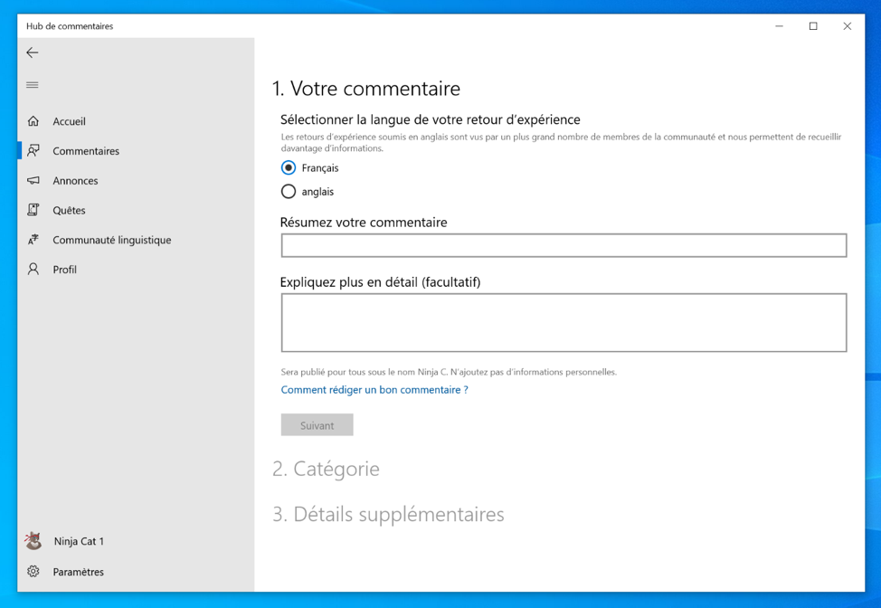

# Feedback Hub 

The latest major updates and features for the Feedback Hub. Let us know what you think about these changes in the [Feedback Hub](https://aka.ms/WIPFeedbackHub) by choosing **Apps > Feedback Hub** under **Category** when filing feeback.

## August 21, 2019

The Feedback Hub team has been hard at work lately to bring you some app updates based on your feature requests, and we have a few changes and improvements to share about the latest version that’s currently rolling out to Windows Insiders in the Fast ring.

### Feedback Search UI updates
On the **Feedback** section of the app, you will now be able to more clearly see Problems and Suggestions, with each showing an icon, color, and the labels Problem or Suggestion displayed above each item. We also have updated the icons and display for adding similar feedback to problems, upvoting suggestions, and adding comments to feedback.

### Adding similar feedback

In the past, Feedback Hub allowed two kinds of participation, upvoting and adding more details. Voting on Suggestions makes a lot of sense. Engineers at Microsoft want to know which features the community wants us to build next, and voting on feature suggestions is a great way to see where your interest lies.

However, voting on Problems was trickier. Problems are not a matter of popularity, and what helps engineers here resolve problems is having clear descriptions of how you hit the issue. Feedback is especially helpful if it includes a reproduction of the problem or data that help our teams pinpoint what went wrong, so they can fix issues faster. Voting on the search page often did not provide enough detail, and we saw few people going into existing feedback to add their personal repros of the issues.

With the new **Add similar feedback** feature, selecting a problem that matches your own will take you to the feedback form, with the title pre-filled. You can edit the title or add your own description to let us know exactly what was happening when you encountered the issue. We’ll already have your category selected to make sure the right feature team sees your feedback, and in our new **Similar feedback** section, the feedback you chose will already be selected. As usual, the last step has you add your own reproduction of the issue or attachments.

### Achievements

We're also excited to announce a refresh of the Windows Insider **Achievements** page. We’ve moved them from your profile page to their own landing page to make them easier to find, and we added additional features that allow you to categorize and track your progress. Be sure to check it out today and begin unlocking badges. We would love to hear your feedback on social media by using the hashtag #Builds4Badges.

The information previously found in your profile, like Device ID and User ID, is now located in the **Settings** section of Feedback Hub.

## June 19, 2019

Based on your feedback, we’re updating the Feedback Hub with a new feature called **Find similar feedback**. When you go to log a new piece of feedback, you’ll now see a section that looks to see if there’s any existing feedback that sounds similar to yours. You can choose to automatically link your feedback to that existing feedback (rather than creating a new piece of feedback). This is currently in the process of rolling out to Insiders with version 1.1904.1584.0. We look forward to you trying it out!

We’ve also updated the Thank You page a little bit, so that now there’s a direct button to share your feedback if that’s what you want to do (rather than having to go find your feedback afterwards in the **My feedback** section).  

This is currently in the process of rolling out to Insiders as an app update in the Microsoft Store (version 1.1904.1584.0).

## April 26, 2019

Based on your feedback, with Feedback Hub version 1.1903, Windows Insiders with Windows set to a language other than English now have the option of browsing English feedback within the Feedback Hub, as well as submitting feedback in English on the New Feedback form.

## December 10, 2018

This update includes:

* We’ve updated the navigation pane to now use the common control, which means when switching between sections you’ll now see that nice little transition animation.
* We’ve made some improvements to how the UI flows between different window sizes.
* Screenshots and Steps capture images can be now be easily reviewed in the app.
* When creating a new feedback item, that feedback is auto-saved as a draft.  If the app closes unexpectedly in the middle of writing feedback, when you re-open the Feedback Hub, you’ll now get notified of the existing draft so you can easily resume.
* You can now check for app updates from the **Settings** page in the Feedback Hub. We’ll also automatically check for app updates on app launch, and you’ll get a notification letting you know one is available.
