# What's new in builds from the Active Development Branch (Fast ring)

The [Windows Insider Program](https://insider.windows.com/) lets you preview builds of the upcoming 20H1 release of Windows 10. This topic lists all new Windows 10 features for you to try.

## Build 19569
Windows 10 Insider Preview Build 19569 was released to the Fast ring on [2/20/2020](https://blogs.windows.com/windowsexperience/2020/02/20/announcing-windows-10-insider-preview-build-19569/)

### Evolving the Windows 10 icons
We are currently working on a multi-year effort across Microsoft’s design teams to redesign the icons across all our products. We started with the Office icons, and now we’re moving forward with updating the icons in Windows 10, starting with the built-in apps like Alarms & Clock, Calculator, Mail, and Calendar. Research and feedback from Windows Insiders showed a desire to see consistency in design and connection to the brand, with enough differences to aid in recognition. You can read all about our approach to updating the icons in Windows 10 in this Medium post from the Microsoft Design Team!

Many of these icons will be updated as app updates from the Microsoft Store. We are beginning to roll them out to Windows Insiders in the Fast ring first, starting today. The Mail and Calendar icons rolled out this morning to Release Preview. Over the coming months, Insiders will see more of the icons in Windows 10 get updated with new designs!

### General changes, improvements, and fixes
* We fixed an issue resulting in OneDrive not working and using an unexpectedly high amount of CPU for some Insiders on the previous build.
* We resolved an issue where SCSI drivers weren’t being recognized with certain third-party virtual machines, which was causing c1900191 errors on these devices. We’re continuing to investigate additional c1900191 errors on other devices.
* We fixed an issue impacting Start menu reliability after upgrade for some Insiders.
* We fixed an issue resulting in some Insiders experiencing a green screen with a SYSTEMTHREAD EXCEPTION NOT HANDLED error on recent builds.

## Quick searches now in Search Home (Build 19018)
To help you find the info that matters even faster, we’ve added four quick web searches to your Search Home:
* __Weather:__ Get current conditions and the upcoming forecast
* __Top news:__ Read the latest headlines from popular news sites
* __Today in history:__ Explore four events that happened on this day
* __New movies:__ Find out what’s playing in theaters near you

### Updated design for web preview in search results (Build 19018)
We have made a few small tweaks to how it looks–here’s what you’ll see now:

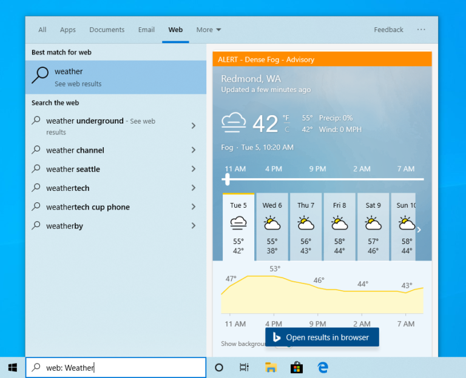

## More kaomoji (Build 19013)
As some of you may know, with Windows 10 version 1903, we updated our WIN+(Period) / WIN+(Semicolon) keyboard shortcut to not only include emoji, but to also now contain kaomoji and special characters. What are kaomoji? Basically, they’re faces with expressions you can make by combining various characters–for example, you might be familiar with the shruggie:

¯\\\_(ツ)_/¯

Based on your feedback, in this build we’re updating our kaomoji list with a few more favorites, including:

* ヾ(⌐■_■)ノ♪
* ლ(╹◡╹ლ)
* (⊙_◎)
* ( ͡~ ͜ʖ ͡°)
* ಠ_ರೃ
* (∩^o^)⊃━☆
* /ᐠ｡ꞈ｡ᐟ\

And more! Enjoy (❁´◡`❁)

## Windows Subsystem for Linux (WSL) 2 improvements (Build 19013)

Previously, your WSL 2 Virtual Machine’s (VM) memory would grow to meet the needs of your workflow, but would not shrink back down when the memory was no longer needed.  With this change, as memory is no longer in use in the Linux VM, it will be freed back to Windows, which will shrink in memory size accordingly.

## Preview new DirectX 12 features (Build 19013)
In the latest 20H1 builds, you can preview new DirectX 12 features, including DirectX Raytracing tier 1.1, Mesh Shader, and Sampler Feedback. In [this blog post](https://devblogs.microsoft.com/directx/dev-preview-of-new-directx-12-features/), the DirectX Team explains what each of these features are and how they will improve the gaming experience in Windows 10!

## Windows Hello PIN in Safe mode (Build 18995)
Safe mode starts Windows in a basic state, using a limited set of files and drivers to help you troubleshoot problems on your PC. If a problem doesn’t happen in Safe mode, this means that default settings and basic device drivers aren’t causing the issue. [Read more about Safe mode](https://support.microsoft.com/help/12376/windows-10-start-your-pc-in-safe-mode).

With the latest flight, we’re taking another step forward in our Passwordless journey by adding Windows Hello PIN sign-in support to Safe mode, so that you no longer have rely on your password when troubleshooting your device. Try it out with the instructions below and let us know what you think!

* Set up Windows Hello in Settings > Accounts > Sign-in options
* Boot your device into Safe mode: 
1. Go to Settings > Update and Security > Recovery. 
2. Under Advanced startup select Restart now. 
3. After your PC restarts to the Choose an option screen, select Troubleshoot > Advanced options > Startup Settings > Restart. You may be asked to enter your [BitLocker recovery key](https://support.microsoft.com/help/4026181/windows-10-find-my-bitlocker-recovery-key). 
4. After your PC restarts, you’ll see a list of options. Select 4 or press F4 to start your PC in Safe Mode. You can also select 5 or press F5 to use Safe Mode with Networking.
* Sign in to your device with your Windows Hello PIN

## Windows Subsystem for Linux (WSL) Improvements (Build 18995)
See the [WSL release notes](https://docs.microsoft.com/windows/wsl/release-notes) for the newest improvements in the latest Insider Preview builds.

## Connecting network cameras to Windows 10 devices (Build 18995)
Network cameras, which are Internet Protocol-based cameras that transmit video data over a local area network (LAN), are becoming increasingly prevalent—especially in surveillance and security scenarios. [Windows now allows users to associate network cameras to their PC, enabling photo capture and streaming of video in camera applications](https://blogs.windows.com/windowsdeveloper/2019/10/10/connecting-network-cameras-to-windows-10-devices/).

## Enabling automatic restart for UWP apps (Build 18990)
We already introduced a new [separate setting](https://docs.microsoft.com/windows-insider/at-home/whats-new-wip-at-home-20h1#control-over-restarting-apps-at-sign-in-build-18965) to control if [registered desktop apps](https://docs.microsoft.com/windows/win32/recovery/registering-for-application-restart) from your previous sign-in session are restarted when signing back in to Windows. In the latest Insider Preview builds, in addition to registered desktop apps, when you opt into this setting, the majority of open UWP apps are now also automatically restarted as well! To reduce sign-in time, UWP apps are restarted minimized, in a suspended state, giving Windows and other apps more resources to get started. To try it out:
1. Go to Settings > Accounts > Sign-in options and turn on “Automatically save my restartable apps when I sign out and restart them after I sign in.” under “Restart apps”.
2. Start one or more UWP apps, such as Feedback Hub.
3. Sign out and then sign back into Windows.

UWP apps that were started, such as Feedback Hub, should restart minimized with a taskbar button.

## Windows Subsystem for Linux (WSL) improvements (Build 18990)
* Improved the performance for directory listings in \\wsl$
* (WSL2) Injected additional boot entropy [Github Issue 4461]
* (WSL2) Fixed Windows interop when using su / sudo commands [Github issue 4465]
For the full details of changes in this latest Insider Preview build, please see the [WSL release notes](https://docs.microsoft.com/windows/wsl/release-notes).

## Xbox Game Bar Updates (Build 18990)
In case you hadn’t seen, we’re starting to roll out an FPS counter and achievement overlay! Thanks to everyone who shared feedback about this. The update will come via the Microsoft Store. Just set focus to your favorite game and press WIN + G to get started.

NOTE: You may have to be joined to receive Game Bar updates via the Xbox Insider Hub app (under Insider Content) from the Microsoft Store to see this update.

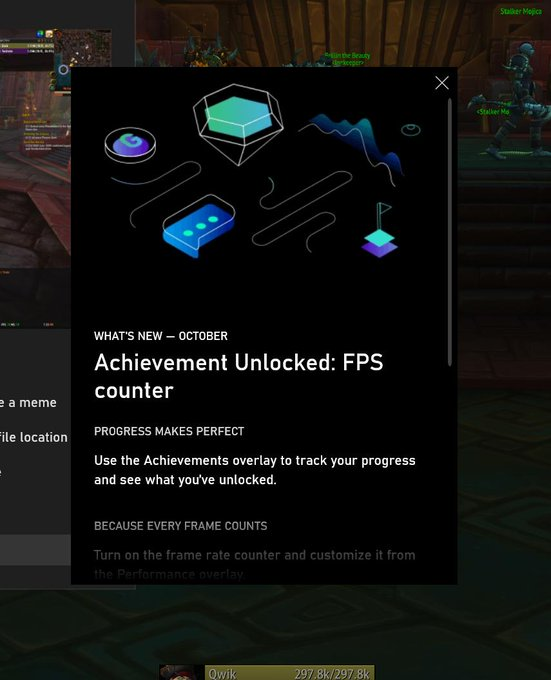

## Improving your Bluetooth pairing experience (Build 18985)

For Windows 10, version 1803, we announced a new [streamlined experience for pairing supported Bluetooth devices](https://blogs.windows.com/windowsexperience/2018/02/07/announcing-windows-10-insider-preview-build-17093-pc/). The idea was simple—if a supported device was nearby and in pairing mode, we’d show a notification that prompted you to go through pairing. This saved you from opening Settings yourself and finding the right place to go. Today, we’re rolling out an update with improvements we hope you’ll like.
Here’s what’s new:
* Pairing is all done in notifications now. You don’t need to go to the Settings app anymore to finish pairing.
* For faster pairing time, we improved the UI by showing one less notification.
* We added a Dismiss button to the first notification to give you more control while using Swift Pair.
* To make the notification more helpful, now we show the device name and category when we can.

Supported devices include:
* Surface Ergonomic Keyboard
* Surface Precision Mouse
* Surface Mobile Mouse
* Surface Arc Mouse
* Surface Headphones
* Microsoft Arc Mouse
* Microsoft Modern Mobile Mouse
* Microsoft Bluetooth Keyboard
* Microsoft Bluetooth Mouse

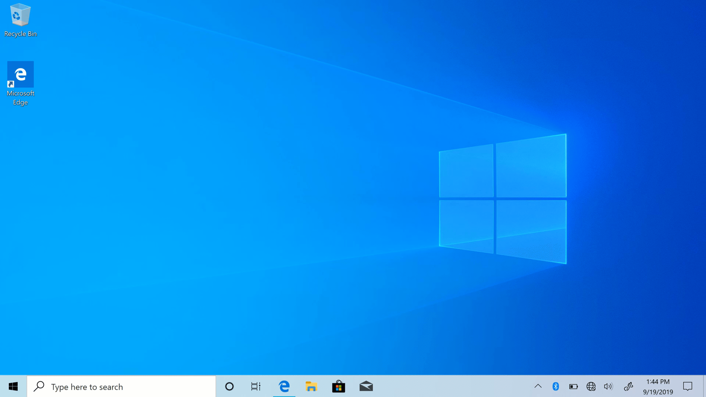

## Windows Subsystem for Linux (WSL) ARM64 support.  (Build 18980)
In this build, we’ve added WSL2 support for ARM64 devices! We’ve also added the ability to set your distribution’s default user using the /etc/wsl.conf file. For the full details of changes in this latest Insider Preview build, please see the [WSL release notes](https://docs.microsoft.com/windows/wsl/release-notes).

## Option to move the Cortana window (Build 18975)

With the [new conversational Cortana experience](https://docs.microsoft.com/windows-insider/at-home/whats-new-wip-at-home-20h1#introducing-a-new-cortana-experience-for-windows-10-build-18945), we understand that you wanna keep the chat going sometimes, and the default position of the window isn’t always where you’d prefer to have it docked if you’re going to have a longer back and forth. That’s why we’re starting to roll out the option to be able to move the window (by dragging the title bar area), to anywhere you’d like on the screen–just like you can with other windows. You can also resize the window if you’d like. 

Please note that we’re still in the process of expanding language/region support of the new Cortana app (as discussed here), and Insiders outside of English (United States) will see a message when launching Cortana saying “Cortana isn’t available.” We’ll update you when the availability increases.

## Windows Subsystem for Linux (WSL) Improvements (Build 18975)
[See the latest improvements with WSL](https://docs.microsoft.com/windows/wsl/release-notes) in the latest Insider Preview builds.

## Update on Virtual Desktop renaming (Build 18975)
The ability to rename your virtual desktops is now available for all Insiders in the Fast ring! Thanks again everyone who shared feedback requesting this.
To get started:
1. Open Task View by selecting the Task View icon in the taskbar or pressing WIN+Tab.
2. Select New Desktop.
3. Select the desktop name (“Desktop 1”) and it should become editable, or right click the desktop thumbnail and a context menu will appear with a Rename entry.
4. Input whatever name you’d like, and press enter.
5. Done!

## Introducing a new tablet experience for 2-in-1 convertible PCs! (Build 18970)

Now available: a new tablet experience for 2-in-1 convertible PCs as a Beta to Windows Insiders. 

This new experience allows users entering tablet posture to stay in the familiar desktop experience without interruption, plus a few key touch improvements:
* Increased spacing between Taskbar icons.
* Search box on taskbar collapsed into an icon.
* File Explorer switches to touch optimized layout.
* Touch keyboard auto invokes when you tap text fields.

As part of this, we’ve also made a few small changes to the tablet section in Settings.
This experience is currently available for a portion of Insiders as we evaluate the quality. Here are the steps once it becomes available on your PC:
1. Use your convertible PC as a laptop as you normally would–opening apps and interacting with them.
2. When you’re ready to pick it up and go or simply lean back on the couch, you can fold back the keyboard or remove it altogether, and it should switch to this new mode shown above.
3. Now use your device as a tablet with touch.

We’d love to hear your feedback about the new experience–share your thoughts here.

## Reset your PC from the cloud (Build 18970)
Reset this PC provides users a new choice to download Windows or use local reinstall. Previously, Reset this PC was only able to do a local reinstall and would build a new Windows installation from existing Windows files. When this feature was introduced in Windows 10 version 1507, it provided the advantage of enabling Windows to be recoverable without requiring extra disk space to store a compressed, backup copy of Windows in a hidden partition. We’ve heard feedback that some of you would prefer to use your high-speed internet connection to speed up this process by just downloading Windows.

>[!NOTE]
>This is a recovery operation and will remove apps you have installed. Additionally, if the “Remove everything” option is selected, user data will also be deleted. For more information on Reset this PC and other recovery options, [visit the link here](https://support.microsoft.com/help/12415/windows-10-recovery-options).

The cloud download option will reinstall the same build, version, and edition, that is currently installed on your device. This new cloud download option is available to all Windows 10 devices and is different from the “Recover from the cloud” feature available on some earlier Windows 10 devices.

For more information, check out [this article from Program Manager Aaron Lower](https://insider.windows.com/articles/optimize-windows-10-pc-reset-using-the-cloud/).

## Control over restarting apps at sign-in (Build 18965)
As some of you already know, apps have the ability to register for restart, which helps in a few situations, including enabling you to get back to what you were doing if you need to restart your PC. Previously this option was tied to the “Use my sign-in info to automatically finish setting up my device” option under Sign-in options in accounts settings. We’ve heard feedback that some of you would prefer more explicit control over when Windows automatically restarts apps that were open when you restart your PC, and with 20H1 we’re bringing that option to you.

Windows now puts you in control with a new app restart setting. When turned on, Windows automatically saves your restartable apps when signing out, restarting, or shutting down Windows, and restarts them next time you sign in. This setting is off by default and you can change it any time in Settings > Accounts > Sign-in options, and can find it by searching for “restart apps” in Start or the search box.

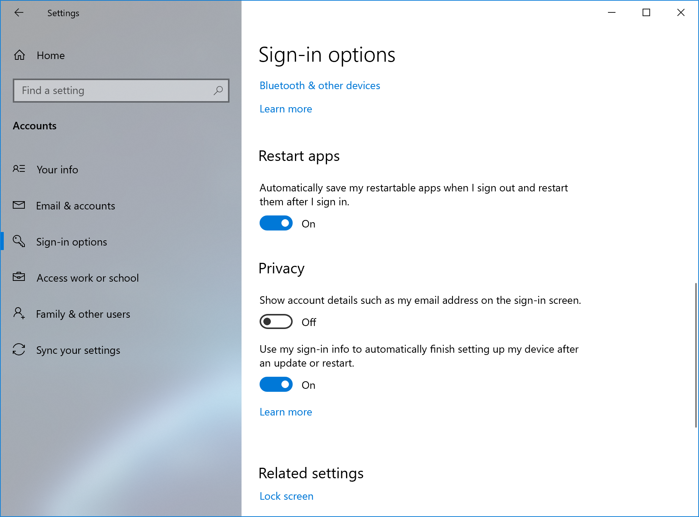

## GPU temperature comes to Task Manager (Build 18963)
One of the longstanding requests we’ve been tracking for Task Manager is to add temperature monitoring support, and with today’s build we’re making progress on that ask. If you have a dedicated GPU card, we will now bubble up the current temperature next to its listing in the Performance Tab.

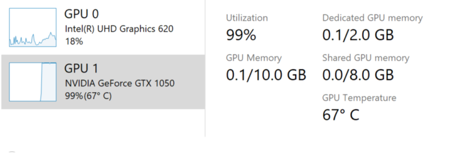

We hope you like the change! If you have any further feedback for Task Manager, please don’t hesitate to share it. To make suggestions or report issues in this space, press WIN+F and file the feedback under Desktop Environment > Task Manager in the Feedback Hub.

__Notes:__
* Showing the GPU temperature in Task Manager is currently only supported if you have a dedicated GPU card.
* You may need an updated graphics driver to see the temperature. Specifically one which supports version 2.4 (or higher) of WDDM is required. To check which version your PC has, press WIN+R and enter dxdiag. Under the Display tab, it will say your WDDM version next to Driver Model.
* Currently the temperature value is only supported in Celsius.

## Renaming your virtual desktops (Build 18963)

Virtual Desktops exist to help you visually and cognitively separate different tasks on your PC. They can also be handy when doing presentations – enabling you to prepare demos on different desktops. Something we’ve heard loud and clear is that you want to be able to set names for your different desktops, in order to help cement the separation between workspaces, and we’re excited to share that rolling out to Insiders in the Fast ring is exactly that!

Wanna try it out? With the change, when you open Task View (by selecting the Task View button in the taskbar, or by pressing WIN+Tab,) clicking the name of your desktop will now switch it to be an editable field where you can set the name to be anything you’d like (including emoji). You can also right-click the thumbnail of the desired desktop in Task View, and a context menu with a Rename entry in it should appear. If you don’t have any additional desktops created yet, select “New desktop” in Task View to get started.

And yes, since we know you’ll ask – the names persist reboot. 

Currently this change is live for 50% of Insiders in the Fast ring, and we’ll be expanding the rollout over the next few weeks as we evaluate the quality of experience.

## Improving the Optional Features page in Settings (Build 18963)
Based on your feedback, we’ve made a number of usability improvements to the Optional Features page in Settings (Settings > Apps & Features > Optional Features), and they’re now starting to roll out to Insiders in the Fast ring.

* __Multi-select:__ You can now select and install multiple optional features at the same time.
Better list management: You can now search through lists of optional features and sort them by Name, Size, and Install date.
* __More useful information:__ You can now see the install date for each optional feature in your ‘Installed features’ list. We’ve also added feature dependencies to the description of each optional feature in the list of features available for install.
* __Easier page navigation:__ View the status of your latest installs/uninstalls/cancels right on the main page in the ‘Latest actions’ section. You can now add optional features and view your history via pop-up dialogues, so you never have to navigate away from the main page

We’re excited for you to try it! Currently these changes are live for 50% of Insiders in the Fast ring, and we’ll be expanding the rollout over the next few weeks as we evaluate the quality of experience. Here’s a peek at what you’ll see once it’s available on your PC:

## Adding Mouse Cursor speed to Settings (Build 18963)
As some Insiders have noticed, you can now set your mouse cursor speed from within Settings! This is the latest piece of our larger ongoing effort to converge Settings and Control Panel experiences. You can find the setting under Settings > Devices > Mouse.

## Notepad improvements (Build 18963)
Notepad has been a well-loved text editor in Windows for over 30 years. Over the last few releases, we’ve been making a number of small improvements to Notepad based on your feedback including:

1. __Wrap-around find/replace:__ We’ve made significant improvement to the find/replace experience in Notepad. We added the option to do wrap-around find/replace to the find dialog and Notepad will now remember previously entered values and the state of checkboxes and automatically populate them the next time you open the find dialog. Additionally, when you have text selected and open the find dialog we will automatically populate the search field with the selected text.

2. __Text zooming:__ We’ve added options to make it quick and easy to zoom text in Notepad. There is a new menu option under View > Zoom to change the zoom level and we display the current zoom level in the status bar. You can also use Ctrl + Plus, Ctrl + Minus and Ctrl + MouseWheel to zoom in and out and use Ctrl + 0 to restore the zoom level to the default.

3. __Line numbers with word-wrap:__ A long outstanding request has been to add the ability to display line and column numbers when word-wrap is enabled. This is now possible in Notepad and we’ve made the status bar visible by default. You can still turn the status bar off in the View menu.

4. __Modified indicator:__ Notepad will now show an asterisk (*) in the title bar before the title of a document to indicate that a document has unsaved changes.

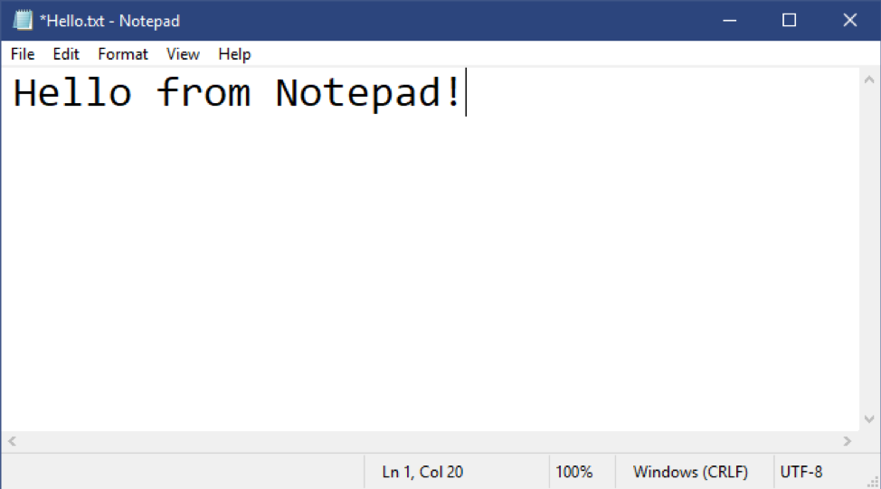

5. __Send Feedback:__ You can now send feedback directly from Notepad! Click Help > Send Feedback to open the Feedback Hub with the Notepad category selected and get your feedback directly to the product team.

__UTF-8 Encoding:__ We’ve made significant improvements to the way Notepad handles encoding. Starting with this build, we are adding the option to save files in UTF-8 without a [Byte Order Mark](https://en.wikipedia.org/wiki/Byte_order_mark) and making this the default for new files. UTF-8 without a Byte Order Mark is backwards-compatible with ASCII and will provide better interoperability with the web, where UTF-8 has become the default encoding. Additionally, we added a column to the status bar that displays the encoding of the document.

__Other Updates__

* __[Expanding line support](https://devblogs.microsoft.com/commandline/extended-eol-in-notepad/)__
* We’ve added support for some additional shortcuts:
  * Ctrl+Shift+N will open a new Notepad window.
  * Ctrl+Shift+S will open the Save as… dialog.
  * Ctrl+W will close the current Notepad window.
* Notepad can now open and save files with a path that is longer than 260 characters, also known as MAX_PATH.
* We’ve fixed a bug where Notepad would count lines incorrectly for documents with very long lines.
* We’ve fixed a bug where, when you select a placeholder file from OneDrive in the File Open dialog, we would download the file to determine its encoding.
* We’ve fixed a recent regression where Notepad would no longer create a new file when launched with a file path that didn’t exist.
* We’ve improved the performance when opening large files in Notepad.
* Notepad now supports Ctrl + Backspace to delete the previous word.
* Arrow keys now correctly unselect text first and then move the cursor.
* When saving a file in Notepad, the line and column number no longer reset to 1.
* Notepad now correctly displays lines that don’t fit entirely on the screen.

## Traditional Chinese IME improvements (Build 18963)
Thank you everyone who’s shared feedback about the new Traditional Chinese Bopomofo, ChangJie, and Quick IMEs. The developer team has been working on improving the quality and fixing bugs. With today’s build:

* __Toolbar Improvements:__ We fixed an issue where toolbar shows up even when [Use IME toolbar] is turned off in the setting. We also added [Hide toolbar] button in the toolbar menu.

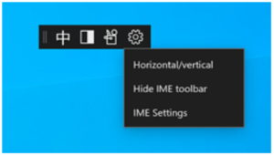

__Note:__ Other ways to show/hide toolbar: 1. From settings: Right click [中/英] icon > Click [Settings] > [General] > [Use IME toolbar] 2. From right click menu: Right click [中/英] icon > [Show/hide IME toolbar]
 
* __Candidate Window Improvements:__ We have been working on improving candidate window quality. We fixed an issue where candidate window sometimes only showed limited number of candidates. We also fixed an issue where candidates shown in table view cannot be selected by number keys.

Please keep trying out this new IME, and let us know your feedback.

## Changes to your account picture in Windows (Build 18963)
Changing the picture for the account you use to sign in to Windows is now better than ever! Your updated picture will now show up quickly across Windows, apps, and many of the Microsoft sites you use every day. Previously, you might see as many as three or four different pictures for your account in different apps and sites at one time. Its super easy to try out – just go to Your info in Windows settings and change your picture there!

__Steps__
1. Open “Your info” in Windows settings by pressing the Windows key, and typing “Your info,” and selecting “Your account info.”
2. Use the options in ‘Create your picture’ to select a new picture for your account.
3. Check if your picture has been updated in Windows, and on the sites and apps you use.

__Note:__ We’re still working with many sites and apps that will need to be updated to work well with this new feature. For example, the account manager control that appears in the upper right of many Microsoft websites currently updates every 24 hours. This will be changed in the next few months to update quickly when your account picture changes.
Other updates for Insiders 

## Windows Search improvements (Build 18963)
We wanted to take a moment to cover some of the server-side search improvements we’ve been rolling out based on your feedback:

* __Improved spell correction for Apps & Settings searches.__
Windows Search has built-in spell correction to help you find what you’re looking for. When you’re typing quickly sometimes mistakes happen – we’re excited to announce that we’ve updated our spell correction technology to intelligently understand and correct small typos like “powerpiont” and “exce;” which previously would return no results. With these updates, you get better results faster. This feature is now available on both Insider and retail builds in English-language markets.  

* __Hints to improve Best match results.__ Our goal with Windows Search is to provide a simple to use experience, and a key aspect of this is making results easy to understand. Something we’ve heard from you is surprise that sometimes settings search results don’t match your search. To help address this, in certain cases where the Best match result isn’t an exact match for your search, a “Related:” line will be included below the result to help clarify why this result is appearing.  We’ll be expanding this feature to include Apps search in the coming weeks.  This feature is now available on both Insider and retail builds in English (United States).

* __Bringing the latest Search Home experience to more users.__ With the Windows 10 May 2019 Update we updated Search Home to help you save time by adding quick access to your Top apps and Recent activities. After receiving positive feedback and comments about this new experience, we’re now making it available to more users by rolling it out to everyone using the Windows 10 October 2018 Update as well. We hope you find them useful and that they help make Search Home more productive for you.
Here’s a glance at what it looks like for those on the Windows 10 October 2018 Update:

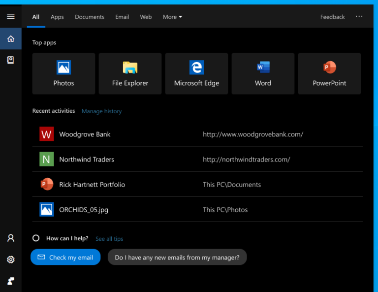

## A redesigned Network Status page in Settings (Build 18956)
Based on your feedback, we’re revamping the Network & Internet landing page in Settings to provide more information at a glance about your device’s connectivity, combining several pages to give you one clear view of how you are connected to the internet.
* __New view of active connections:__ We now show all available connection interfaces on the Status page, so you can quickly see what is connected and view and change properties as needed. If you have multiple connections, only one will be used for internet connectivity at a time, and that one is still shown in the Status diagram at the top of the page.

* __Integrated Data Usage:__ As you may have noticed in the picture above, you can now see how much data is being used by a network right from the Status page! If it looks like you’re using a lot of data, you can drill into the Data Usage page to create a limit for that network, which will warn you if you get close or go over your limit. You can also see how much data each app is using on that network.

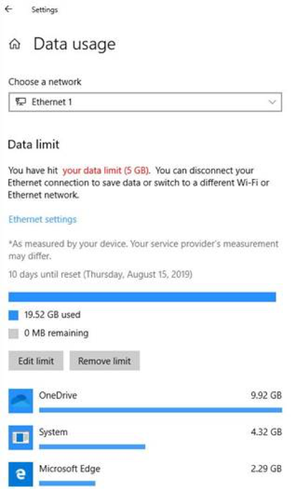

We hope you like the changes! If you have any feedback about these, you can share it via the Feedback Hub under Network and Internet > Networking Experience – Look and Feel.

## Traditional Chinese IME Improvements (Build 18956)
Thank you everyone who’s shared feedback about the new Traditional Chinese Bopomofo / ChangJie / Quick IME so far! The development team has been working on improving the quality and fixing bugs based on what you’ve told us, including:
* __Bopomofo, ChangJie, and Quick IMEs:__ We improved the speed of toggling conversion mode ([中] mode and [英] mode). Now it you can switch between the two faster.
* __Bopomofo IME:__ We heard feedback that some of you’ve been accidentally hitting the Shift + Space keyboard shortcut, resulting in the character width changing unexpectedly between Half-width and Full-width, so we’ve added a new setting for this if you’d prefer to disable the keyboard shortcut (Note: The default is enabled). To access this setting, right click the [中/英] icon in the taskbar, click Settings > General > “Use Shift + Space to switch character width”.

As you may have noticed in the screenshot below, we’re now adding the ability to change the candidate font size, separate from the rest of the system if you find that you need it to be a bit bigger. (You can still change the system font size under [Ease of Access]>[Display]>[Make text bigger].)

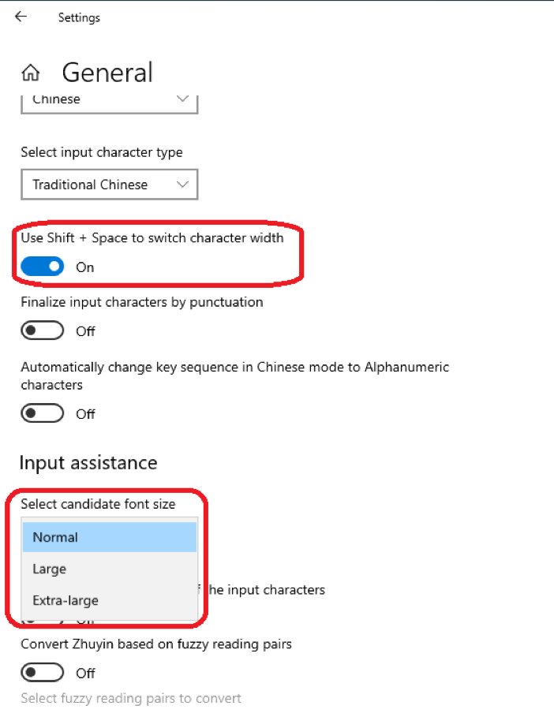
 
## Calculator app updates (Build 18956)
Over the next few days we’ll be starting to roll out a Calculator app update to Insiders in the Fast ring. This app is most notable because it adds the ability to put Calculator in an Always on Top mode! Thanks everyone who shared feedback requesting this – we look forward to you trying it out. Once you have the updated version, you’ll be able to switch into the Always on Top mode by clicking the icon next to the calculator mode name.

## Accessibility Improvements (Build 18956)
•	__Text Cursor Indicator Preview:__ Changes to the text cursor indicator can now be viewed on the fly in a new preview pane when changing the size or color in the Text cursor page in Ease of Access.  
•	__Magnifier reading now supports 3 new ways to start reading:__ Press the play button to start reading from the top of content, or selected text if text was selected, or press the read from here button then click where you want to start reading. Note that this experience works with apps with large content like Edge, Word, Mail, etc. __Known issue:__ Play from top may not work at times and you will hear “cannot read from here.”  
•	__Narrator__ gives page summaries and popular links: In Build 18894, we released a quick summary with Narrator + S that will give you headings, links, and landmarks. Pressing Narrator + S twice quickly will open a dialog window with the number of headings, landmarks, and links and a list of popular links. Popular links are the most commonly used links on the website, and you can navigate directly to those links from the page summary.
•	__New Narrator Sound Scheme:__ We’ve revamped Narrator sounds to be more functional and responsive. As part of that effort, we added sounds for common actions, such as when you land on a link or when you turn on or off scan mode. To manage sounds for common actions, go to Narrator settings.  
•	In [Build 18945](https://blogs.windows.com/windowsexperience/2019/07/26/announcing-windows-10-insider-preview-build-18945/), we released a more efficient reading experience in Outlook when arrowing through emails. If the older reading experience is preferred, you can disable the new reading experience by unchecking the “Have Narrator be more efficient in Outlook (experimental)” option in Narrator Settings.

## Sideloading setting for MSIX no longer required (Build 18956) 
Starting in this build, enabling the sideloading setting is no longer required to install MSIX packages. Prior to this, you would need to enable a sideloading policy through Settings or group policy to deploy an MSIX package. Now, you can deploy a signed MSIX package onto a device without a special configuration. As part of this change, we have changed the developer mode to be a toggle in the For developer page in Settings. Enterprises can still disable sideloading behaviors via enterprise policy. To learn more about MSIX, please refer to the documentation here: aka.ms/msix.

## Japanese IME Improvements (Build 18950)
Thank you everyone who’s shared feedback so far about the new Japanese IME. The development team has been working on improving the quality based on your feedback. Here are some improvements that you can try out in this build:
* __Prediction Candidate window key navigation:__ We fixed an issue where the focus inside prediction candidate window wouldn’t move when using the Up Arrow key.
* __Key customization:__ We’ve improved the discoverability of key assignment settings. Also, based on feedback, we’ve updated the default assigned value of Ctrl + Space to be “None”. Ctrl + Space can still be used for toggling IME-on/off by changing the value through its setting.

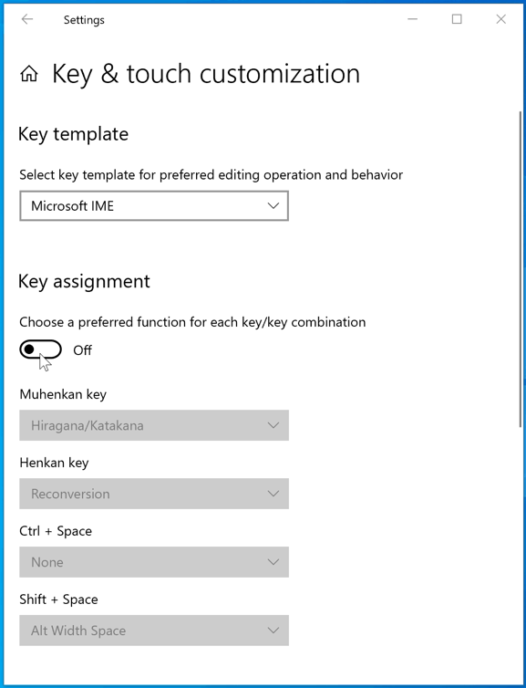

Please don’t hesitate to continue [sharing your thoughts with us](https://aka.ms/inputfeedback) about typing in Windows – our ears are open and we’d love to hear from you.

## Introducing a new Cortana experience for Windows 10 (Build 18945)
We are beginning to roll out a new Cortana experience for Windows 10 as a Beta to Windows Insiders in the U.S. This new experience features a brand-new chat-based UI that gives you the ability to type or speak natural language queries.

It supports most of the Cortana features people enjoy using on Windows, such as Bing answers, Assistant conversations, opening apps, managing lists, and setting reminders, alarms, and timers. And we’ve added some new features we think people will enjoy:

* Cortana now supports both light and dark themes in Windows.
* We have created a new, less intrusive screen for “Hey Cortana” queries so you can stay in the flow while you work.
* We have updated Cortana with new speech and language models, and significantly improved performance – making it faster and more reliable than ever before.

Not all the features from the previous Cortana experience are available just yet. As a Beta, we plan to add more features over time with updates to Cortana from the Microsoft Store.

To get started, choose the Cortana icon on the taskbar next to the search box. You may need to sign in with your account to get started. You can also leverage the speed and convenience of voice with improved speech recognition by simply saying “Hey Cortana”. To enable this functionality, go to Settings > Privacy > Voice activation and enable "Let Cortana respond to 'Hey Cortana' keyword".

__Note:__ 
* Starting with Build 18980, all Insiders worldwide will see the Cortana icon and the new app. In a future Cortana app update, customers will have the option to use Cortana if they speak a supported language, regardless of their OS display language. 
* The new Cortana app currently supports English (United States)—because Cortana is service backed. We can and will continue to add new languages over the coming months outside the bounds of OS build updates. We expect to support the same set of regions and languages we [currently support in retail](https://support.microsoft.com/help/4026948/cortanas-regions-and-languages) by 20H1 launch. We will share more details of our language rollout plans as they progress and appreciate your patience during this transition period.
* Historically, there were quite a few skills that could be used unauthenticated (Bing answers, open apps, Assistant conversations) but this is no longer the case. Only limited skills are currently supported in the new experience. We’ll be bringing back many skills over the coming months.

## Windows Subsystem for Linux (WSL) Improvements (Build 18945) 
### Added connecting via localhost to WSL 2 Linux apps from Windows and global WSL configuration options

You’ll now be able to connect to your WSL 2 Linux networking applications using localhost. For example, the image below shows starting a NodeJS server in a WSL 2 distro, and then connecting to it in the Edge Browser with localhost.

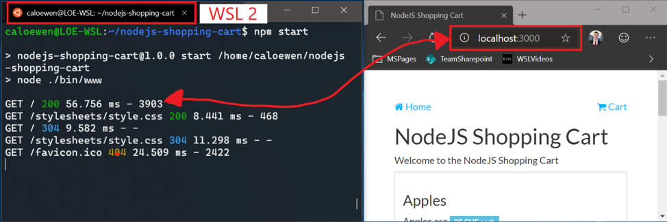

Additionally, we’ve added global configuration options for WSL. These are options that will apply to each of your WSL distros. This also allows you to specify options that relate to the WSL 2 virtual machine (VM), as all your WSL 2 distros run inside of the same VM. The most exciting option that you’ll get access to in this build is being able to specify a custom Linux kernel!
For the full details on what’s new in this release, check out [What’s new for WSL in Insiders Preview Build 18945](https://devblogs.microsoft.com/commandline/whats-new-for-wsl-in-insiders-preview-build-18945) on the Windows command line blog.

## Accessibility Improvements (Build 18945)

### Narrator now provides a more efficient reading experience when reading messages in Outlook or Windows Mail

When the message is opened, Scan Mode will turn on automatically. This allows the user to use their arrow keys to read the message in addition to all other Scan Mode hotkeys to jump through the text of the message.

Email messages like newsletters and marketing content are often formatted using tables to visually represent the look of the message. For a screen reader user, this information is not needed while reading the message. Narrator now recognizes some of these situations and will remove the information about the table to allow you to quickly move through the text contained in the message. This lets you to be much more efficient while reading these types of email messages.

### Narrator’s Outlook folder reading has been enhanced for an optimal triaging experience
As you read through your emails in Outlook, such as the inbox, Narrator now reads the information more efficiently. Each line item now starts with the status of the email, such as unread, forwarded, etc., followed by the other columns, such as from, subject, etc. Column headers will be silenced and columns with no data or that have the default (expected value) will be silenced, such as normal importance or unflagged, etc. While in Outlook, headers can be turned back on by pressing Narrator + H which will toggle their reading on and off.

### Text cursor indicator
Have you ever had an issue finding the text cursor in the middle of a large amount of text, during a presentation, or on the screen in an educational setting? The new Text cursor indicator will help you see and find the text cursor wherever you are at any time! Select from a range of sizes for the text cursor indicator and make it a color easy for you to see. Or, personalize the color of your text cursor indicator to your personal preference. In the Ease of Access settings, open the new Text cursor page, turn on the text cursor indicator, and never lose track of your text cursor ever again!

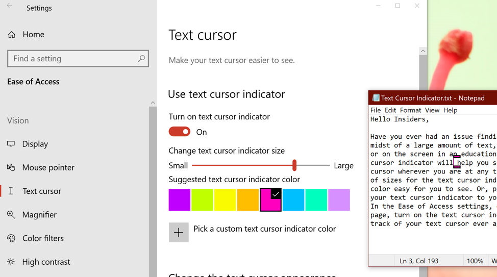

## Updating the Korean IME (Build 18941)
Earlier in this development cycle, we released [updated versions of both the Chinese and Japanese IMEs](https://blogs.windows.com/windowsexperience/2019/04/10/announcing-windows-10-insider-preview-build-18875/). As part of our ongoing efforts to modernize and improve your typing experience in Windows, today we’re rolling out an updated version of the Korean IME to all Insiders in the Fast ring. This update is going out with the goal of making the IME more secure, reliable, and more beautiful to look at.

For those who’re familiar with typing in Korean, the changes will be most noticeable if you write in Hanja; we have a new candidate selection window that uses modern controls and clearer typography:

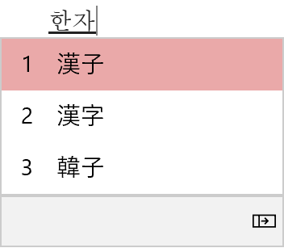

We have also improved the algorithm used for text prediction when writing Korean using the touch keyboard. Text suggestions should now be more accurate and relevant to what you are writing.
With this change, we have a couple of known issues we’re working on addressing:
* Typing very fast in Notepad can cause the IME to stop working. If you experience this, restarting Notepad should resolve it.
* Pressing hotkeys, such as CTRL + A, in while in the middle of writing a Hangul letter has inconsistent behavior across apps.

We started rolling this change out to a small portion of Insiders a few days ago, and appreciate the feedback shared so far! Your feedback helps make Windows is better for everyone, so please don’t hesitate to [continue sharing your thoughts and experiences](https://aka.ms/inputfeedback).

## Quick Event Create from the Taskbar (Build 18936)
You can now quickly create an event straight from the Calendar flyout on the Taskbar. Just select the date and time at the lower right corner of the Taskbar to open the Calendar flyout and pick your desired date and start typing in the text box. You’ll then see inline options to set a time and location.

Note: This feature is available in Insider Preview builds in both the Fast and Slow rings.

'

## Go passwordless with Microsoft accounts on your device (Build 18936)
For improved security and a more seamless sign-in experience, you can now enable passwordless sign-in for Microsoft accounts on your Windows 10 device by going to Settings > Accounts > Sign-in options, and selecting ‘On’ under ‘Make your device passwordless’. This will strengthen your device sign-in by switching all Microsoft accounts on your device to modern multifactor authentication with Windows Hello Face, Fingerprint, or PIN, and eliminating passwords from Windows.

Don’t have Windows Hello set up yet? No problem! We’ll walk you through the setup experience on your next sign-in. Curious how a Windows Hello PIN is more secure than a password? Learn more [here](https://channel9.msdn.com/Blogs/One-Dev-Minute/Why-is-the-PIN-for-Windows-Hello-more-secure-than-a-password--One-Dev-Question). 
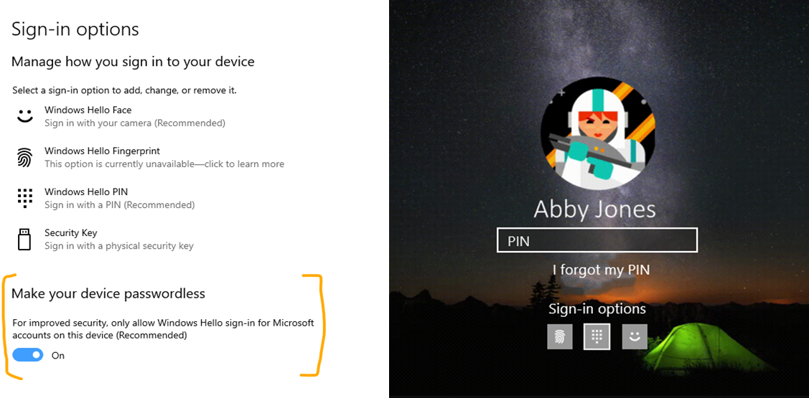'

Please note: This feature is currently being rolled out to a small portion of Insiders and the above option may not show for all users in Settings. If the toggle isn’t showing for you yet, check back in a week so.

## Eye Control Improvements (Build 18932)
We’re continuing to extend and improve Eye Control based on your customer feedback. With this release, we have improvements in the following areas, which we invite your feedback about through the Feedback Hub and [Microsoft Accessibility Feedback Forum](https://microsoftaccessibility.uservoice.com/forums/307429-microsoft-accessibility-feedback?category_id=317314).

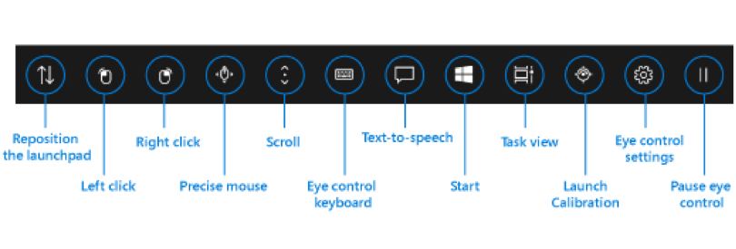

__Drag-and-drop:__ One of the most requested features, performing mouse drag-and-drop, is now implemented in Eye Control. When turned on from within Eye Control’s settings screen, the precise mouse control tool now allows mouse drag operations, as well as the ability to combine clicks and drags with Shift and Ctrl modifier keys.

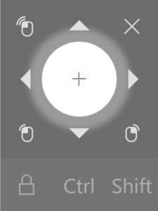

__Pause:__ We’ve made improvements to the pause experience. Selecting the pause button completely hides the launchpad. When dismissed, the launchpad reappears when you briefly close your eyes or look away from the screen. This allows uninterrupted viewing of full screen content, like watching a video. Similarly, it also allows eye gaze enabled applications to be used without triggering Eye Control features, useful if playing the [recently launched Eye First applications](https://blogs.msdn.microsoft.com/accessibility/2019/06/18/eyesfirstgame/).

__Switch support:__ Previously, Dwell was the method for clicking a button. Dwelling is the act of fixing your eyes on part of the screen and keeping your eyes there for a specific amount of time. In this release, we’re adding a second activation method, switch. In this method, dwell is used to select the target, but clicking a button is done with switch. Currently switches on joysticks, or devices emulating joysticks, are supported.

__Under the hood__ People wishing to develop their own gaze enabled applications can do so using the open source Gaze Interaction Library in the [Windows Community Toolkit](https://docs.microsoft.com/windows/communitytoolkit/). In this revision of Eye Control, the user interface is implemented using the same code that is in the Gaze Interaction Library.

__Settings:__ We have updated settings to allow you to manage more Eye Control features. This includes enabling some of the new features and more fine control of the numeric values that change how responsive the system is to eye movements. This allows for a more customized and natural feel for your Eye Control experience.

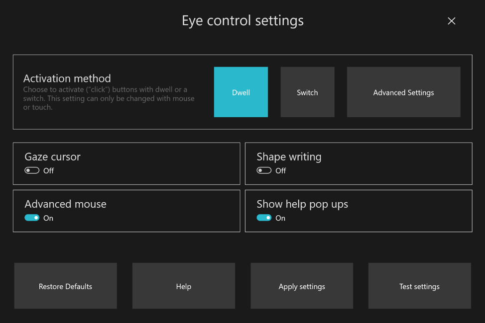

## Other Accessibility Improvements (Build 18932)
* __Narrator will now automatically start reading webpages and emails:__ Do you want to hear the most valuable content faster? Narrator now automatically starts reading webpages when they are loaded. Narrator will start reading at the main landmark, if there is one, or will fall back to a reasonable paragraph. Narrator will also start automatically reading emails when they are opened in Outlook and the inbox Mail applications. If you find experiences that aren’t working well, please send us feedback.
* __The Magnifier UI now works with dark theme and text sizing options.__ The image below shows two Magnifier windows. The top one is in Light theme and default text size; the bottom one is in Dark theme and the text is scaled at 125%.

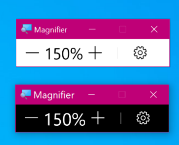

## Refining your notification settings (Build 18932)
Over the last few releases, based on your feedback, we’ve been working on giving you more control over potential interruptions. [Introducing Focus Assist](https://blogs.windows.com/windowsexperience/2018/05/09/windows-10-tip-how-to-enable-focus-assist-in-the-windows-10-april-2018-update/) to automatically suppress notifications when you’re trying to stay in the moment and not get distracted, and adding the option to use middle click to dismiss notifications if you want to quickly make a notification toast go away.
One thing we’ve heard from you, though, is that our notification settings aren’t easily discoverable. In addition, once you find the settings, they can be difficult to understand.
In order to address this, we’ve begun rolling out a few changes, including:
1. When you receive a notification toast, there will now be an inline option to turn off notifications for that app, or head to the app’s notification settings.

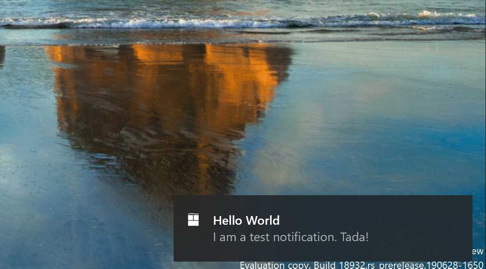

2. When you dive into an app’s notification settings, you’ll find that we’ve added pictures to help articulate the impact of a certain settings.

3. Prefer to have all your notifications muted? You no longer have to go to the old sound control panel to do that – we’ve added it as a top-level option in Notification & Actions Settings.

4. But wait, there’s more! We’ve also added a new direct link at the top of the Action Center to manage notifications, so it takes one less step to get to Notification & Actions settings. To make room for this we’ve moved the “no notifications” text down to the middle of the Action Center, which also means your eyes don’t have to traverse as far to see it when you launch the Action Center from the bottom of the screen.

5. Finally, ever dismissed a notification you wanted to disable, and went to Notification & Actions Settings only to find the list of notification senders to be really really long? You can now sort the list by which apps most recently sent notifications.

## Language Settings Improvements (Build 18922)
The Global Language Experience team has improvements in Language Settings to make it easier for you to see the current state of your language settings at a glance. The new overview section lets you quickly know which languages are selected as default for their Windows display, Apps & websites, Regional format, Keyboard, and Speech. If everything looks as expected you can quickly move on, you can click one of the tiles which will take you to where you need to be to change that selection.

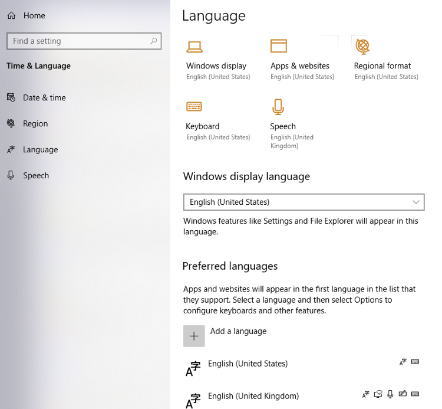

We also found through usability studies and feedback that some users didn’t understand what the different language features empowered them to do or why they might be greyed out. In response to this, we’ve reorganized the language features installation page a bit and added tool tips with descriptions.

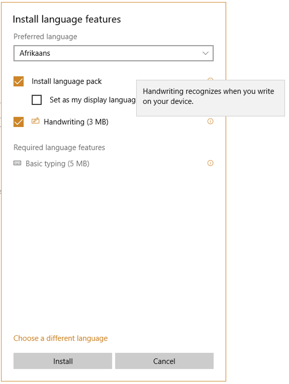

## Feedback Hub updates (Build 18922)
Based on your feedback, we’re updating the Feedback Hub with a new feature called Find Similar Feedback! When you go to log a new piece of feedback, you’ll now see a section that looks to see if there’s any existing feedback that sounds similar to yours. You can now choose to automatically link your feedback to that existing feedback (rather than creating a new piece of feedback). This is currently in the process of rolling out to Insiders with version 1.1904.1584.0 – we look forward to you trying it out!

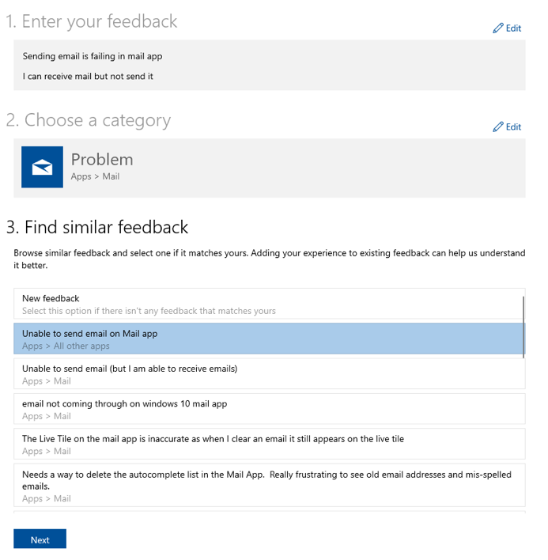

We’ve also updated the Thank You page a little bit, so that now there’s a direct button to share your feedback if that’s what you want do (rather than having to go find your feedback afterwards in the My Feedback section).  
Thank you for all the feedback you’ve been sharing with us – we hope you like these updates! This is currently in the process of rolling out to Insiders as an app update in the Microsoft Store (version 1.1904.1584.0) – we look forward to you trying it out. 

## New download throttling options for Delivery Optimization (Build 18917)
We’ve heard from our users with very low connection speeds that setting download throttling as a percentage of available bandwidth isn’t providing enough relief in reducing the impact on their network. That’s why we’ve added a new option to throttle the bandwidth used by Delivery Optimization as an absolute value. You can set this separately for Foreground downloads (downloads that you initiate from Windows Store for example) or background downloads. This option already exists for IT Pros who use Group Policies or MDM policies to configure Delivery Optimization. In this build, we’ve made it easier to set via the settings page. You can access this option via Settings > Update & Security > Delivery Optimization > Advanced Options

## Narrator Data Table Reading improvements (Build 18917)
We’ve optimized the information you hear with Narrator when navigating a table using table navigation commands. Narrator now reads the header data first, followed by the cell data, followed by the row/column position for that cell. Additionally, Narrator only reads the headers when the headers have changed, so you can focus on the content of the cell.

## Windows Subsystem for Linux 2 (Build 18917)
WSL 2 is a new version of the architecture that powers the Windows Subsystem for Linux to run ELF64 Linux binaries on Windows. This new architecture, which uses a real Linux kernel, changes how these Linux binaries interact with Windows and your computer’s hardware, but still provides the same user experience as in WSL 1 (the current widely available version). WSL 2 delivers a much faster file system performance and full system call compatibility, which lets you run more applications like Docker!
[Read more about the release of WSL 2](https://devblogs.microsoft.com/commandline/wsl-2-is-now-available-in-windows-insiders/).

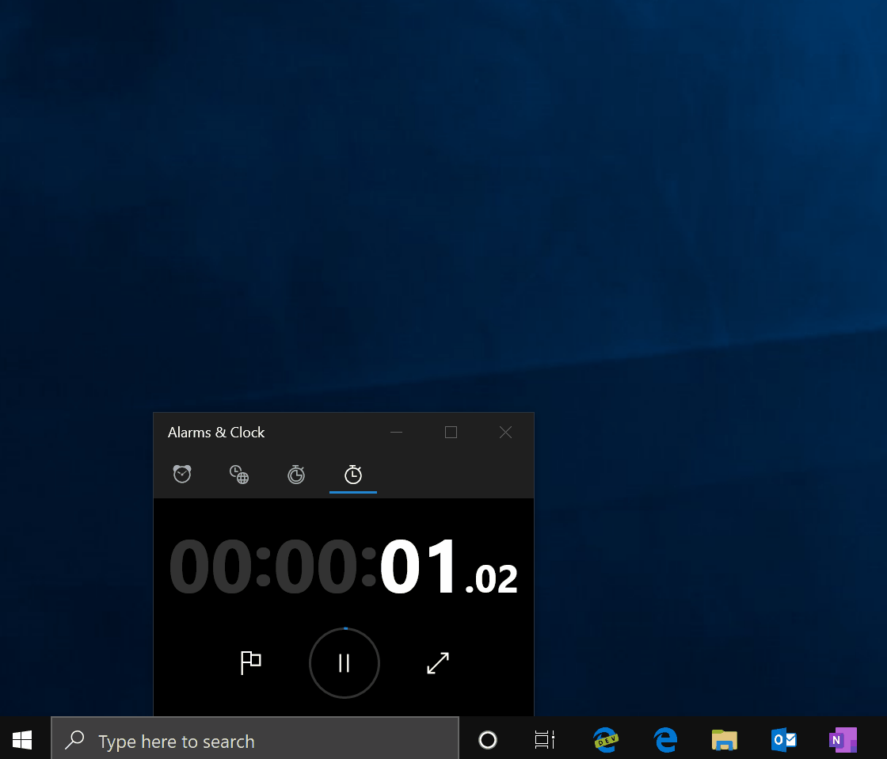

## Windows Ink Workspace Updates (Build 18917)
As we mentioned last week, you may notice that Windows Ink Workspace has changed on your PC. That’s because we’re updating the Windows Ink Workspace experience and starting to roll it out to some Insiders.

As part of this, Windows Ink Workspace now takes up less screen real estate, and we’re converging our whiteboarding experiences with a new direct link to our [Microsoft Whiteboard app](https://products.office.com/\/microsoft-whiteboard/digital-whiteboard-app). Microsoft Whiteboard is a freeform digital canvas where ideas, content, and people can come together. It includes an infinite canvas, optional backgrounds (including graph paper and solid dark grey) to choose from, rainbow ink support, multiple pages, and generally addresses much of the feedback you shared with us about Sketchpad. If you used Sketchpad, don’t worry – we saved the sketch you were working on in your Pictures folder.

We heard your feedback, and we’ve streamlined the Windows Ink Workspace for you. Stay tuned as we continue to evolve! Once the new experience arrives on your PC, please take a moment to try it out and share feedback via Feedback Hub under Desktop Environment > Windows Ink Workspace. If the Windows Ink Workspace icon isn’t visible in your taskbar, you can show it by right-clicking the taskbar and selecting “Show Windows Workspace Icon.”

## Narrator “Click me” link solution (Build 18912) 
Do you get frustrated tabbing through “Click me” links? Narrator can now tell you the title of the page that’s linked to—just press Caps + Ctrl + D, and Narrator will take the URL of the hyperlink you are on and send it to an online service that will provide the page title to Narrator. If you would like to disable all online service usage by Narrator, you can turn this off in Narrator Settings. If you find links that don’t give you a meaningful page title, please send us feedback. Thanks!

## Disk type now visible in Task Manager Performance tab (Build 18898)
A small, but perhaps convenient change — you’ll now be able to see the disk type (e.g. SSD) for each disk listed in Task Manager’s performance tab. This is particularly helpful in cases where you have multiple disks listed, so you can differentiate between them.

## Updated File Explorer search (Build 18894)
We’ve heard your feedback asking for increased consistency, and to make it easier to find your files. Over the next few days we’ll be starting to roll out a new File Explorer search experience – now powered by Windows Search. This change will help integrate your OneDrive content online with the traditional indexed results. This rollout will start with a small percent, and then we’ll increase the rollout to more Insiders as we validate the quality of the experience.

What does that mean for you? Once you have the new experience, as you type in File Explorer’s search box, you’ll now see a dropdown populated with suggested files at your fingertips that you can pick from.

These improved results can be launched directly by clicking the entry in the new suggestions box, or if you want to open the file location, just right-click the entry and there’ll be an option to do so. If you need to use commands or dig deeper into non-indexed locations, you can still press enter and populate the view with the traditional search results.

We’ve also updated the design, so now as soon as you click the search box in File Explorer (or press CTRL+E to set focus to it), you’ll see the dropdown list with your search history.

If you encounter any issues, or have any feedback, file them under “Files, Folders, and Online Storage” > “File Explorer” in the Feedback Hub.

NOTES: You may notice in the screenshot, we’ve made the File Explorer search box wider so the suggestions dropdown has a bit more room to show results – that’s not a new option, but we figured you might want to know how to do it: just move your mouse to the starting border of the search box, and your mouse should turn into a resizing double arrow cursor. Just click down and drag the search box to be a bit wider.

## Accessibility improvements (Build 18894)
* __Table reading improvements:__ Narrator is now more efficient when reading tables. Header information is not repeated when navigating within the same row or column. Entering and exiting tables is also less verbose.
* __Narrator web page summary:__ There’s a new command in Narrator to give a webpage summary! (Narrator + S). Currently this command will give information about hyperlinks, landmarks and headings.
* __Magnifier text cursor setting:__ Windows Magnifier has a new ability to keep the text cursor in the center of the screen making it easier and smoother to type. Centered on the screen is on by default and can be changed in the Magnifier settings.

## Expanding dictation support to more languages (Build 18885)
Ever had a word that you just can’t figure out how to spell? Or like to think out loud and wanna automatically jot it all down? In addition to English (United States), we now support dictation when using English (Canada), English (UK), English (Australia), English (India), French (France), French (Canada), German (Germany), Italian (Italy), Spanish (Spain), Spanish (Mexico), Portuguese (Brazil), and Chinese (Simplified, China)

How to try it? Set focus to a text field and press WIN+H! Or you can tap the little microphone button at the top of the touch keyboard. Say what you wanna say, then press WIN+H a second time or tap the mic button to stop the dictation, or let the dictation session time out on its own. 

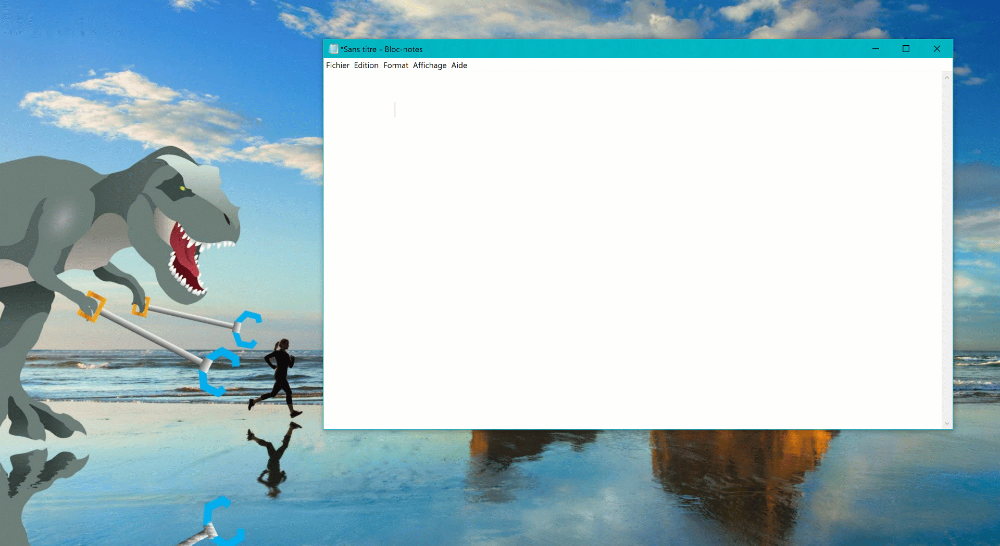

We’d love to hear your feedback – you can report issues or make feature requests under Input & Language > Speech Input in the Feedback Hub.

Notes:
* Speech resources will need to be downloaded for dictation to work. To check that they’re available, go to Language Settings, click on the desired language, and then click on Options. If speech resources are available but haven’t been downloaded, there should be a download button.
* Dictation is based on the language of your active keyboard. To switch between preferred languages, press WIN + Space.

## Cross-language support in Feedback Hub 
Based on your feedback, with Feedback Hub version 1.1903, Insiders with Windows set to a language other than English now have the option of browsing English feedback within the Feedback Hub, as well as submitting feedback in English on the New Feedback form.

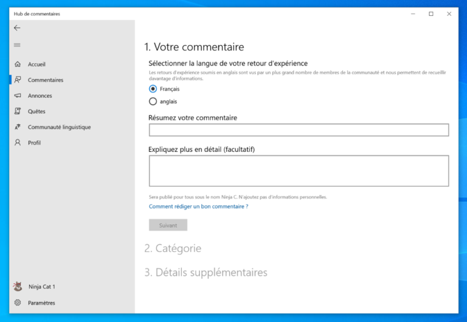

## East Asian Microsoft Input Method Editor (IME) Improvements (Build 18875)
__The New Japanese IME is now available to all Insiders in Fast.__ During 19H1, we announced that we were working on [a new Japanese IME](https://blogs.windows.com/windowsexperience/2018/11/07/announcing-windows-10-insider-preview-build-18277/). We got a lot of great feedback, and the IME was taken offline for a time while we worked on improving the experience based on what you had told us. Today the IME—now more secure, more stable, with improved game compatibility, and more—is once again available for all Insiders starting with this build. If you speak Japanese, please take some time to evaluate how it feels to use the IME (with all the improvements) for daily usage, and let us know what you think! If you already were using the Japanese IME, you’ll automatically have the new one when you install this build—if you weren’t already using the Japanese IME, you can add it by going to Languages Settings and adding Japanese to the list.

__New IMEs are available for Simplified and Traditional Chinese.__ Just like the Japanese IME above, we’ve been working on refining your Chinese typing experience, and are happy to share that we have new versions of the Chinese Simplified IMEs (Pinyin and Wubi), as well as the Chinese Traditional IMEs (Bopomofo, ChangJie and Quick). We’ve improved the security and reliability by redesigning how they work with applications. You’ll also notice we’ve added a cleaner interface for the candidate window and settings pages. Improved and renewed settings of the IMEs are available in the Settings app. If you’re using one of the IMEs and you’d like to check it out, the fastest way there is to right-click the IME mode indicator in the taskbar and select Settings (you can get there from the Language Settings page by clicking the language, and going into options). Looking forward to hearing [what you think about it](https://aka.ms/inputfeedback)! 

## Bringing SwiftKey’s Typing Intelligence to Even More Languages (Build 18860)
As many of you know, we’ve been working on bringing SwiftKey’s typing intelligence to Windows. We’re excited to announce that we’re expanding support to these 39 languages:

Afrikaans (South Africa),  Albanian (Albania),  Arabic (Saudi Arabia),  Armenian (Armenia), Azerbaijani (Azerbaijan), Basque (Spain), Bulgarian (Bulgaria), Catalan (Spain), Croatian (Croatia), Czech (Czech Republic), Danish (Denmark), Dutch (Netherlands), Estonian (Estonia), Finnish (Finland), Galician (Spain), Georgian (Georgia), Greek (Greece), Hausa (Nigeria), Hebrew (Israel), Hindi (India), Hungarian (Hungary), Indonesian (Indonesia), Kazakh (Kazakhstan), Latvian (Latvia), Lithuanian (Lithuania), Macedonian (Macedonia), Malay (Malaysia), Norwegian (Bokmal, Norway), Persian (Iran), Polish (Poland), Romanian (Romania), Serbian (Serbia), Serbian (Serbia), Slovak (Slovakia),  Slovenian (Slovenia), Swedish (Sweden), Turkish (Turkey), Ukrainian (Ukraine), Uzbek (Uzbek)

What does this mean for you? Basically, we’re updating the underlying language model when typing in each of these languages, to improve the accuracy of the autocorrections, shapewriting, and predictions. You’d notice this when using the touch keyboard, or the hardware keyboard text predictions (if enabled). If you use these languages above to type, help us make your typing experience even better by sharing feedback! ([being as specific as possible](https://insider.windows.com/how-to-feedback/), if you can). We’ll be posting a Quest about this improvement in the Feedback Hub soon.

## Improved Windows Sandbox accessibility (Build 18855)
We have made several updates to improve Windows Sandbox accessibility scenarios. This includes: 
* Microphone support
* Added functionality to configure the audio input device via the Windows Sandbox config file
* A Shift + Alt + PrintScreen key sequence in Windows Sandbox which activates the ease of access dialog for enabling high contrast mode.
* A ctrl + alt + break key sequence in Windows Sandbox which allows entering/exiting fullscreen mode

## Windows Sandbox configuration file support (Build 18841)
Windows Sandbox now supports configuration files! These files allow users to configure some aspects of the sandbox, such as vGPU, networking and shared folders. [Check out the blog post explaining this new feature](https://aka.ms/WindowsSandbox_ConfigFile).
