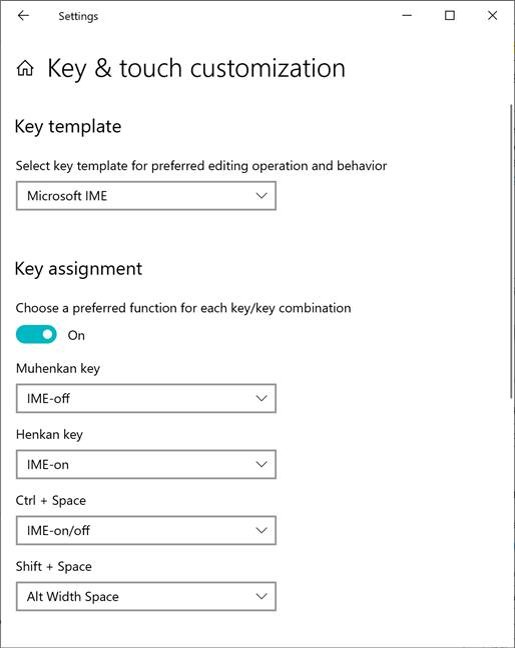

# What's new for Windows 10 Insider Preview Builds (20H1)
The [Windows Insider Program](https://insider.windows.com/en-us/) lets you preview builds of the upcoming 20H1 release of Windows 10. This topic lists all new Windows 10 features for you to try. 

## East Asian Microsoft Input Method Editor (IME) Improvements (Build 18875)
__The New Japanese IME is now available to all Insiders in Fast.__ During 19H1, we announced we were working on [a new Japanese IME](https://blogs.windows.com/windowsexperience/2018/11/07/announcing-windows-10-insider-preview-build-18277/#jJxpLldDZEsihHJv.97). We got a lot of great feedback, and the IME was taken offline for a time while we worked on improving the experience based on what you’d told us. Today the IME – now more secure, more stable, with improved game compatibility, and more – is once again available for all Insiders starting with this build. If you speak Japanese, please take some time to evaluate how it feels to use the IME (with all the improvements) for daily usage, and let us know what you think! If you already were using the Japanese IME, you’ll automatically have the new one when you install this build – if you weren’t already using the Japanese IME, you can add it by going to Languages Settings and adding Japanese to the list.

__New IMEs are available for Simplified and Traditional Chinese.__ Just like the Japanese IME above, we’ve been working on refining your Chinese typing experience, and are happy to share that we have new versions of the Chinese Simplified IMEs (Pinyin and Wubi), as well as the Chinese Traditional IMEs (Bopomofo, ChangJie and Quick). We’ve improved the security and reliability by redesigning how they work with applications. You’ll also notice we’ve added a cleaner interface for the candidate window and settings pages. Improved and renewed settings of the IMEs are available in the Settings app. If you’re using one of the IMEs and you’d like to check it out, the fastest way there is to right-click the IME mode indicator in the taskbar and select Settings (you can get there from the Language Settings page by clicking the language, and going into options). Looking forward to hearing [what you think about it](https://aka.ms/inputfeedback)! 

## Bringing SwiftKey’s Typing Intelligence to Even More Languages (Build 18860)
As many of you know, we’ve been working on bringing SwiftKey’s typing intelligence to Windows. We’re excited to announce that we’re expanding support to these 39 languages:

Afrikaans (South Africa),  Albanian (Albania),  Arabic (Saudi Arabia),  Armenian (Armenia), Azerbaijani (Azerbaijan), Basque (Spain), Bulgarian (Bulgaria), Catalan (Spain), Croatian (Croatia), Czech (Czech Republic), Danish (Denmark), Dutch (Netherlands), Estonian (Estonia), Finnish (Finland), Galician (Spain), Georgian (Georgia), Greek (Greece), Hausa (Nigeria), Hebrew (Israel), Hindi (India), Hungarian (Hungary), Indonesian (Indonesia), Kazakh (Kazakhstan), Latvian (Latvia), Lithuanian (Lithuania), Macedonian (Macedonia), Malay (Malaysia), Norwegian (Bokmal, Norway), Persian (Iran), Polish (Poland), Romanian (Romania), Serbian (Serbia), Serbian (Serbia), Slovak (Slovakia),  Slovenian (Slovenia), Swedish (Sweden), Turkish (Turkey), Ukrainian (Ukraine), Uzbek (Uzbek)

What does this mean for you? Basically, we’re updating the underlying language model when typing in each of these languages, to improve the accuracy of the autocorrections, shapewriting, and predictions. You’d notice this when using the touch keyboard, or the hardware keyboard text predictions (if enabled). If you use these languages above to type, help us make your typing experience even better by sharing feedback! ([being as specific as possible](https://insider.windows.com/en-us/how-to-feedback/), if you can). We’ll be posting a Quest about this improvement in the Feedback Hub soon.

## Improved Windows Sandbox accessibiity (Build 18855)
We have made several updates to improve Windows Sandbox accessibility scenarios. This includes: 
* Microphone support
* Added functionality to configure the audio input device via the Windows Sandbox config file
* A Shift + Alt + PrintScreen key sequence in Windows Sandbox which activates the ease of access dialog for enabling high contrast mode.
* A ctrl + alt + break key sequence in Windows Sandbox which allows entering/exiting fullscreen mode

## Snip & Sketch version 10.1901.10521.0 (Build 18850)
As some of you may have already noticed, we’re in the process of rollout out a new app update to Skip Ahead. It includes a number of fixes based on your feedback, among which are:
* We fixed an issue that could result in snips being a bit blurry after saving or copying to clipboard.
* We fixed an issue where copying to clipboard would fail if you switched out of the app while the copy operation was in progress.
* We fixed an issue where the suggested file name was unexpectedly a GUID for snips opened from Win + Shift + S toast.
* We’ve added Narrator (screen reader) confirmations when a snip is copied to clipboard.
* We’ve updated the default save format to be png. You can still use the dropdown when saving to pick your desired format if it’s not png.
* We fixed an issue where auto-copy changes to clipboard wasn’t working on return from Snip & Sketch settings.
* We fixed an issue where the app might crash if you closed two app windows one after another.
* We fixed an issue where the default save file location was documents rather than pictures. In fixing this we also fixed an issue where when saving the save dialog wouldn’t remember where you last saved a snip.

The rollout of this app is not tied to the upgrade, so you may see it outside the bounds of this flight.

## Windows Sandbox configuration file support (Build 18841)
Windows Sandbox now supports configuration files! These files allow users to configure some aspects of the sandbox, such as vGPU, networking and shared folders. [Check out the blog post explaining this new feature](https://aka.ms/WindowsSandbox_ConfigFile).