#  What's new in the Windows 10 Insider preview builds (RS5)
The [Windows Insider Program](https://insider.windows.com/en-us/) lets you preview builds of the upcoming release of Windows 10. This topic lists all new Windows 10 features for you to try. Unlike the [Windows Insider Program Blog](https://blogs.windows.com/windowsexperience/tag/windows-insider-program), this topic is organized by feature instead of by the build number so that you can see all items about a specific feature listed together.

## Acrylicic improvements

### Acrylic in task view 
The entire task view background now has a soft blur effect.

### Acrylic comes to menus and more!
Our acrylic material is being used by default in XAML controls and on transient XAML surfaces like flyouts. The new acrylic material is now applied to:
* Context menus
* Flyouts
* Auto-suggest drop down list boxes
* combo box drop down list boxes
* date and time picker flyouts
* media transport control flyouts and overflows

You will notice new acrylic backgrounds in places on the system using these controls – for example when you right-click open apps in task view. Apps using the SDK for Windows 10, version 1809 or higher will see this change by default as well.

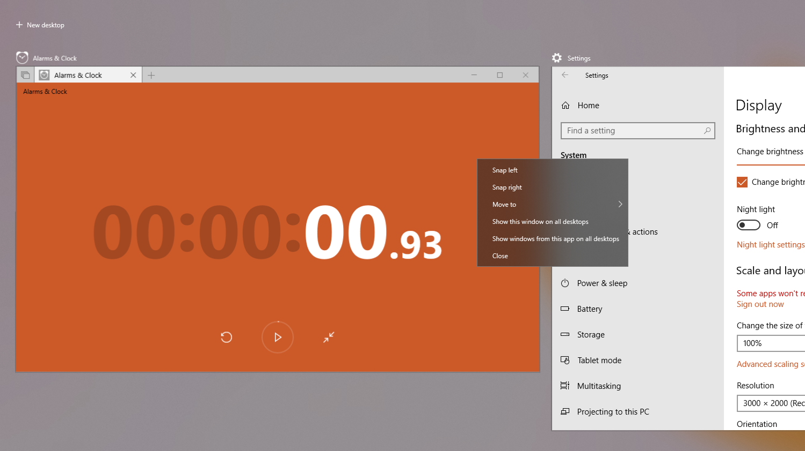

## Bluetooth battery percentage in settings
In the__Bluetooth & other devices__ page in Settings, you can check the battery level of your Bluetooth devices for Bluetooth devices that support this feature, in which case the battery percentage will update whenever your PC and the device are connected.

## New clipboard experience
Copy/paste - it's something we all do, probably multiple times a day. But what do you do if you need to copy the same few things again and again? How do you copy content across your devices? Today we're addressing that and taking the clipboard to the next level. Press WIN+V and you'll be presented with our new clipboard experience.  

Not only can you can paste from the clipboard history, but you can also pin the items you find yourself using all the time. This history roams with you using the same technology which powers Timeline and Sets, which means you can access your clipboard across any PC.  

Our new settings page for enabling this experience is under__Settings > System > Clipboard__ - please try this out and share feedback! [This link](feedback-hub:///) will open the Feedback Hub to where you can tell us about your experience and what you'd like to see next. 

__Note:__ Roaming text on the clipboard is only supported for clipboard content less than 100kb. Currently, the clipboard history supports plain text, HTML and images less than 1MB. 

## Cortana Show Me voice queries
 You can now launch the Cortana Show Me app through voice queries. Simply say to Cortana, “Show me how to change my background,” and you’ll get help content, with a new “Let’s go” button below, which launches the guided help experience. 

 You can download [Cortana Show Me](https://www.microsoft.com/en-us/store/r/cortana-follow-me/) from the Microsoft Store.

 Here are some voice queries to try:

*__Update Windows__– Try, “Update my Windows device”
*__Check if an app is installed__ – Try, “How to see what apps are installed”
*__Uninstall an app__ – Try “How to uninstall apps”
*__Change your desktop background__– Try, “Show me how to change my background”
*__Use Airplane Mode__ – Try, “How do I turn on airplane mode”
*__Change your display brightness__ – Try, “Show me how to change my screen brightness”
*__Add nearby printers or scanners__ – Try, “How to add a printer”
*__Turn off Windows Defender Security Center__ – Try, “Show me how to turn off Windows Defender Security Center”
*__Change Wi-Fi settings__ – Try, “Show me how to change Wi-Fi network”
*__Change your power settings__ – Try, “How to change when my computer goes to sleep”
*__Discover Bluetooth devices__ – Try, “Show me how to discover devices”
*__Check your version of Windows__ – Try, “How do I find my current version of Windows”

## Ease of access improvements
__Make text bigger__: We’ve heard your feedback and are excited to announce that the ability to increase text size across the system is back and better than ever! When you go to__Settings > Ease of Access > Display__ in today’s build, you’ll find a new setting called “Make everything bigger” – this slider will adjust text across the system, win32 apps, and UWP apps.

That means you can now make text bigger in Start, File Explorer, Settings, etc., without having to change the overall scaling of your system. 

### Wrap-around find and replace 
We’ve made significant improvement to the find/replace experience in Notepad. We added the option to do wrap-around find/replace to the find dialog. Notepad will remember previously entered values and the state of check boxes, and will automatically populate them the next time you open the find dialog. Additionally, when you have text selected and open the find dialog we will automatically populate the search field with the selected text.

### Text zooming
We’ve added options to make it quick and easy to zoom text in Notepad. There is a new menu option under__View > Zoom__ to change the zoom level and we display the current zoom level in the status bar. You can also use Ctrl + Plus, Ctrl + Minus and Ctrl + MouseWheel to zoom in and out and use Ctrl + 0 to restore the zoom level to the default.

### Line numbers with word-wrap
Notepad can display line and column numbers when word-wrap is enabled, and we’ve made the status bar visible by default. You can still turn the status bar off in the View menu.

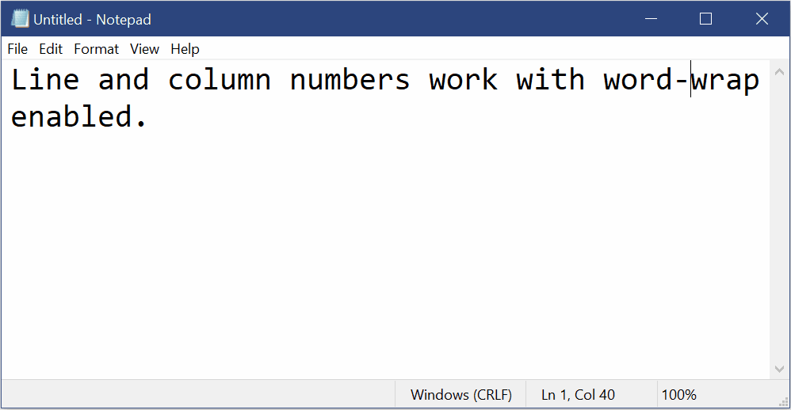

## Microsoft Edge improvements
__New, clearer__Settings and more__ (“…”) menu:__ We’ve redesigned the__Settings and more__ menu in Microsoft Edge so it’s easier to find the options you’re looking for. The menu options are now organized into groups, with icons for each entry, and keyboard shortcuts (where applicable). Click the “…” button in the top-right corner of Microsoft Edge to see what’s new.

__See your top sites in the jump list:__ You can now see your top sites in the jump list on the Windows task bar or Start menu. Just right-click the Microsoft Edge icon to see a list of your most visited sites and pin the ones that matter most to you. Right-click on any entry to remove it from the list. 

__Organize the tabs you’ve set aside:__ It's easier to organize the groups of tabs you’ve set aside, so you can remember what’s in each group when come back to it later. Once you’ve set a group of tabs aside, choose the “Tabs you’ve set aside” icon (top left corner), and click on the label for any group to rename it.  

__Do more from the “Downloads” pane:__ We’ve added options for__Show in folder__ and__Copy link__ to the right-click menu for downloads in the__Downloads__ pane. 

__Retired XSS filter:__ We are retiring the XSS filter in Microsoft Edge. Our customers remain protected thanks to modern standards like Content Security Policy, which provide more powerful, better performing, and secure mechanisms to protect against content injection attacks, with high compatibility across modern browsers.

### Microsoft Edge PDF reader improvements
__Improved toolbar options:__ The toolbar available on a PDF document opened in Microsoft Edge will now show text descriptions for the icons to make them easily understandable by users. New options like__Add notes__ are now available in the toolbar so that these tools are handy when you need them.

__Pin/unpin PDF toolbar:__ The PDF toolbar can now be pinned at the top of the document, making all the PDF tools easily accessible if you need them. You can also unpin the toolbar for an immersive reading experience. If the toolbar is unpinned, it will hide itself – just hover over the top area to bring it back.

__Rendering improvements:__ We’ve included a bunch of rendering performance fixes so that you will see less white pages when you navigate through PDF files in Microsoft Edge.

### Per-site media autoplay controls
You can now control autoplay permissions on a per-site basis under the__Website permission__ section of the__Website Identification__ pane – just click the information icon or lock icon on the left side of the address bar and click__manage permissions__ to get started.

### Lookup definitions for words in reading view, books, and PDFs
We’ve added a new dictionary function, so you can look up definitions for key words when reading a page or document. Simply select a single word to see the definition appear above your selection.

You can choose to have a word read aloud to you to hear the correct pronunciation or expand more details from the definition. You can toggle whether definitions appear and which types of content they work in under the__General__ tab of the Microsoft Edge settings menu.

### WebDriver improvements
You can automate testing in Microsoft Edge using WebDriver. WebDriver is a Windows Feature on Demand, so you no longer need to match the build and branch manually when installing WebDriver. When you take new Windows 10 updates, your WebDriver binary will be automatically updated to match.

To install WebDriver, just turn on__Developer Mode__ in Windows 10 Settings, or install the standalone feature on the__ Manage optional features__ Settings page.

We’ve also updated WebDriver to match the latest [W3C Recommendation spec](https://www.w3.org/TR/webdriver/) with major new improvements. You can learn all about these changes on the [Microsoft Edge dev blog](https://www.w3.org/TR/webdriver/).

### Web authentication preview
Web Authentication provides an open, scalable, and interoperable solution to facilitate authentication, which replaces passwords with stronger hardware-bound credentials. The implementation in Microsoft Edge allows users to use Windows Hello (via PIN or biometrics) and external authenticators like FIDO2 Security Keys or FIDO U2F Security Keys, to securely authenticate to websites. 
 

## External GPU safe removal experience
We added a safe removal experience for external GPUs connected via Thunderbolt 3. The safe remove experience allows you to know which applications are running on an external GPU so that you can safely remove it and prevent data loss during detach.

To safely remove an external graphics card, go to the__Safely Remove Hardware and Eject Media__ icon and click to eject your GPU. If there are applications running on your external GPU, a dialog will appear with the applications that are currently running on the GPU. Close the applications to safely remove the device. If there are no applications currently running on your GPU then no dialog will appear and you can safely detach your GPU.

## Focus assist improvements when gaming 
Now focus assist will turn on automatically when you’re playing any full screen game. No more interruptions when you’re crushing it. This behavior should be turned on automatically, but you can always check by going to__Settings > System > Focus assist__ and ensuring the__When I’m playing a game__ automatic rule is enabled. For more information, see [Windows 10 Tip: How to enable Focus Assist in the Windows 10 April 2018 Update](https://blogs.windows.com/windowsexperience/2018/05/09/windows-10-tip-how-to-enable-focus-assist-in-the-windows-10-april-2018-update/).

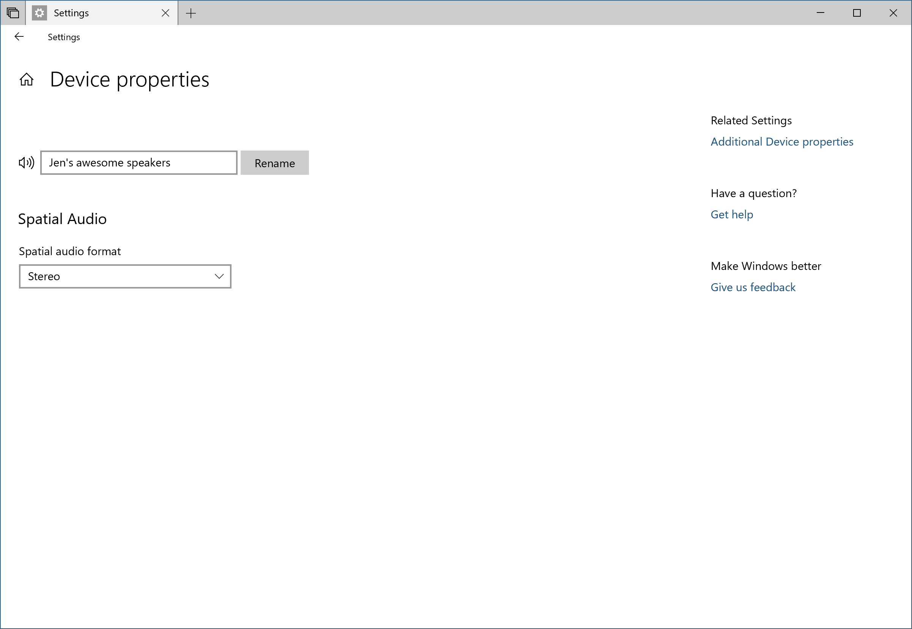

## Game bar improvements
*__Audio controls__: Change your default audio output device and mute or adjust the volume of games and apps running.
*__Performance visualizations__: See your game’s framerate (FPS), CPU usage, GPU VRAM usage, and system RAM usage.

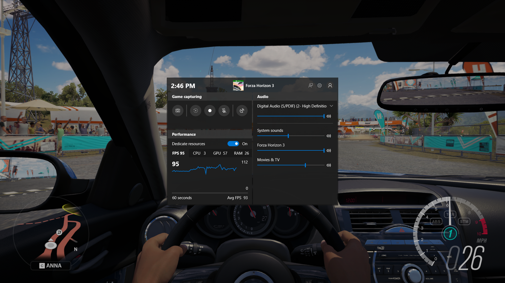

## Game mode improvements
New options are now available for Game Mode that are expected to improve the gaming experience on desktop PCs.  Gamers on PCs with many background processes may also see performance improvements when they toggle__Dedicate resources__ in Game bar.

## High Efficiency Image File Format (HEIF)
The__High Efficiency Image File Format (HEIF)__ is supported in Windows 10 and the Photos app. [HEIF is an image container](https://en.wikipedia.org/wiki/High_Efficiency_Image_File_Format) that leverages modern codecs like HEVC to improve quality, compression, and capabilities compared to earlier formats like JPEG, GIF, and PNG. In addition to traditional single images, HEIF supports encoding image sequences, image collections, auxiliary images like alpha or depth maps, live images & video, audio, and HDR for greater contrast. 

HEIF files use the HEVC video codec to compress the image into approximately half the size of JPEG. If your Windows PC does not already have the HEVC video codec, it can be purchased from the Windows Store using [this link](https://aka.ms/HEVCcodec).

In order to try this out, you need to join the Windows App Preview Program for the Photos app and make sure you are running the March release of the Photos app (Version 2018.18022.13740.0 or newer). This version of the [Photos](https://www.microsoft.com/store/productId/9WZDNCRFJBH4) app has been updated to support viewing the primary image inside a HEIF file and to guide the install of dependencies like the HEIF and HEVC media extensions from the Microsoft Store. Once installed, these media extensions enable HEIF viewing in Photos as well as thumbnails and metadata in File Explorer.

Additionally, any application that uses [WIC](https://msdn.microsoft.com/en-us/library/windows/desktop/ee719654(v=vs.85).aspx), [WinRT Imaging APIs](https://docs.microsoft.com/en-us/uwp/api/windows.graphics.imaging), or the [XAML Image control](https://docs.microsoft.com/en-us/uwp/api/windows.ui.xaml.controls.image) can now add similar support for viewing single HEIF images.

[Click here](https://aka.ms/photosfb) to open Feedback Hub and send us feedback on the HEIF experience with the Photos app and Windows 10.

You can now rotate HEIF-format images in File Explorer, and edit metadata, such as "Date taken". 
The new functionality requires the latest version of the HEIF package. The latest version will be installed automatically be the Microsoft Store. If automatic updates are disabled you can download the HEIF package manually using [this link](https://aka.ms/HEIFpackage). 

To rotate a HEIF image file, simply right-click on it in File Explorer and select "Rotate right" or "Rotate left" from the menu. "Date taken" and other properties can be edited by clicking on "Properties" and selecting the "Details" tab.

## Input 

### Emoji 11
[Unicode 11 comes with 157 new emoji](http://blog.unicode.org/2018/06/announcing-unicode-standard-version-110.html) – as of today they’re now available for Insiders to try in the build. Including superheroes, redheads, a softball, a pirate flag, and a llama all made the cut. You can access them using the Emoji Panel (WIN+.) or the touch keyboard.

We’ve also made tweaks to some of our existing emoji – here are some examples:

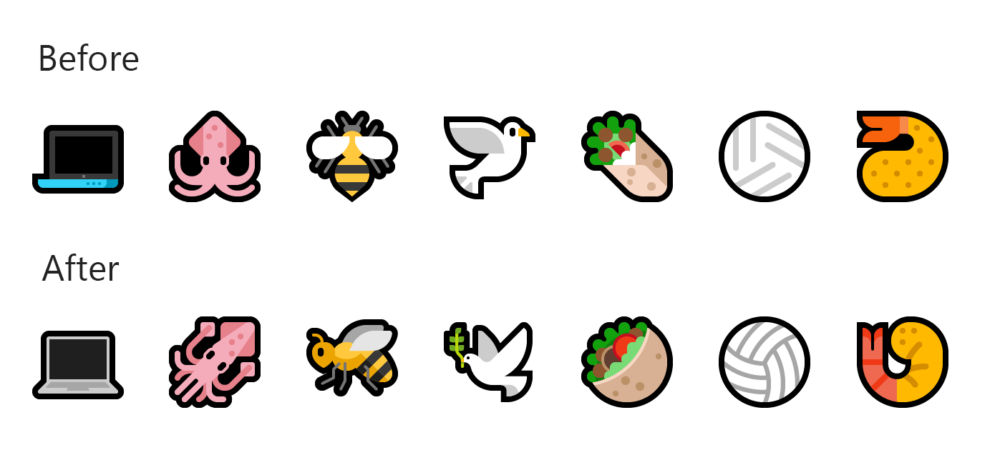

Our ninja cats got a bit of love too – can you spot the difference?

__Emoji design updates__ based on your feedback and to improve consistency, we’ve made adjustments to the design of some of our emoji. Examples of updated emoji include:

__Before__

__After__

__Emoji search comes to more languages__: You can find an emoji by keyword in over 150 locales, including English (Great Britain), French (France), German (Germany), Spanish (Spain), and more. This will help you get the emoji you want easily and quickly. As a reminder, to bring up the Emoji Panel set focus to a text field and press WIN + (period) or WIN + (semicolon).

## A faster safer internet with HTTP/2 and CUBIC
The internet is part of our daily lives both at work and at home, in the enterprise and in the cloud. We are committed to making your internet experience faster and safer. For example:

* Microsoft Edge clients will take advantage of connection coalescing for HTTP/2 as supported in Windows Server 2019
* Improved security on Microsoft Edge browsers by guaranteeing HTTP/2 preferred cipher suites
* Improved performance on Windows 10 thanks to Cubic, the new default TCP congestion provider.

For more information on how the features in Windows Server 2019 and Windows 10 brings those goals to reality, see our post [A Faster, Safer Internet](https://blogs.technet.microsoft.com/networking/2018/08/01/faster-safer-internet/).

## Kernel debugging improvements 
We are adding support for IPv6 to KDNET. To make room for the larger headers required for IPv6, we decreased the payload size of packets. As a result, we’re declaring a new version of the protocol, so that host PCs running the latest version of the debugger can be used to debug target PCs that only support IPv4. There is a version of WinDbg Preview available at [http://aka.ms/windbgpreview](http://aka.ms/windbgpreview). Follow the [Debugging Tools for Windows](http://aka.ms/windbgblog) blog for updates on KDNET IPv6 support and documentation. 

## Local experience packs
Local Experience Packs are Microsoft Store apps that deliver Windows display language quality improvements. You can now access them easily via the Settings App. Please go to Settings App – Time & Language – Language. Once here click on <i>Add a Windows display language with Local Experience Packs</i> link to download a Local Experience Pack from the Microsoft Store and start enjoying Windows in your preferred language.

The Settings app provides improved discoverability of features supported for each language.

We have also started utilizing Artificial Intelligence (AI) and neural network-based Machine Learning (ML) for Windows localization. Having the Local Experience Packs in the Microsoft Store allows us to take advantage of ML improvements and user feedback via [Language Community App](https://www.microsoft.com/en-us/store/p/language-community) to release better translations more frequently. This will consistently improve the experience of our international customers with Windows.

We have introduced a new __Region__ page that allows overrides to default regional format settings such as Calendar, First day of the week, Dates, Times, and Currency. 

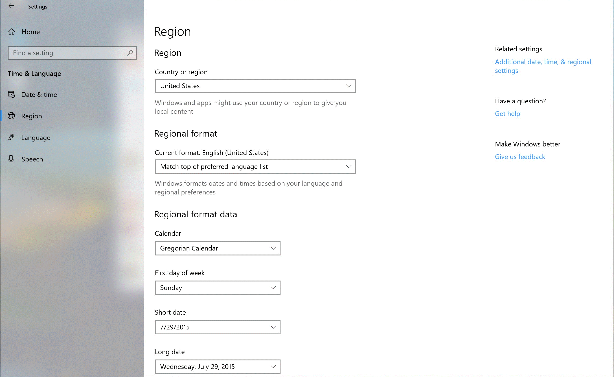

## Narrator improvements 

* __Reliability:__ We have made improvements in Narrator reliability.
*__Scan Mode:__ Reading and navigating while in Scan Mode has been improved. Selecting text in Scan Mode has also been improved. 
*__QuickStart:__ The link in settings to relaunch the QuickStart is available from the first Welcome page. The QuickStart more reliably takes focus when Narrator is launched, which means Narrator starts reading automatically.
*__Providing Feedback:__ The keystroke to provide feedback has changed. The new keystroke is__Narrator + Alt + F__. This will work both in the standard and legacy layouts.
<i>Note: The legacy layout also allows you to use__Narrator + E__ to send us feedback.</i>
*__Move Next, Move Previous, and Change View:__ When changing Narrator’s view to characters, words, lines, or paragraphs the __Read Current Item__ command will read the text of that specific view type more reliably.
*__Keyboard command changes:__ The keystroke to move the caret to the beginning of text is now__Narrator + B__ (formerly Narrator + Control + B), to move the caret to end of text is now__Narrator + E__ (was Narrator + Control + E).
*__Braille:__ Improved use of Braille commands when using the Narrator key from the braille display.
*__Narrator standard keyboard layout__: Narrator now ships with a new keyboard layout that is designed to be more familiar to screen reader users. 
*__Selection commands in Narrator scan mode__: Narrator’s scan mode now supports selecting content in Microsoft Edge, Word, Outlook, Mail, and most text surfaces. Standard shift- selection commands can be used as well as __Control + A__ for the entire document. __Caps + Shift + Down Arrow__ will speak the current selection. For a full list of selection commands, you can refer to Narrator’s __Show Commands List__ by pressing __Caps + F1__. Once content is selected you can copy it to the clipboard by pressing __Control + C__. Formatting information will also be retained. 
*__Automatic Dialog Reading__: Narrator automatically reads the contents of a dialog box when brought to the foreground. Narrator speaks the title of the dialog, the focused element within the dialog and the static text at the top of the dialog. For example, if you try to close a document in Word with unsaved changes, Narrator will speak the title “Microsoft Word,” the focus “Save button” and the static text within the dialog.
*__Narrator Find__: You now have the ability to search for text using Narrator’s new __Find__ feature. If the text is found Narrator will move to the found item. 
*__List of Objects__: Narrator can present a list of links, headings or landmarks present in the application or content. You are also able to filter the results by typing in the list or the text field of the window. 
*__Selection in Scan Mode__: Along with being able to select content in Narrator’s scan mode using Shift-selection commands, you can now also select a block of data by first moving to one end of the block and pressing __F9__, moving to the other end of the block and pressing __F10__. Once __F10__ is pressed the entire contents between the two points will be selected. 
*__Stop on Controls in Scan Mode__: Scan mode is a Narrator feature that lets you use just a few keys to move around your screen. Scan mode is already on by default in Microsoft Edge and you can toggle it on and off by pressing __Caps lock + Spacebar__. While you’re in scan mode, you can press the Up and Down arrow keys to read different parts of the page. The press of a Down arrow in Scan Mode stops on interactive elements, so that they are easier to use. An example of this behavior is  reading a paragraph with multiple links. Narrator will stop on these links when you press the Down arrow.

For more information about Narrator new keyboard layout and other known issues, refer to [Intro to New Narrator Keyboard Layout doc](http://aka.ms/RS5NarratorKeyboard).

## Time accuracy and traceability improvements

*__Leap second support:__ Windows will now support these occasional 1-second adjustments in a traceable and UTC-compliant manner. What’s a leap second? As the earth’s rotation slows, [UTC](https://en.wikipedia.org/wiki/Coordinated_Universal_Time) (an atomic timescale) diverges from [mean solar time](https://en.wikipedia.org/wiki/Solar_time#Mean_solar_time) or astronomical time.  Once UTC has diverged by at most .9 seconds, a [leap second](https://en.wikipedia.org/wiki/Leap_second) is inserted to keep UTC in-sync with mean solar time.  Since the practice of inserting leap seconds began in 1972, a leap second has typically occurred every 18 months.

*__Precision Time Protocol:__ For the highest accuracy environments, you can improve your time accuracy by leveraging a new time protocol that delivers more accurate time samples to the endpoint (Windows Server 2019 or Windows 10, host or virtual machine).

*__Software Timestamping:__ You can now further improve your network time accuracy by eliminating the software delay introduced by the Windows networking stack.

For more details about these new improvements, please see our announcement [here](https://blogs.technet.microsoft.com/networking/2018/07/18/top10-ws2019-hatime/).

## Update experience

Have you ever had to stop what you were doing, or wait for your computer to boot up because the device updated at the wrong time? To alleviate this pain, if you have an update pending we’ve updated our reboot logic to use a new system that is more adaptive and proactive. We trained a predictive model that can accurately predict when the right time to restart the device is. We will not only check if you are using your device before we restart, we will also try to predict if you had just left the device to grab a cup of coffee.

### How accurate is this model?

We’ve been using this model on internal devices, and we’ve seen promising results upon rollout.  Due to the nature of its architecture, we’re able to update the model with minimal turnaround time based on our insights from its performance. It’s all thanks to our cloud infrastructure.

### How do you give us feedback?

If you find your device restarting at the wrong time, please file a bug in the [feedback hub](https://aka.ms/updatefeedback) with the details on your experience. (i.e. I went to grab a cup of coffee for 5 minutes and it updated!). We would love to hear your stories and take it into account when training our update model.

## Windows mixed reality improvements

* You can stream audio to both the headset and the PC speakers simultaneously. To try it out make sure that you can hear sound from your normal PC speakers when not running the Mixed Reality Portal (MRP) and from the headset’s audio jack or built-in headphones when mixed reality is running. Then close all apps, including MRP, and go to Settings > Mixed reality > Audio and speech to turn on “When Mixed Reality Portal is running, mirror headset audio to desktop.” You should now hear audio from both the headset and PC speakers when running mixed reality.
* Windows no longer requires a physical monitor to be connected while running Mixed Reality in cases such as backpack PCs. Setting up WMR for the first time in Mixed Reality Portal and unlocking the PC on the sign in screen still, require a monitor to be connected initially. However, you can configure auto login to prevent needing to sign in for subsequent usage here. Using Windows Mixed Reality while standing requires setting up a room boundary.
* Apps running in Windows Mixed Reality can now make use of the Camera Capture UI API to capture images of the mixed reality world using the system capture experience. Try running Mail in the Cliff House and inserting an image from your camera in a new message to share an image of the scenic view.
* We’ve also made some adjustments to the mixed reality video capture experience in this build to make it easier to stop videos from the Start menu.

## Windows mixed reality flashlight

How many times have you been immersed in a captivating virtual experience and…
* Wanted to take a quick peek at someone nearby?
* Wanted to reach for a drink, your phone or a keyboard?
* Needed to find a surface to set down your controllers?

In the past you probably fumbled about or removed your headset, which can be clumsy if you have controllers in your hands.

We added the ability to peer into your physical environment through Flashlight – without removing your headset! With the latest Windows Insider Program build, you can open a portal into your real world at any time via the Start menu, a button shortcut, or a voice command. This opens a low-latency pass-through camera feed connected to your controller. It’s comfortable, intuitive, and keeps you immersed.

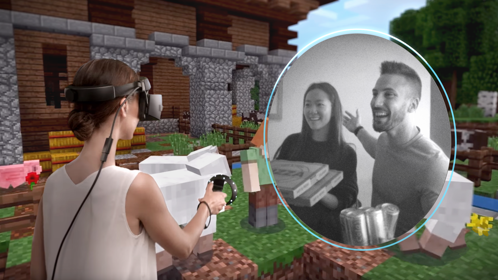

Flashlight finally allows you to mix your physical and virtual realities. 

## Mobile Broadband (LTE) connectivity on Windows gets a makeover

Windows is transforming the networking stack after 20 years through the NetAdapter framework. This framework introduces a new, more reliable, network driver model that inherits the goodness of the Windows driver framework while bringing an accelerated data path. 

The Mobile Broadband USB NetAdapter driver, a new and improved USB class driver based on the NetAdapter framework, is the default driver in Windows 10 RS5. To try this out – install on a PC that relies on mobile broadband for cellular connectivity and setup cellular connectivity and turn off Wi-fi. 

If your PC supports Mobile Broadband, i.e., your PC relies on cellular network for connectivity, and you want to try it out? Here is what you need to do:

__Step 1__: Ensure your PC can support SIM cards and USB modems (either over the internal USB bus or using a USB dongle for cellular connectivity). 

__Step 2__: Install this build (Build 17655 and higher) and setup cellular connectivity. 

__Step 3__: Choose the Net Adapter based MBB USB class driver as default driver. 

1. Navigate to Device Manager. (You can right-click on the Start button to get there.) 
2. Go to Network Adapters -> Generic Mobile Broadband Adapter or xxxxx Mobile Broadband Adapter 
3. Right click and choose update driver -> Browse my computer for driver software -> Click on Let me pick from a list of available drivers on my computer -> Choose Generic Mobile Broadband Cx Net Adapter -> Click Next. 
4. Once installed reboot for the new driver to take effect. 
5. Ensure the status of the connection remains “Connected”.

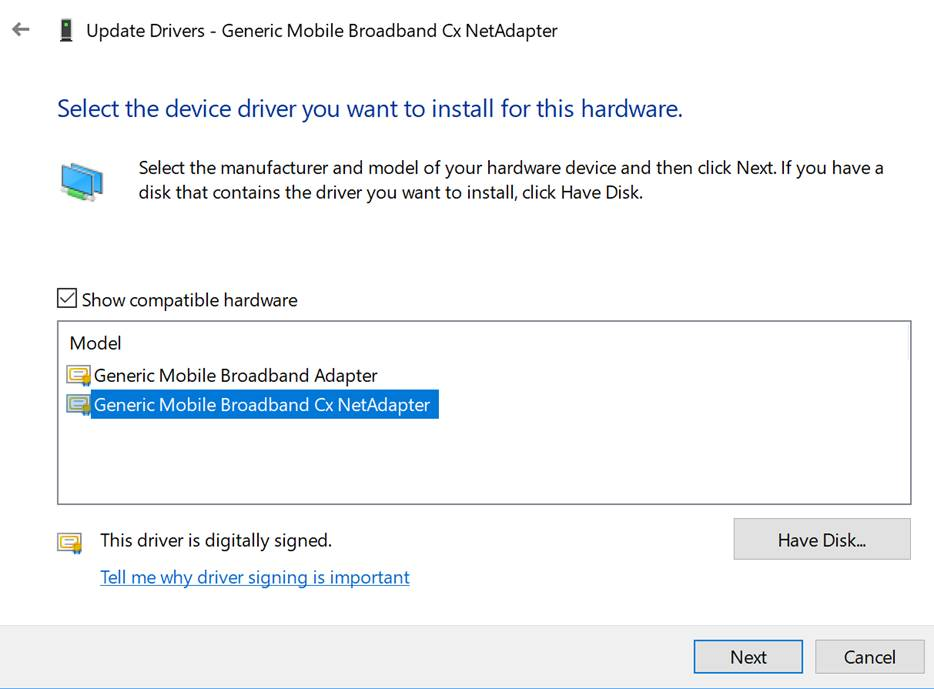

__Note__: Follow the instructions in Step 4 to revert to the default driver(xxxxx Mobile Broadband Adapter), in case of issues with Net Adapter driver(Generic Mobile Broadband Cx Net Adapter). 

__Step 4__: For Internet access, try using cellular network primarily by turning off Wi-Fi 
To report issues and give feedback, use Feedback Hub on your PC and set Category and subcategory as Network and Internet -> Connecting to a cellular network. Use [cxwmbclass] in the summary.

## Notepad improvements

### Extended line endings support for Notepad 
In addition to Windows line endings (CRLF), Notepad now supports Unix/Linux line endings (LF) and Macintosh line endings (CR)! 

For more details, check out [Introducing extended line endings support in Notepad](https://aka.ms/notepadeol). 

## Dark theme comes to File Explorer (and more!) 

As many of you know, we added dark theme support to Windows based on your feedback. This setting is available under Settings > Personalization > Colors, and if you switch it any apps and system UI that support it will follow suit. Since releasing this feature, our top feedback request from you has been to update File Explorer to support dark theme. Along the way, we also added dark theme support to the File Explorer context menu, as well as the Common File Dialog (aka the Open and Save dialogs). Thanks again for everyone’s feedback!

## Microsoft Pinyin and Wubi IMEs

*__We updated the Microsoft Pinyin IME__. We’ve been focusing on addressing your performance, reliability and compatibility feedback. You'll also notice a number of other improvements, including design improvements, a new logo for the Microsoft Pinyin IME, new IME toolbar, and dark theme support!

    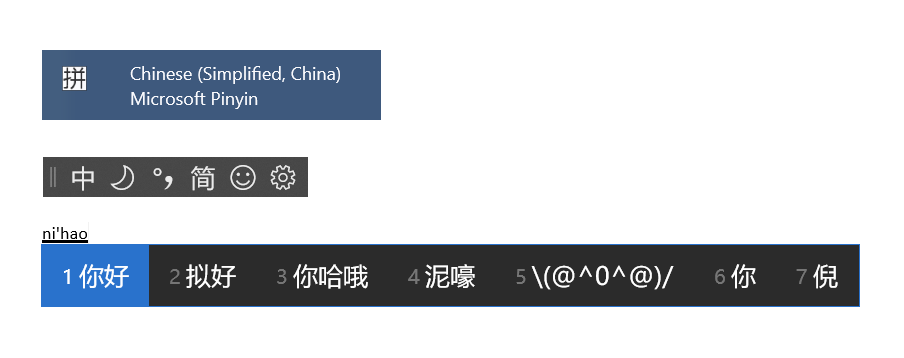

*__We updated the context menu__. We’ve added a bunch of options to the IME mode indicator’s context menu in the taskbar, so you can quickly access the things you need.

*__The IME now uses the same UX for Expressive Input as other languages__. You can bring it up by clicking the emoji button in the IME toolbar, or use the Emoji Panel hotkeys (WIN + period (.) or WIN + semicolon (;)). You can browse between Emoji, Kaomoji, and Symbol input when Chinese (Simplified) is the active locale.

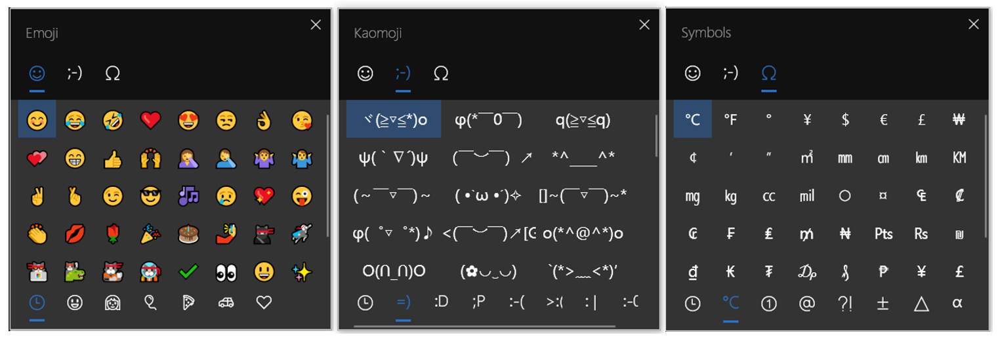

## Post-upgrade setup
You may see this window showing after you upgrade. Don’t worry – all your stuff is still there! We know some of you bought and setup your devices a long time ago – the features available in Windows have changed since then, so we’re giving you an opportunity to go through the setup questions you may have missed to ensure your device has the best setup possible. Click “Let’s Go” to go through those setup questions or click “Skip for now” if you want to go straight to your desktop. The conditions for showing this page are cloud programmable and may change over time.

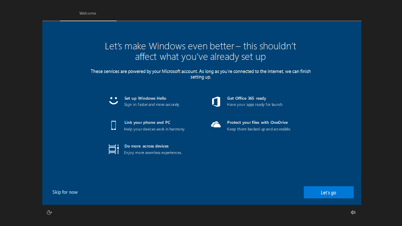

## Privacy improvements
We wanted to let you know that if access to the microphone has been disabled in your privacy settings, we’ll now pop a notification the first time an attempt to use the microphone is blocked so you can review the settings if desired.

### Privacy settings layout in the set-up experience 

__Changes to the set up experience for privacy settings__ This new design conveys focused information to help our customers make focused choices about their privacy and offers two new settings for Inking & Typing and Find my device.

## RSAT is now available on demand!
What does that mean? You no longer have to manually download RSAT every time you upgrade! Just go to “Manage optional features” in Settings (the fastest way there is to search for that) and click “Add a feature” – you’ll now see all of the RSAT components listed. Pick the ones you want, and the next time you upgrade Windows will automatically ensure all those components persist the upgrade (just like any of our other on-demand features, like speech resources or OpenSSH). Thanks to everyone who logged feedback asking for this! We’d love for you to try this out on today’s build and [let us know what you think](http://aka.ms/rsatfeedback).

## Search improvements

### Search in Calendar

Now you can find past or future events by searching for the name, location, people included or words in the event body. Events that match your search will be clearly visible on your calendar, while those that don’t will be greyed-out so you can find what you need quickly.

Search will work for Outlook, Hotmail, Live and Office 365 accounts. We do not yet support searching Exchange Server, Gmail, Yahoo or other IMAP calendars.

### Search preview
We have expanded previews to support apps, documents, and more. Search previews are here to help you: 
* Get back to what you were doing, such as a recent Word doc or Remote Desktop session 
* Jump-start your task, be it a new Outlook meeting, a quick comment in OneNote, or changing a setting 
* Disambiguate between files by seeing more info including file location, last modified, or author 
* Access quick answers from the web like “are bananas good for you?” “height of mt everest”  

We made the search experience wider so you can access information and actions in the preview faster than ever. 

__Find software downloads faster in Search!__: Continuing our theme of improving the search preview experience, we’re rolling out an update to make it easier to find official download pages for Windows software you want to install. The team is continuing to develop this experience and more is coming. 

## Sets
Sets is designed to make sure that everything related to your task: relevant webpages, research documents, necessary files, and applications, is connected and available to you in one click. With Sets, first party experiences like Mail, Calendar, OneNote, MSN News, Windows, and Microsoft Edge become more integrated to create a seamless experience, so you can get back to what’s important and be productive, recapturing that moment, saving time – we believe that’s the true value of Sets. Here are some of the things you can do with sets.

__Bring on the acrylic!__ We love Fluent Design as much as you do – Sets now have an acrylic title bar. We also adjusted the window border so that it’s now grey. 

__Recent Microsoft Edge tabs now show in Alt + Tab__: Do you use Alt + Tab to quickly switch back and forth between apps? All of your recent Microsoft Edge tabs will now be included, not just the active one. Prefer it the old way? Use the “Pressing Alt + Tab shows the recently used…” setting in Multitasking Settings. 

__Should apps and websites open in a new window or a new tab? It’s up to you!__ The Sets section of Multitasking Settings now lets you set your windowing preference. If you choose “Window”, new windows won’t open into a new tab unless you explicitly click the + or drag with your mouse. Choosing “Tab” opens any new windows invoked from your running apps into tabs. As a reminder, if you would like to exclude any particular app from Sets, you can do this from this same settings page. 

__Want to mute one of your web tabs? You can now do that!__ When a webpage in Sets starts playing audio, you’ll now see a volume icon on the tab. Simply click it and the audio will mute, just like in Microsoft Edge. 

__Tabs restore with better performance__ – they’ll open in the background and use no resources until you go to the tab. This means you can restore a lot of tabs at once with no issues. 

We’ve also made other fixes, changes, and improvements to Sets, including: 
* Task Manager is in the list of apps where Sets are not enabled. 
* We fixed an issue where right clicking a tab in the Sets title bar didn’t bring up a context menu. 
* We fixed an issue where if Microsoft Edge wasn’t already open, clicking the plus button in Sets would open all of your default websites along with the new tab page. 

__Drag and drop app tabs within and between Sets windows is now supported__: It works just like it sounds! You can now drag an app tab around within the Set or combine tabbed app windows into Sets.  

<i>Note: If you open a Microsoft Edge tab outside of a Set, you can’t drag and drop it into a Sets window. Drag and drop for Microsoft Edge web tabs within Sets isn’t supported yet and you may experience a crash if this is attempted.</i>  

__Tabs are now bubbled up in Alt + Tab__: Have Photos, Microsoft Edge, and OneNote tabbed together? You can now use Alt + Tab to switch between them. Prefer to only show the primary window in Alt + Tab? 

<i>Note: If you have multiple Microsoft Edge windows in a Set, only the one most recently accessed will be visible in Alt + Tab.</i>

__Support for desktop (Win32) apps__ Sets now supports File Explorer, Notepad, Command Prompt, and PowerShell. One of the top feature requests by Insiders has been tabs for File Explorer and with Sets you can get a tabbed File Explorer experience.

__Launch apps from the new tab page__ by typing the app name into the search box.

__UWP apps are launched in the same window__ replacing the new tab page.
The tab UI in Sets now shows icons including website favicons and app icons.
Resume your project with more control – When restoring your projects you’ll be prompted to restore related apps and webpages. In Timeline you’ll see when a project has multiple activities associated with it.

__Improved Settings for Sets__: We’ve updated the settings for Sets via __Settings > System > Multitasking__. To start with, Sets now has its own section on this page, and is searchable (try typing “Sets” or “tabs” and it will appear in the dropdown). We’ve also added a setting to control the Alt + Tab behavior mentioned above.

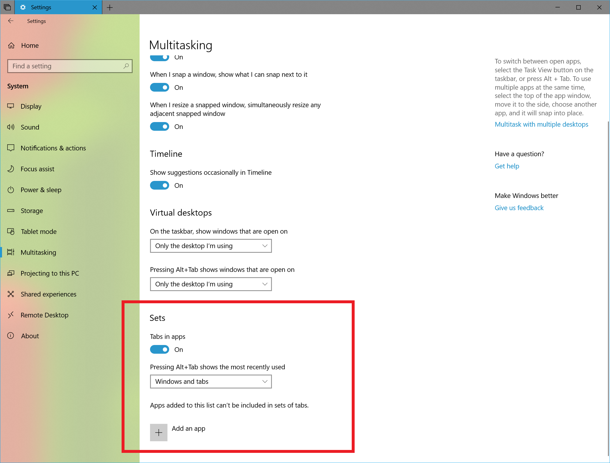

__File Explorer & Sets Improvements__: We’ve heard your feedback – you’d like it to be easier to get two File Explorer windows grouped together. We  added a new keyboard shortcut to open a new tab when a File Explorer window is in focus: Ctrl + T. Remember, you can use Ctrl + N to open a new window, and Ctrl + W to close the window/tab.

__New UI for opening new tabs and windows__ in the File Menu.

__New UI__ for easily opening new tabs and windows in the File Menu.

__New context menu options for tabs in Sets__: If you right-click on a Sets tab, you’ll discover several options to leverage, including “close other tabs”, “move to new window”, and “close tabs to the right”.

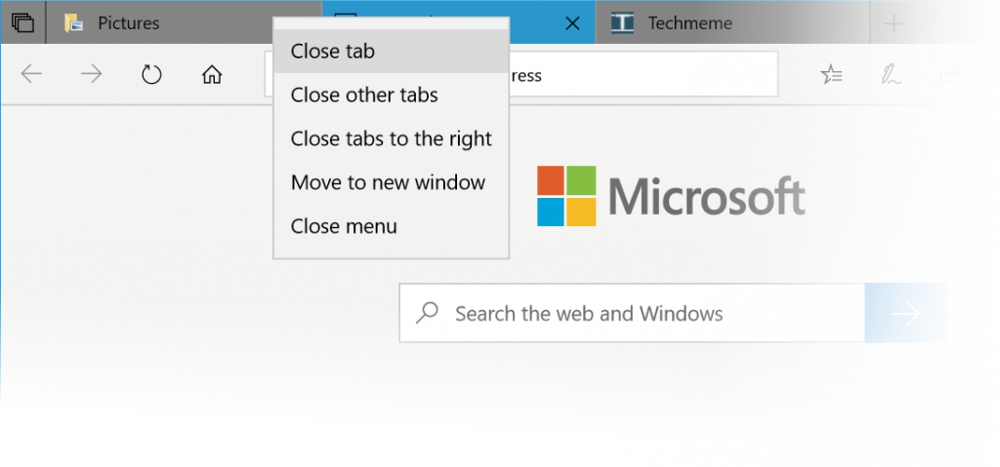

__Improvements to previous tabs__: We’ve done a few things to improve the experience in this space, including:

*__You can choose which previous tabs you want to restore__, in addition to being able to restore all tabs. 

*__You can now restore previous tabs from any type of activity__ – in addition to restoring tabs when the primary window is a document.

* When you open a document that previously had tabs, a prompt will appear offering to restore those tabs, and the previous tabs button will be in the filled state. For things that aren’t documents, a prompt will not automatically appear, but you’ll know that there are tabs available to restore because the previous tabs button will be in the filled state.

* We added an animation to the experience when there are no previous tabs available to be restored.

__Keyboard shortcuts__

*__Ctrl + Win + Tab__ – switch to next tab.
*__Ctrl + Win + Shift + Tab__ – switch to previous tab.
*__Ctrl + Win + T__– open a new tab.
*__Ctrl + Win + N__ - open a new window.
*__Ctrl + Win + W__– close current tab or window.

We’ve heard your feedback and have been hard at work updating the new tab page to make it more obvious you can launch apps. When you click the plus button in a Sets window, you will now see apps included in your frequent destinations list. You’ll also find that we’ve integrated the all apps list into this page so you can browse your apps, rather than just using the search box – apps that support Sets will launch into a tab when clicked. If you have __News Feed__ selected, simply click the “Apps” link next to “News Feed” to switch to the all apps list.

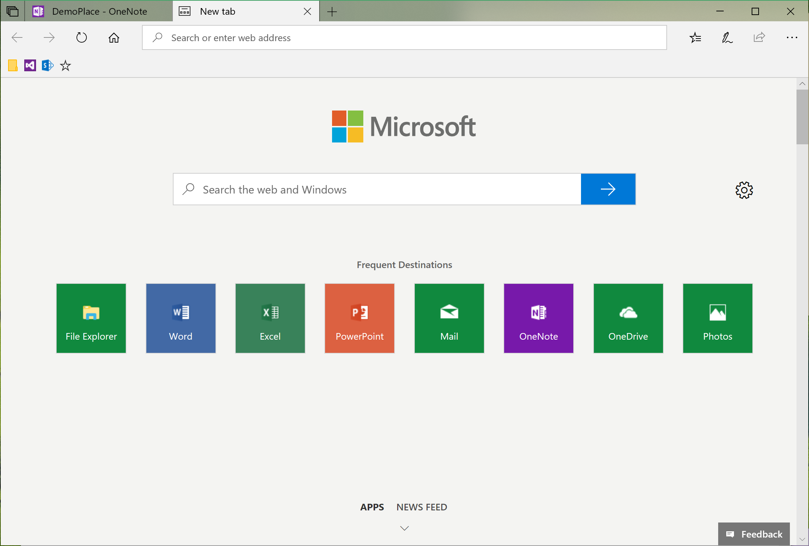

## Settings

We’ve heard your feedback that settings can be confusing sometimes, so we’re working with Bing to bubble up some of the most common questions we hear right into the Settings pages themselves. The FAQ’s are contextual in nature and aim to you to quickly get the answer you’re looking for to complete configuration tasks. It may even help you discover something you didn’t know was an option! Clicking on these questions will take you to Bing.com to display the answer.  

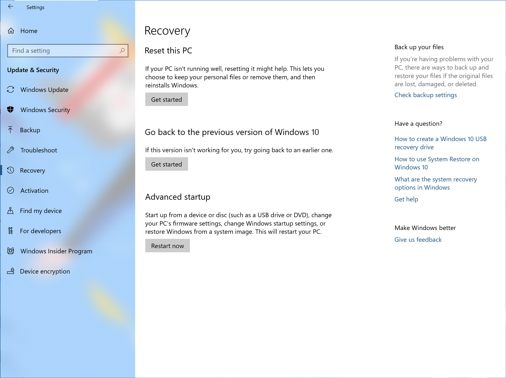

## Snipping experience 
The new modern snipping experience is here to help you effortlessly capture and annotate what you see on your screen. While working on this we’ve been carefully going over all your feedback about taking screenshots in Windows - you’ll find the flow and tools are optimized for sharing and make communicating visually with others quick and easy.

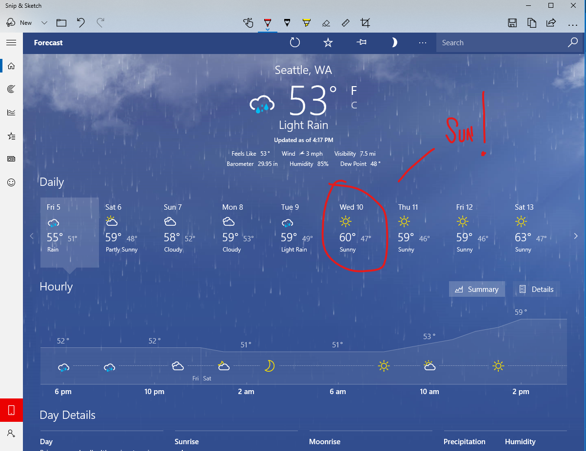

### Screen Sketch is now an app! 

Originally introduced as part of the Windows Ink Workspace, this comes with a variety of benefits, including that it can now be updated via the Microsoft Store, it will now show up in the list when you press Alt + tab, you can set the window size to be your preference if you like multitasking, and it even supports multiple windows (and tabs, thanks to Sets!). 

### Easy snipping is only a single step away. 

One of the loudest things we heard is that you want to be able to quickly snip & share a screenshot, and we’re making it happen! WIN + Shift + S will now bring up a snipping toolbar – snip a rectangle, something a bit more freeform, or full screen and it will go straight to your clipboard. If that’s all you need, you can take it from there. Want more, though? Immediately after taking a snip you’ll now get a notification that will take you and your snip to the Screen Sketch app where you can annotate and share away!

But wait, there’s more! Is the WIN + Shift + S keyboard shortcut too long to remember? Guess what! We’ve added easy entry options for every input modality: 
*__Just click the pen tail button__. If you have a pen, go into Pen & Windows Ink Settings – you’ll find Screen Snipping is now an option for single click. This will launch you directly into our snipping experience:

*__Press Print Screen__. You heard it right, just one button! It’s not enabled by default – go to Keyboard Settings – you’ll see a new option that says “Use the Print Screen key to launch screen snipping”. Opening Settings and searching for “print screen” will take you to the right page.

*__Press the quick action button in Action Center__. Called “Screen snip” – it should be there as soon as you upgrade, but if not you can always enable it via Notifications & Actions Settings.

## Start tile folder naming 
To create a tile folder in Start, just drag one tile on top of another for a second then release. Continue dropping as many tiles into the folder as you’d like. When you expand the folder, you’ll see a new option to name it. The name will be visible when the folder is medium, wide, or large-sized. 

## Storage improvements
__Storage Sense picks up a new skill__:  Starting with the [Creators Update](https://blogs.windows.com/windowsexperience/2017/01/19/announcing-windows-10-insider-preview-build-15014-for-pc-and-mobile-hello-windows-insiders-today-we-are-excited-to-be-releasing-windows-10-insider-preview-build-15014-for-pc-and-mobile/) we embarked on a journey to help you automatically clean up storage when low on disk space. We expanded on that with the Fall Creators Update ([here](https://blogs.windows.com/windowsexperience/2017/05/17/announcing-windows-10-insider-preview-build-16199-pc-build-15215-mobile/) and [here](https://blogs.windows.com/windowsexperience/2017/06/21/announcing-windows-10-insider-preview-build-16226-pc/)). We also added the ability to automatically make any downloaded Files On-Demand online-only if you haven’t used them in a certain number of days. Head to __Settings > System > Storage > Storage Sense__ to try out this new feature.

## SwiftKey intelligence comes to Windows
[SwiftKey](https://www.microsoft.com/en-us/swiftkey) gives you more accurate auto-corrections and predictions by learning your writing style – including the words, phrases and emoji that matter to you. It’s available for Android and iOS, and SwiftKey powers the typing experience on Windows when using the touch keyboard to write in English (United States), English (United Kingdom), French (France), German (Germany), Italian (Italy), Spanish (Spain), Portuguese (Brazil), or Russian.

## Task Manager memory reporting improvements
In Windows 10, version 1809, the main memory column in Task Manager “Processes” tab does not include memory used by suspended UWP processes. This more accurately reflects the OS behavior in which the OS can reclaim memory used by suspended UWP processes if needed. This means that if you have several UWP processes suspended in the background, the OS can take back memory from these suspended UWP processes if needed and use it for something that requires more memory. New and old memory columns will be available in “Details” tab for you to do comparisons. 

## Windows app permissions 
You have more control so you can now decide which UWP apps can access your full file system. Particular UWP apps will be granted permission to have broad file system access. This capability will be granted on a per app basis by Microsoft. If a UWP app has the broad file system access restricted capability, you will receive a consent dialog prompting you to accept or deny the request. If at any time you change your mind about the decision, you can go to __Settings > Privacy__ where you’ll find a new Settings page for file system access. On this page, you can turn access on or off globally, and if it’s on you can also turn it on or off for each app that has requested the capability. UWPs with broad file system access will not appear in the Photos, Videos, or Documents privacy settings pages. If you grant broad file system access, this includes Photos, Videos and Documents.

## Windows Calculator 

Windows Calculator now correctly calculates square roots for perfect squares (integers that are squares of other integers). Because of the [arbitrary precision arithmetic library](https://blogs.msdn.microsoft.com/oldnewthing/20160628-00/?p=93765) used by the Calculator app, the square root calculation is an approximation calculated using the [Exponential Identity](https://en.wikipedia.org/wiki/Methods_of_computing_square_roots%23Exponential_identity) function.
Previously, when you would calculate the square root of 4, the result would be 1.99999999999999999989317180305609 which would be rounded to 2 when displayed, because we calculated enough digits to do the rounding correctly. However, as soon as you subtract 2, you would see the remaining digits.
After this update, the square root calculation now recognizes perfect squares and correctly returns exactly 2 for the square root of 4.

## Windows Defender Application Guard (WDAG) improvements

The Windows Defender Application Guard (WDAG) team has introduced new improvements for users to have a better experience with our upcoming release. We have combed through our user feedback and acted to ensure your needs are met. On top of significant performance improvements, we have added an ability to download documents.

__Performance improvements__: The teams at Microsoft are constantly working to improve performance for our users. WDAG is no different. In this feature update, you will notice an improvement in the launch time for WDAG. We have made the start process lighter and faster, which will provide our users with a better experience when accessing Microsoft Edge in WDAG.

__Download files to the host__: One of the items our users voiced was an inability to “download files from within WDAG” to the host. This created an inconsistent experience for Edge overall as downloaded files were stuck inside the container. In this release, users can turn on a feature to download files from their WDAG browsing session onto the host file system. This feature is available in the Windows 10 Enterprise edition and is not turned on by default. Once the feature is enabled, users will be able to download files into a folder created in their Downloads folder and open all files on the host.

<i>How to enable and configure the Download to host feature</i>:

__Requirements:__
* Latest Windows 10 Enterprise, version 1803 builds.
* Windows Defender Application Guard feature is installed.
* Network isolation policies are configured.

__Steps:__
1. Navigate to Local Group Policy Editor > Administrative Templates > Windows Components > Windows Defender Application Guard.

2. Select Allow files to download and save to the host operating system from Windows Defender Application Guard
3. Select__Enabled__ and__Apply<b/>

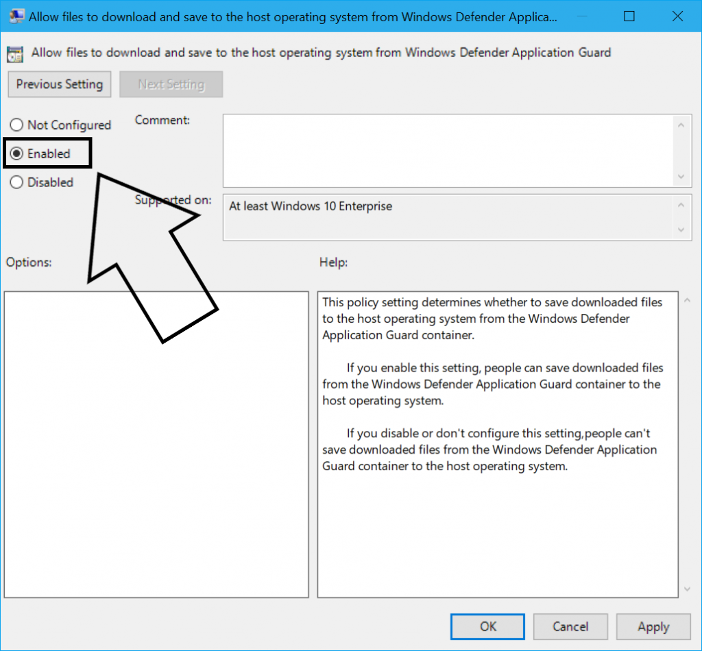

4. After this policy is enabled, you can download files from your Windows Defender Edge session to your Downloads folder. The files from Application Guard will be saved in a folder called “Untrusted files” nested inside the Downloads folder. This folder is created automatically when you first download a file from Application Guard after enabling the policy.

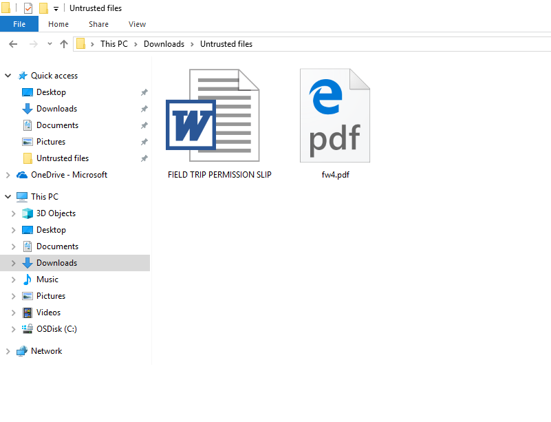

Notes:
* This feature is off by default.
* Users will need to assess the files they downloaded and assume any risks of opening on the host.
* We encourage you to try our download feature and assess our launch performance. Your feedback and suggestion are important to us as we continue to improve our products. You can click here to open Feedback Hub to give feedback on WDAG.
* We’ve also made updates to Windows Defender System Guard. With Windows Defender System Guard, we are making a leap forward in platform security with memory integrity by default and bringing a born secure device promise to our user base. To learn more about these changes and talk with product team, see their post in the Windows Insider Technical Community.

## Wireless projection experience
One of the things we’ve heard from you is that it’s hard to know when you’re wirelessly projecting and how to disconnect if your session especially if started from file explorer or from an app. In today’s build, just like remote desktop you’ll see a control banner at the top of your screen when you’re in a session. The banner keeps you informed of the state of your connection, allows you to quick disconnect or reconnect to the same sink and allows you to tune the connection based on what you are doing. This tuning is done via the settings gear, which optimizes the screen to screen latency based on one of the three scenarios:
* Game mode minimizes the screen to screen latency to make gaming over a wireless connection possible.
* Video mode increases the screen to screen latency to ensure the video on the big screen plays back smoothly and without glitching.
* Productivity modes strikes a good balance between game mode and video mode where the screen to screen latency is responsive enough that typing feels natural, while ensuring videos don’t glitch too often.

## Your Phone app
Android phone users, you can finally stop emailing yourself photos. Drag and drop that photo from your phone onto your PC. Copy, edit, or ink on that photo, right from your PC. With Your Phone app, live today for Windows Insiders, you get instant access to your Android’s most recent photos on your PC. Try it out by opening Your Phone app. You will receive an app from Microsoft which you must download to your mobile phone and follow the setup prompts. Build 17723+ is highly recommended for the best experience. Android 7.0+ are compatible with Your Phone app. For PCs tied to the China region, Your Phone app services will be enabled in the future.
For iPhone users, Your Phone app helps you to link your phone to your PC. Surf the web on your phone, then send the webpage instantly to your computer to pick up where you left off to continue what you’re doing–read, watch, or browse with all the benefits of a bigger screen. With a linked phone, continuing on your PC is one share away.

We’ve added a new entry point to Your Phone app. Notice a desktop pin? It’ll take you directly to Your Phone app – for quicker access to your phone’s content. Or go through the all apps list in Start Menu, or Windows key and search for Your Phone app. You pick how you get there, just get there. 

Link your mobile phone to your PC through Your Phone app. Open Your Phone app and follow the setup flow. You will receive an app from Microsoft which you must download to your mobile phone and follow the setup prompts. Android 7.0 and above are compatible with Your Phone app. For PCs tied to the China region, Your Phone app services will be enabled in the future. 

