# What's new in the Windows 10 Insider preview builds (19H1)
The [Windows Insider Program](https://insider.windows.com/en-us/) lets you preview builds of the upcoming release of Windows 10. This topic lists all new Windows 10 features for you to try. 

## A touch of Fluent for menus in Start (Build 18290)

Following up on our jump list improvements with [Build 18282](https://blogs.windows.com/windowsexperience/2018/11/14/announcing-windows-10-insider-preview-build-18282/), when you update to today's build you'll notice we've polished up the power and user menus in Start as well – including adding icons for easier identification.

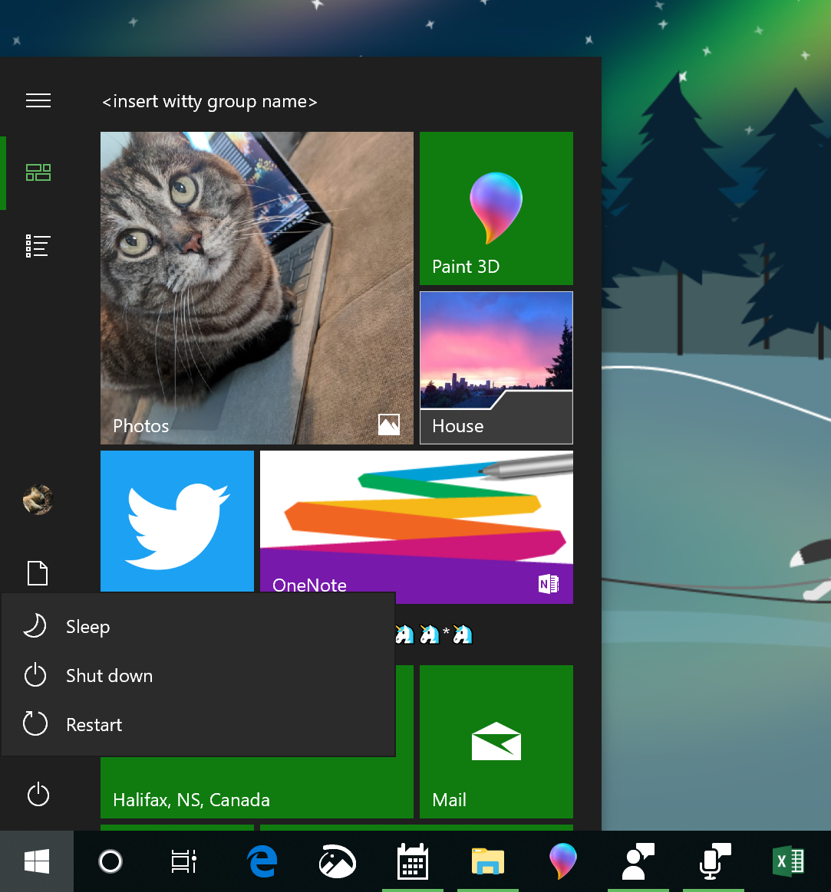

This will also be visible in the power menu on the sign in screen.

## Sync your clock (Build 18290)

In response to your feedback, we're adding an option in Date & Time Settings to manually synchronize your clock with the time server. This will help in scenarios where you think the clock might be out of sync, or if the time service has been disabled. We'll also show the last time that time was successfully synced, and the address of your current time server.

>[!NOTE]
>This feature is currently only supported for non-domain joined PCs, although in today's build it will be visible on all devices.

## See which app is using your microphone (Build 18290)

In [Build 18252](https://blogs.windows.com/windowsexperience/2018/10/03/announcing-windows-10-insider-preview-build-18252/) we introduced a new mic icon that would appear in the notification area letting you know when an app was accessing your microphone. Today we're updating it so if you hover over the icon, it will now show you which app. Double-clicking the icon will open Microphone Privacy Settings.

If multiple apps are using your microphone, then it will just list how many are actively using your microphone. We still have a bit more to do, stay tuned!

## Improving your Search and Cortana experiences (Build 18290)

We're exploring some options for improving these experiences in Windows. When you start a search now, you'll notice we've updated the landing page – giving recent activities a bit more room to breathe, adding light theme support, a touch of acrylic and including all the search filter options as pivots from the get go. We'd love to hear your feedback – you can report issues and suggestions to us here. You may notice some other changes as we continue flighting, we'll have more details to share later.

## Windows Update notifications (Build 18290)

Starting with 19H1, when your device has an update requiring reboot (including new builds we release) you will see Windows Update icon with orange indicator in the notification area (system tray) alerting you to restart your device.

## Windows light theme (Build 18282)

Ever since we introduced the ability to choose between light and dark in Windows 10, we've heard feedback asking for a truer separation between the two options. When you select **Light** under **Settings > Personalization > Colors**, the expectation is that the system color would be lighter too. And it didn't do that before – the taskbar and many other things stayed dark. Now, if you choose Light under **Settings > Personalization > Colors**, *all* system UI will now be light. This includes the taskbar, Start menu, Action Center, touch keyboard, and more.

When you update to this build, your system color won't automatically change to the new light system color. This is because we want everything to be exactly as you left it before you did the update. We're leaving the choice up to you! If you had light mode selected prior to the update, this is what Color Settings will look like after updating:

To try the full light experience, just select **Light** in the **Choose your color** dropdown.

**As part of this work we're also adding a new default wallpaper!** Showcased above, you can use it on your PC today by going to **Settings > Personalization > Themes** and selecting **Windows Light**. This will also change your PC to be light themed.

We look forward to [hearing your feedback](https://aka.ms/themingfeedback) on the new light system color experience. However, please note that we're still working on "lightening up" different pieces of the OS and refining the experience. For example, the OneDrive icon in the notification area (system tray) is white, making it hard to see when you are using the light system color. Expect us to refine this experience.

## Bringing window snip to your modern snipping experience

When we [started this journey](https://blogs.windows.com/windowsexperience/2018/05/03/announcing-windows-10-insider-preview-build-17661/), we asked for your feedback and two requests shone above the rest:

- Add a delay snip option
- Add window snip mode

Delay snip was the first on our list, and we added it with [app version 10.1807](https://blogs.windows.com/windowsexperience/2018/09/06/announcing-windows-10-insider-preview-build-18234/#F4J20LU38c8B3Prp.97). We then addressed a few more of your requests with app version 10.1809*, and today are really excited to announce that window snip is on its way to Insiders too!

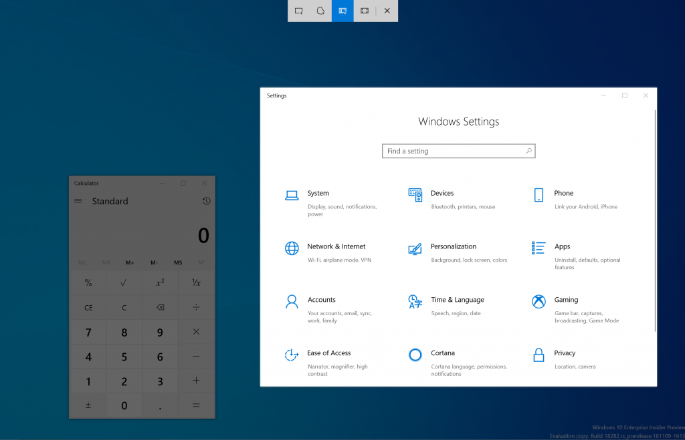

Start your snip via your preferred entry point (WIN + Shift + S, Print Screen (if you've enabled it), directly from within Snip & Sketch, etc.), and select the window snip option at the top, and snip away! That selection will be remembered the next time you start a snip.

Currently the window snipping experience is available for 50% of Insiders, as we want to ensure a smooth rollout – we'll let you know once it's live for 100%.

What's next? [Let us know](http://aka.ms/snippingfeedback) what you'd like to see!

>[!NOTE]
>This app update is now starting to roll out to people on Windows 10 version 1809! Please note that the borders feature is currently only supported on 19H1 builds, and like window snipping is currently only available for 50% of Insiders.

## Improving your modern printing experience (Build 18282)
You'll notice a few differences once you update to build 18282:

- First and foremost, the modern print dialog now supports light theme!
- Second: In order to improve clarity, we've updated a number of the printing options to now include icons to help you easily and quickly identify the one you're looking for. We've also added a line of description to some of the dropdown settings. This can be seen in the Pages example below, and in other settings if you click More Settings at the bottom of the print dialog.
- Finally: If you have a long printer name, it will now wrap rather than being cut off.

If you have any further feedback in the printing space, please don't hesitate to tell us! You can log feedback for this in the Feedback Hub under **Devices and Drivers > Print**.

## Updating Windows Update (Build 18282)
Based on customer feedback, we're introducing two important new features to provide more control over updates:

**Pause Updates:** We're making the Pause Updates feature easier to find by surfacing the existing option directly on the **Settings > Update and Security > Windows Update** page. Just like before, when Pause is enabled, some updates, like Windows Defender definition updates, will continue to be installed. In addition, Pause can be enabled for either a pre-defined number of days or until the specific day (day selector is available on Advanced options page).

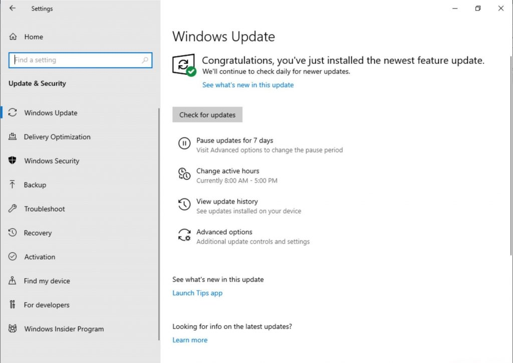

**Intelligent Active Hours:** Setting your active hours will let Windows know when to avoid rebooting your device. However, we understand some of our users have shifting productivity schedules and remembering to adjust Active hours can be a challenge. Now, Windows can automatically adjust active hours for you based on your device activity. Just go into **Settings > Update and Security > Windows Update > Change active hours** page to turn this setting on and know that reboots will not disrupt your productive time.

## Display brightness changes when going to battery power (Build 18282)
We've heard your feedback about a specific case where a display can become brighter when transitioning from a battery charger to battery power. For 19H1, we're modifying the display brightness behavior so that this can no longer happen. If a person adjusts their display brightness, that brightness will now be remembered as their preferred brightness whether they are on battery or connected to a charger. This new behavior results in a more consistent and battery friendly experience. This does not affect battery saver mode settings; if a person has opted into lowering the screen brightness in battery saver mode, their display will still dim when the battery is below the threshold selected.

Please use Feedback Hub to tell us what you think! You can file the feedback under the category “Device and Drivers” and subcategory “Display and Graphics”.

## Narrator Improvements (Build 18282)

**Narrator Verbosity improvements:** We are improving the amount of information you hear while interacting in Windows and you will see these changes filter in throughout future builds. In the current release we have a new Narrator Setting entitled “Hear advanced information about controls when navigating”. When this feature is off you will not hear the advanced information previously spoken on controls. In addition, Tooltips will not be read by default. Use the Narrator Advanced Information command (Narrator + 0) to read a tooltip on a given item. In addition, you will notice that some control information will now begin to speak in a more consistent manner. Checkboxes and radio buttons will be the first controls with this new behavior.

**More consistent reading experience:** Narrator text reading commands (previous/next for character/word/line/sentence/paragraph/page) can now be used to scan a full window from top to bottom. It is no longer possible to get the “not on explorable text” error and only when you reach the boundary of the window will you receive “no next/previous text.” Also, the views options are now consistent whether you are within text content or not. For example, you can now use the views option to search for a link anywhere within the active window.

**Read by Sentence Braille support:** The new read by sentence commands are now available via a braille display by pressing dots 2-3-4 or 2-3-4-7 in command input mode. Note, we are still working on fixing a couple issues.

**Narrator character phonetic reading optimization:** In a previous release, Narrator received support for reading characters phonetically. That is, reading out "a Alfa, b Bravo, c Charlie" while navigating "abc" by character.

Since then, we have received feedback that you didn't want to hear the phonetic information announced automatically. Instead, this should be an on-demand feature, to be called upon only when you needed it. In this release, we will no longer announce the phonetic information automatically. As you navigate by characters, this information will be omitted. If you need the phonetic information to disambiguate characters, you can issue a command to hear the phonetics. Use the keyboard command of **Narrator key + Comma twice quickly**. If, for example, you are using the Standard Keyboard layout with the default Narrator key setting of “Caps Lock or Insert”, you would issue the command of Caps Lock + Comma (or Insert + Comma), where the Comma key is pressed twice quickly while depressing the Caps Lock (or Insert) key.

If you need to hear phonetics for a string of characters in a sustained fashion, the phonetics can be read out continuously as you move forward or backward through a range of characters with the Read Next Character command (Narrator key + Period) or Read Previous Character command (Narrator key + M). However, in this mode, you will only hear the phonetics announced and not the characters themselves (e.g., “Alfa Bravo Charlie”). To stop hearing the phonetics, press any other command (e.g., Left arrow, Right Arrow, Tab, etc.) or re-issue the Read Current Character command (Narrator key + Comma). Subsequent reading of next and previous characters via Narrator key + Period or Narrator key + M will return to reading just the characters, without phonetic information.

If you prefer the original character phonetic reading behavior, a setting has been added for you to toggle on the automatic reading of phonetics.

## Evolving Focus assist (Build 18277)
[Starting with the Windows 10 April 2018 Update](https://blogs.windows.com/windowsexperience/2018/05/09/windows-10-tip-how-to-enable-focus-assist-in-the-windows-10-april-2018-update/), we embarked on a journey to help reduce the number of distractions you encounter when you're trying to get in the zone. With today's build, we're taking this to the next level: We've added a new focus assist option so that when you're doing *anything* full screen we can automatically turn on focus assist.

Watching a movie? Poring over some excel tables? Studying? Focus assist is here for you, and will keep your notifications quiet until you exit full screen mode.

Like our other focus assist settings, this can be found under Settings > System > Focus Assist. Make sure you take a moment to customize your priority list to ensure any notifications you want to break through the rule will appear! If you'd like to turn off the warning notification that's shown in Action Center after entering focus assist, you can do so by clicking the rule in Focus Assist Settings which prompted the notification.

## Improving your Action Center experience (Build 18277)
One of the top requests we've heard from you is that you'd prefer the brightness Quick action to be a slider instead of a button, and with today's build we're making it happen!

But wait, there's more!

You can now easily customize your Quick actions right from the Action Center itself, rather than having to go into Settings. That means not only can you re-arrange in the moment, but you can also add any Quick action you need on the fly, without needing for it to always take up space.

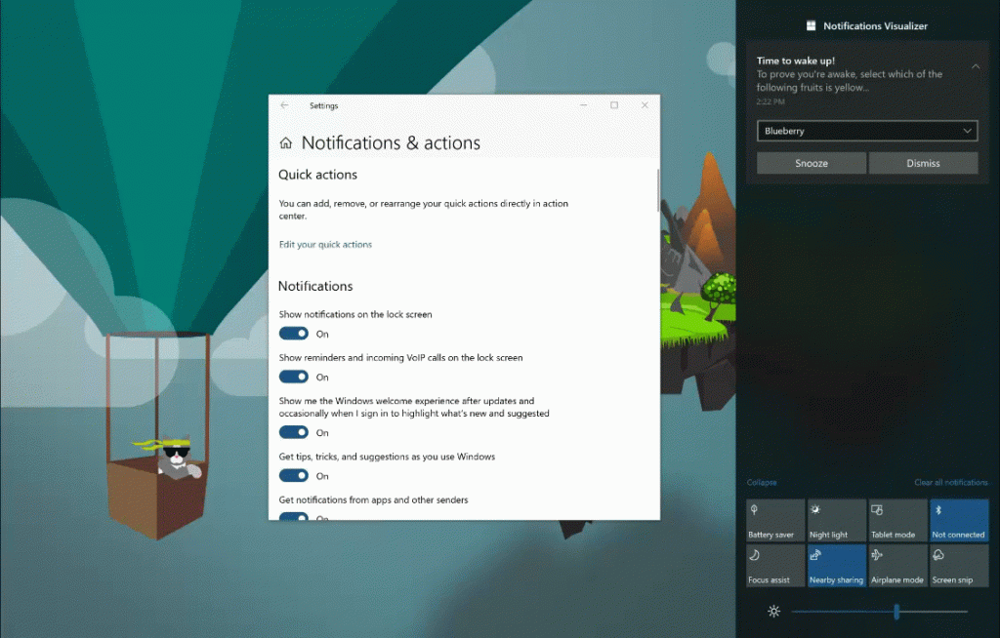

We'd love for you to try it out and share feedback!

## Preparing for Emoji 12 (Build 18277) 
With today's build, Insiders will get a first look at the emoji we've designed so far in preparation for the Emoji 12 release! These emoji are available for use via the emoji panel (WIN + .) and the touch keyboard.

>[!NOTE] 
>The complete list of emoji for the Emoji 12 release is [still in beta](http://blog.unicode.org/2018/10/draft-candidates-for-emoji-120-beta.html), so Insiders may notice a few changes over the coming flights as the emoji are finalized. We have a bit more work to do, including adding search keywords for the new emoji, and adding a few emoji that aren't finished yet.

## High DPI improvements (Build 18277)
As many of you know, we've been working [over the past few years](https://blogs.windows.com/buildingapps/2016/10/24/high-dpi-scaling-improvements-for-desktop-applications-and-mixed-mode-dpi-scaling-in-the-windows-10-anniversary-update/#BhoQFcZJ0KWWFqub.97) to improve the High DPI story for Win32 (desktop) apps on Windows. As part of this, some of you may recall getting a toast about fixing your apps that led you to this setting we added with [Build 17063](https://blogs.windows.com/windowsexperience/2017/12/19/announcing-windows-10-insider-preview-build-17063-pc/#ffbtP8jT9IuKq8sp.97):

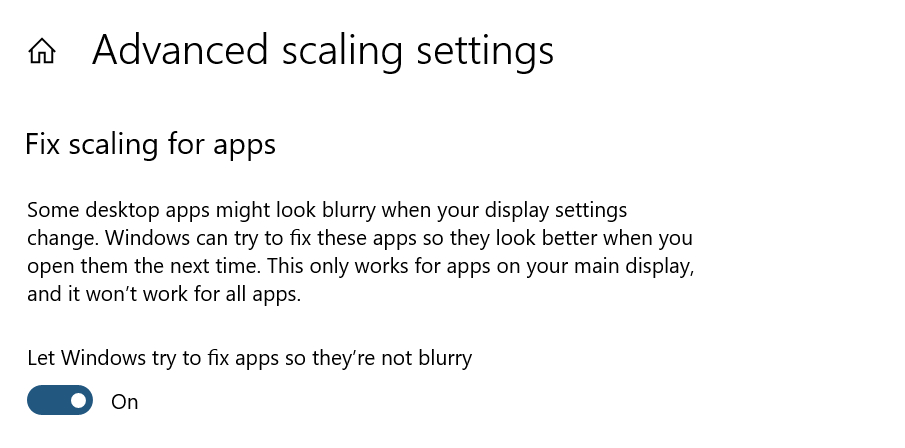

In 19H1, we're enabling this setting by default, to help automatically address some of your scaling feedback, and reduce the number of times you see that “Fix blurry apps” notification.
We'd love your feedback! Notice that some of your apps seem blurry after docking/undocking, or other mixed DPI scenarios? You can let us know by reporting it at [https://aka.ms/scalingfeedback](https://aka.ms/scalingfeedback)!

If you're interested to learn whether or not an app is DPI aware you can find out using [this feature](https://blogs.windows.com/windowsexperience/2018/10/17/announcing-windows-10-insider-preview-build-18262/) we rolled out to Task Manager a few flights ago.

## Refreshing the Japanese IME (Build 18277)
We've already made [a few](https://blogs.windows.com/windowsexperience/2018/10/24/announcing-windows-10-insider-preview-build-18267/#3joUFcLxg0ozUFbp.97) [announcements](https://blogs.windows.com/windowsexperience/2018/10/31/announcing-windows-10-insider-preview-build-18272/#FZRyBpZfJrussGPF.97) about how we plan to improve your typing experiences in Windows with this release, and we're excited to add one more to the list today! To provide increased security and reliability, we're updating the Japanese IME by redesigning how it works with applications. Not only that, but we've updated the IME candidate window interface to be cleaner and more polished:

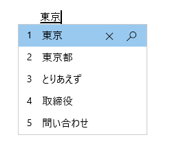

You'll notice that each text prediction candidate now has an index so you can quickly select it, just like the conversion candidates! We're looking forward to you trying it out, and that's not all! As part of this work, all of your familiar Japanese IME settings have now been fully integrated into Settings. If you'd like to check them out, fastest way there is to right-click the IME mode indicator in the taskbar and select Settings, although you can also get there from the Language Settings page.

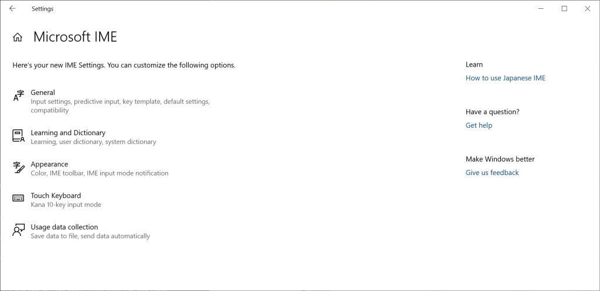

Some Insiders have had this change for [a few flights now](https://blogs.windows.com/windowsexperience/2018/09/18/announcing-windows-10-insider-preview-build-18242), so we wanted to take a moment to say thank you for all of your great feedback so far! Please don't hesitate to [continue sharing thoughts with us](https://aka.ms/inputfeedback) about typing in Windows – our ears are open and we'd love to hear from you.

## Help us shape the future of Cortana + Amazon Alexa (Build 18277)
Recently, we announced an exciting preview in the US that allows you to call up Cortana on Amazon Alexa Echo devices – and Alexa on your Windows 10 PC. You can, for example, enlist Cortana through an Amazon Alexa Echo device to tell you your next meeting or have Alexa order groceries through your Windows 10 PC. Now, we'd like to take the experience even further with the help of Windows Insiders like you. Just start by completing this [short survey](http://aka.ms/CortanaAlexasurvey).

If you haven't already tried it out, simply click the microphone icon in Windows Search on your Windows 10 PC and say ‘'Hey Cortana, open Alexa'. Or, on your Amazon Echo device, say “Alexa, open Cortana” on Echo devices. (Then let us know what you think in the Feedback Hub.) For more, see our [AI blog](https://blogs.microsoft.com/ai/alexa-cortana-public-preview/.

## Sign-in options redesigned for Windows Hello (Build 18272)

Security shouldn't be intimidating, and we aspire to help you eliminate passwords. That's why we want to make sure you can easily set up your first line of defense securing your device with Windows Hello. Your feedback that the previous design was cluttered, and confusing is what drove us to simplify the Sign-in options Settings. We believe this update will help you choose the safest and fastest sign-in option for your needs, whether that's using a PIN or a biometric factor like fingerprint or facial recognition.

Ultimately, we want to help you make the right decision for your situation. By condensing each sign-in option into a list that explains individual properties and next step for setup, we hope you feel more informed the next time you decide how you want to sign in using enhanced security features with Windows Hello.

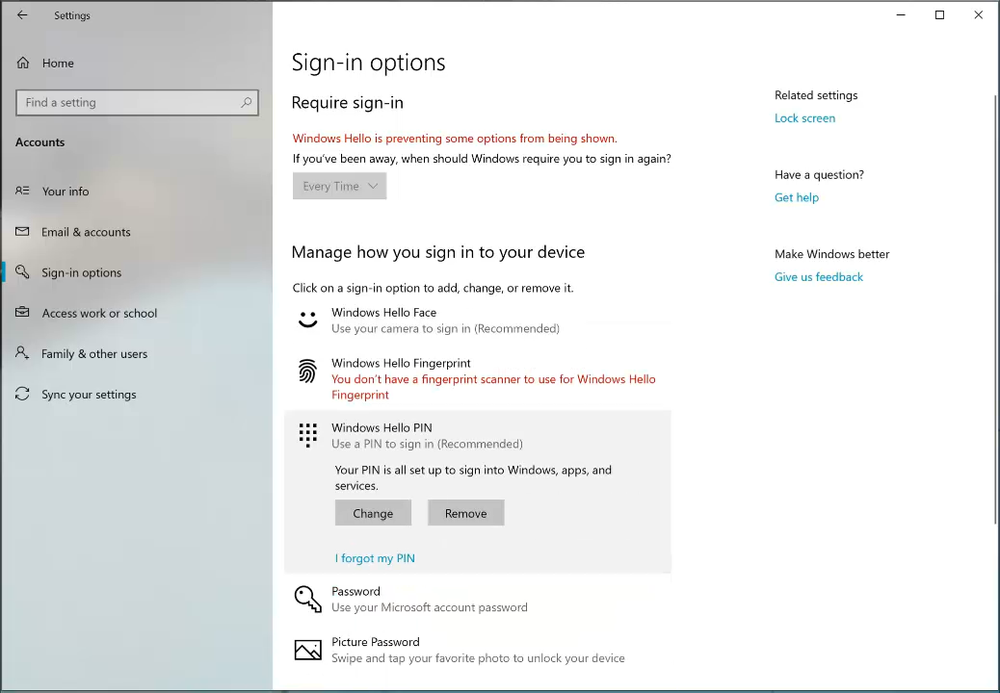

## Input improvements (Build 18272)

**Expanding SwiftKey's typing intelligence to more languages:** In RS5 we started working on bringing [SwiftKey's AI technology to Windows](https://blogs.windows.com/windowsexperience/2018/06/14/announcing-windows-10-insider-preview-build-17692/#KqkzsMxQJAWrMbJC.97), and we're excited to announce that we're expanding support to the following languages:

- English (Canada) – en-CA
- English (India) – en-IN
- French (Canada) – fr-CA
- French (Belgium) – fr-BE
- French (Switzerland) – fr-CH
- Portuguese (Portugal) – pt-PT
- German (Switzerland) – de-CH
- Spanish (United States) – es-US

If you're a touch keyboard user that writes in any of these languages, please try out the text predictions and shapewriting in this build and [let us know](http://aka.ms/inputfeedback) how it feels for you. If you'd like to compare how the keyboard feels with and without this change, check the options for supported languages under **Settings > Devices > Typing > Suggestions and Autocorrections**.

Using a physical keyboard? Hardware keyboard text suggestions are also supported with the above languages now. Text suggestions for the hardware keyboard is a learning tool we originally introduced in [RS4](https://blogs.windows.com/windowsexperience/2017/11/08/announcing-windows-10-insider-preview-build-17035-pc/), and expanded language support for [with RS5](https://blogs.windows.com/windowsexperience/2018/10/03/windows-10-accessibility-in-the-october-2018-update/). If you'd like to try it out in one of the supported languages, you can do so by enabling the **Show text suggestions as I type** feature under **Settings > Devices > Typing**.

**Indic Phonetic keyboards now available for PC:** Do you write in an Indic language? We've heard your feedback, and in addition to the Indic Traditional INSCRIPT keyboards already available, with today's build we're adding Indic Phonetic keyboards for Hindi, Bangla, Tamil, Marathi, Punjabi, Gujarati, Odia, Telugu, Kannada and Malayalam!

How does a phonetic keyboard work? Basically it's a convenient way of typing that leverages the English QWERTY keyboard – as you type, we use transliteration to suggest possible Indic text candidates. For example, if you typed "namaste" using the Hindi Phonetic keyboard we would suggest नमस्ते, as you can see in the below gif:

If your native language is one of the above languages or you have some knowledge of Indic languages, please try this out with either the hardware or touch keyboard and let us know how it feels.

Here are the steps to get started:

1. Select **Start > Settings > Time & Language-> Language** from the navigation menu.
2. Select the **+** icon labeled [Add a preferred language] (or skip ahead to step 4 if your preferred Indic language was already added).
3. Type the name of an Indic language into the search box and select it – for example "Hindi". Click **Next** and install the Indic language on your device, which will return you to the Language page.
4. Now back on the Language page, click the one you just added, and then click **Options**. This will take you to that language's options page.
5. Select the **+** icon labeled [Add a keyboard].
6. Enable the Phonetic keyboard, for example [Hindi Phonetic – Input method editor] – now the languages options page will look something like this:
   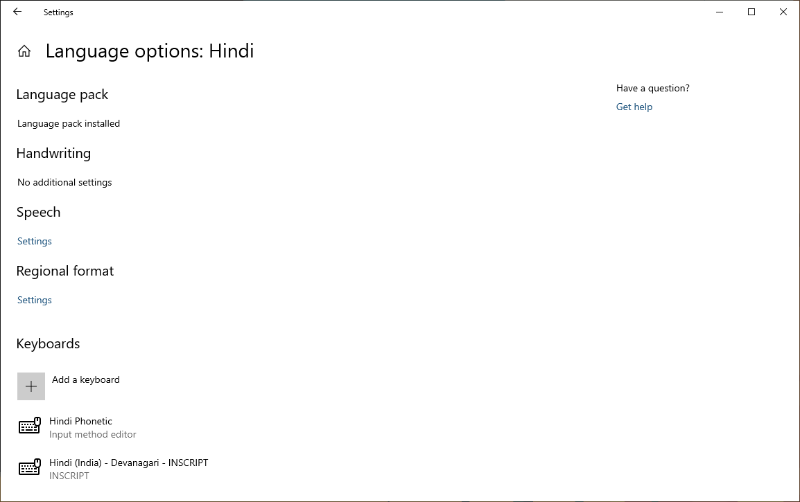

7. Click input indicator on the taskbar (or press the Windows key + Space) and select the Indic Phonetic keyboard. Time to type something!
   >[!NOTE]
   >You need to [download the dictionaries](https://docs.microsoft.com/windows-hardware/manufacture/desktop/features-on-demand-v2--capabilities) used for the Indic Phonetic keyboards. Right after adding the keyboard, please connect to Internet – you may need to wait a bit for the dictionary download to finish.

## Accessibility improvements (Build 18272) 

**Narrator Caps Lock ON alert while typing:** Narrator will now alert you when you are accidentally typing with Caps Lock turned on. The setting is on by default. To adjust this setting, visit Narrator Settings (Ctrl + Win + N), then navigate to the “Change how much content you hear” heading and review the combo box for “Change when you receive Caps Lock warnings while typing”.

It will work even if you have character echo option ("Hear characters as you type") disabled, and it will work in edit fields as well as password field. By default, Narrator will always alert you regardless of presses of the Shift key as you type alphabetic characters. But you can choose to only be alerted when you press the Shift key together with an alphabetic character, or you can disable the feature altogether.

In this initial release, the sound effect you hear will sound like the standard Narrator error sound effect which we are working on improving. We look forward to your feedback on this new feature!

## Input Improvements (Build 18267)
**Vietnamese Telex and Number key-based keyboards are now available on your PC**: Do you write Vietnamese? We want you to have the best possible typing experience, so we're happy to announce that with this build you can now use Vietnamese [Telex](https://en.wikipedia.org/wiki/Telex_(input_method)) and Number-key based (VNI) keyboards for typing Vietnamese! Bringing these keyboard options to PC has been one of the top feature requests in the input space, so we're looking forward to you trying it out!

Here's a short animation of what it looks like (using the touch keyboard so you can see what we're typing):

If your native language is Vietnamese or you have some knowledge of the Vietnamese language, please try them out with hardware keyboard or touch keyboard and let us know how it feels.  Here are the steps to get started:

1. Select **Start > Settings > Time & Language > Language** from the navigation menu.
2. Select the **+** icon labeled [Add a preferred language] (or skip to step 4 if Vietnamese was already added).
3. Type *Vietnamese* in the search box and select **Vietnamese**. Click the **Next** button and install Vietnamese on your device, which will return you to **Language** page.
4. Click **Vietnamese**, and then click the **Option button**, that will allow you to navigate to **Language options: Vietnamese**.
5. Select the **+** icon labeled [Add a keyboard] (or skip to step 7 if your target keyboard was already added).
6. Enable the Vietnamese Telex keyboard or Vietnamese Number key-based keyboard (whichever you prefer).
7. Click the input indicator button on the taskbar (or press Windows key + Space) and select Vietnamese Telex or Number-key based keyboard. Input anything via your hardware keyboard or touch keyboard.

**More symbols are now available on the touch keyboard**: Now you can easily access more symbols and special characters directly from touch keyboard. After changing to the number & symbols view (&123) on the touch keyboard, just tap the new ‘Ω ‘ key and you'll now see a number of tabs with lists of symbols.

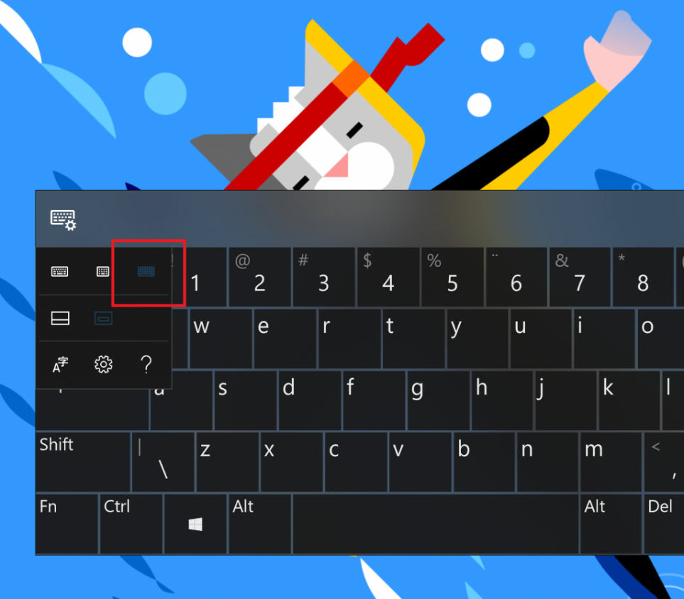

## Accessibility Improvements (Build 18267)
* **Narrator works better with Chrome now!** Using up and down arrows in scan mode, navigating with tab key, continuous reading commands, and navigating by headings and links have initial support for Chrome, with more functionality coming in future flights.
* **Narrator Braille**: BRLTTY version 5.6 is now provided which adds USB support for Inceptor and Orbit 20 displays. In addition, the BrailleNote Touch is recognized when using USB. Baum displays can now use B9 and B10 interchangeably. Liblouis binaries and tables have been updated to version 3.7.0.
* **UI Automation framework IAccessible2 Support**: The UI Automation framework now supports translating IAccessible2 information from Chrome, which supports IAccessible2 rather than UI Automation. This enables UI Automation clients to receive the IAccessible2 information through the UI Automation client interfaces.

## Enhanced Mode for Search Indexer (Build 18267)
To improve our search indexing, we created a new feature that enables Windows to search all your folders and drives, instead of limiting search to your documents, pictures, videos, and desktop by default. To turn it on, search for *Windows search settings*, and in the Searching Windows settings, under “Find My Files”, select **Enhanced** to begin the one-time indexing process. It will take about 15 minutes for search to begin returning these additional files in results. If you have lots of files, it may take longer. Make sure you plug in before you start, indexing is a resource-intensive activity.

When the indexing is complete, you'll be able to find all your files almost instantly when you use Windows Search. To exclude a folder from search, add it to the Excluded Folders list. Thanks for your feedback about search and the indexer. These improvements were made because of your input. Keep the feedback coming!

## DPI Awareness in Task Manager (Build 18262)
We added a new optional column to the **Details** tab of **Task Manager** so you can look at DPI awareness per process as in the following example:

To show the column, right-click on any of the column headers in the **Details** tab, click **Select Columns**, then add **DPI Awareness** to the list. To learn more about DPI Awareness, see [High DPI Desktop Application Development on Windows](https://docs.microsoft.com/en-us/windows/desktop/hidpi/high-dpi-desktop-application-development-on-windows).

## Uninstall additional inbox apps (Build 18262)
In 19H1, we are adding the ability to uninstall the following (preinstalled) Windows 10 inbox apps via the context menu on the **Start** menu **All Apps** list:
* 3D Viewer (previously called Mixed Reality Viewer)
* Calculator
* Calendar
* Groove Music
* Mail
* Movies & TV
* Paint 3D
* Snip & Sketch
* Sticky Notes
* Voice Recorder

In the Windows 10 October 2018 Update and prior, only the following inbox apps could be uninstalled via the context menu on the **Start** menu **All Apps** list: 
* Microsoft Solitaire Collection
* My Office
* OneNote
* Print 3D
* Skype
* Tips
* Weather

## Narrator Improvements (18262)
**Narrator Read by Sentence**: You can now read next, current and previous sentences in Narrator. Read by sentence is available with the keyboard and with touch. Move by sentence doesn't yet work for Braille. 
* Caps + Ctrl + Period (.) to Read next sentence
* Caps + Ctrl + Comma (,) to Read current sentence
* Caps + Ctrl + M to Read previous sentence 
Sentence is now a new Narrator view and can be reached via Caps + Page Up or Caps + Page Down and then you can navigate with Caps + Left arrow for move by previous sentence and Caps + Right arrow for move by next sentence. 

## Enhanced settings for Ethernet (Build 18252)
You can now use the **Settings** app to configure advanced Ethernet IP settings. We have added support for configuring a static IP address as well as setting a preferred DNS server. These settings were previously accessed within **Control Panel**, but you will now find them on the connection properties page under **IP settings**.

## New icon for disconnected Internet (Build 18252)
First seen on Always Connected PCs, we brought the disconnected internet icon to all devices running Windows 10. This single icon appears when there is no internet connection detected, and replaces the individual disconnected icons for Cellular, Wi-Fi, and Ethernet. This new icon should help you quickly identify network problems so that you can take action to resolve them.

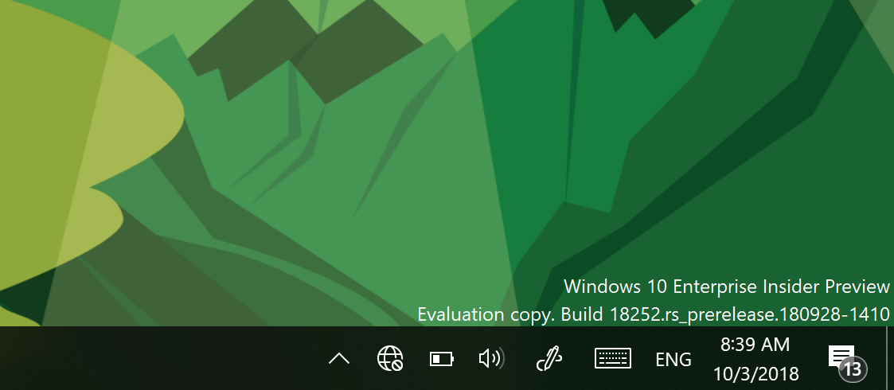

## Ebrima font addition with ADLaM support (Build 18252)
You can now read your ADLaM documents and webpages with the Windows Ebrima font!

ADLaMis a writing system for Pular/Fulfulde, the language of the Fulani people, predominantly residing in west Africa. In the early 1990s, two young teenager brothers, Abdoulaye and Ibrahima Barry, created this writing system. Their work became “Bindi Pulaar” and eventually “ADLaM,” ADLaM is enabling literacy and growing in use for commerce, education, and publishing across western Africa. It was added to Unicode in Unicode 9.0.

The Ebrima font also supports other African writings systems N'ko, Tifinagh, Vai and Osmanya – here's a sample of what the font looks like:

## Bringing acrylic to the Windows sign-in screen (Build 18237)
The Windows sign-in screen now supports [acrylic](https://docs.microsoft.com/en-us/windows/uwp/design/style/acrylic), a type of brush from the [Fluent Design System](https://docs.microsoft.com/en-us/windows/uwp/design/fluent-design-system/index), to the sign-in screen background.  The translucent texture of this transient surface helps you focus on the sign-in task by moving the actionable controls up in the visual hierarchy while maintaining their accessibility.

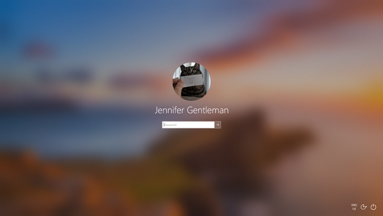