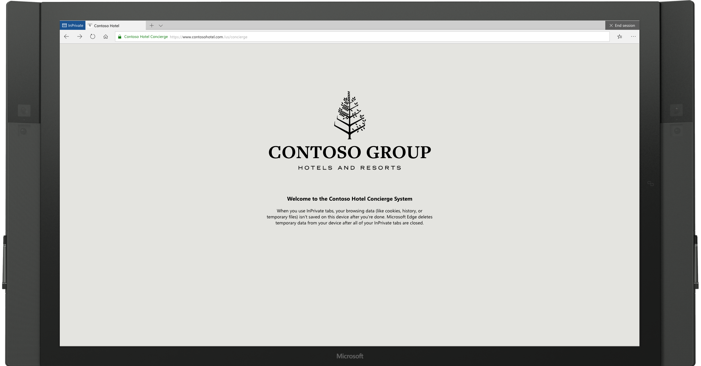
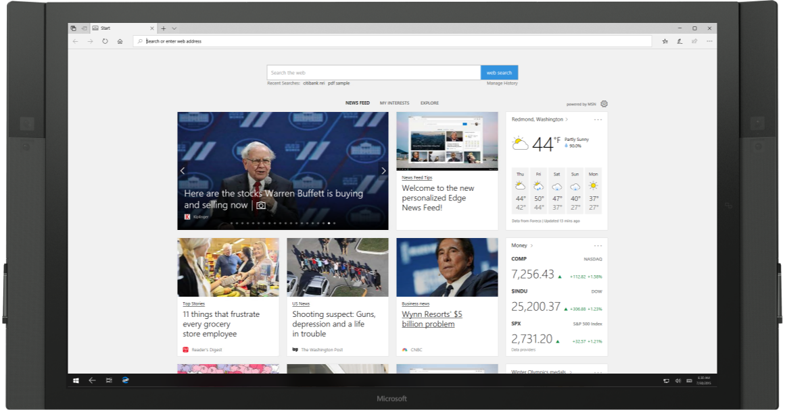
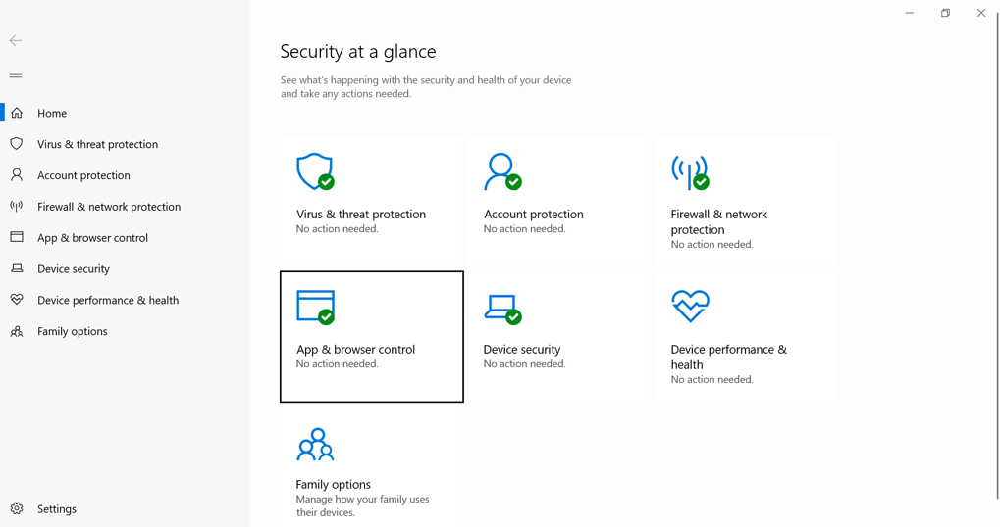
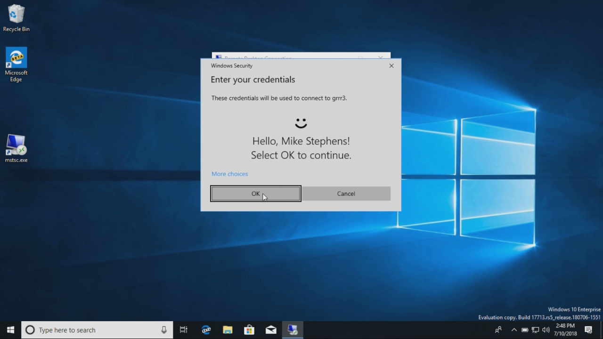
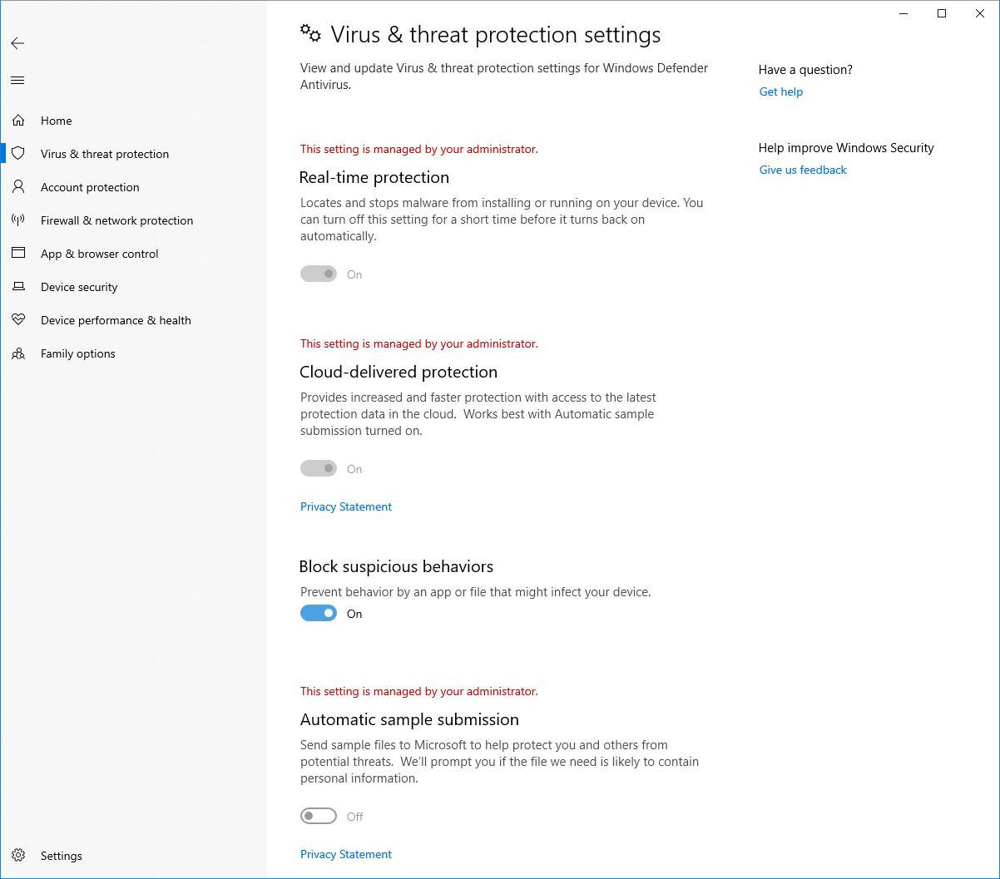
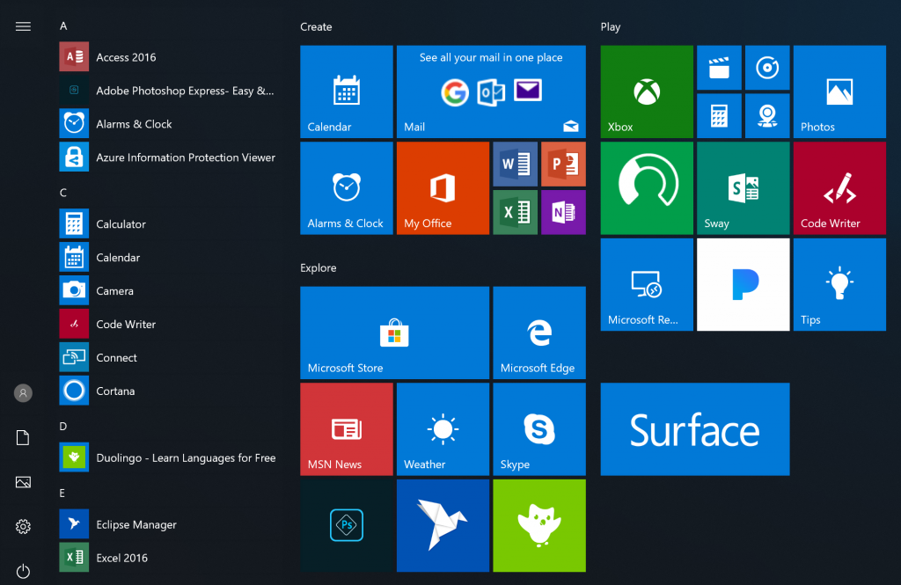

# What’s New in Windows 10 Insider Program for Business Preview Builds 
## Improved Kiosk Setup Experience (Build 17723)

We have introduced a simplified assigned access configuration page in Settings that allows device administrators to easily set up their PC as a kiosk or digital sign. This new page provides a wizard experience that walks you through the kiosk setup flow including creating a kiosk account that will automatically sign in on device start.

Please go to Settings, search for assigned access, and open the “Set up a kiosk” page to give it a try. We would love to hear your feedback! Let us know via the [Feedback Hub](wip-4-biz-feedback-hub.md).   

We are very excited to announce that Microsoft Edge now works with assigned access which allows IT administrators to create a tailored browsing experience designed for kiosk devices. Microsoft Edge kiosk mode supports the following four types.

For Microsoft Edge kiosk mode running in single-app assigned access the two kiosk types are:
1. <b>Digital / Interactive signage</b> that displays a specific website full-screen InPrivate.
2. <b>Public browsing</b> supports multi-tab browsing and runs InPrivate with minimal features available. Users cannot minimize, close, or open a new Microsoft Edge windows or customize it using Microsoft Edge Settings. Users can clear browsing data, downloads and restart Microsoft Edge by clicking “End session.” Administrators can configure Microsoft Edge to restart after a period of inactivity.

For Microsoft Edge kiosk mode running in multi-app assigned access the two kiosk types are (<i>Note the following Microsoft Edge kiosk mode types cannot be setup using the new simplified assigned access configuration page in Windows 10 Settings</i>):

3. <b>Public browsing</b> supports multi-tab browsing and runs InPrivate mode with minimal features available. In this configuration, Microsoft Edge can be one of many apps available. Users can close and open multiple InPrivate windows.

4. <b>Normal mode<b> runs a full version of Microsoft Edge, although some features may not work depending on what apps are configured in assigned access. For example, if the Microsoft Store is not set up, users cannot get books.

## New Microsoft Edge Group Policies (Build 17723)
The Microsoft Edge team introduced new Group Policies and MDM settings for IT administrators to manage Microsoft Edge. The new policies include enabling/disabling full-screen mode, printing, favorites bar, and saving history; prevent certificate error overrides; configuring the Home button and startup options; setting the New Tab page and Home button URL and managing extensions. Learn more about the [new Microsoft Edge policies](https://aka.ms/new-microsoft-edge-group-policies).

## Microsoft Edge kiosk mode (Build 17713)

Microsoft Edge kiosk mode works with assigned access to let IT administrators create a tailored browsing experience designed for kiosk devices. 
When you configure Microsoft Edge kiosk mode in assigned access, you can set it up to show only a single URL in full-screen, in the case of digital/interactive signage on a single-app kiosk device. You can restrict Microsoft Edge for public browsing (on a single and multi-app kiosk device) which runs a multi-tab version of InPrivate with limited functionality. Also, you can configure a multi-app kiosk device to run a full or normal version of Microsoft Edge. 
Learn more about [Microsoft Edge kiosk mode](https://docs.microsoft.com/en-us/microsoft-edge/deploy/microsoft-edge-kiosk-mode-deploy).

## Web sign-in to Windows 10 (Build 17713)
Until now, Windows logon only supported the use of identities federated to ADFS or other providers that support the WS-Fed protocol. We are introducing “Web Sign-in,” a new way of signing into your Windows PC. Web Sign-in enables Windows logon support for non-ADFS federated providers(e.g.SAML).

### To try out web sign-in:
1. Azure AD Join your Windows 10 PC. (Web Sign-in is only supported on Azure AD Joined PCs).
2. Set the Policy CSP/Authentication/EnableWebSignIn policy to enable Web Sign-in. 
3. On the lock screen, select Web Sign-in under Sign-in options.
4. Click the “Sign in” button to continue.

## Faster sign-in to a Windows 10 shared pc (Build 17713)
Do you have shared PCs deployed in your work place? Introducing “Fast Sign-in,” which enables users to sign in to a shared Windows 10 PC in a flash!

### To enable Fast Sign in,
1. Set up a shared or guest PC with Windows 10
2. Set Policy/Authentication/EnableFastFirstSignIn to enable fast sign-in
3. With the policy enabled, sign-in to a shared PC with your account and notice the difference!

## Windows Defender Application Guard Improvements (Build 17713)
Windows Defender Application Guard introduced a new user interface inside Windows Security in this release. Standalone users can now install and configure their Windows Defender Application Guard settings in Windows Security without needing to change Registry key settings. 

Additionally, users who are managed by enterprise policies will be able to check their settings to see what their administrators have configured for their machines to better understand the behavior of Windows Defender Application Guard. This new UI aims to improve the overall experience for users to manage and check their Windows Defender Application Guard settings. As long as devices meet the minimum requirements, these settings will appear in Windows Security.For detailed information, click [here](https://techcommunity.microsoft.com/t5/Windows-Insider-Program/test/m-p/214102#M1709).

To check this out, 
1. go to Windows Security and select App & browser control.

2. Select Install Windows Defender Application Guard under Isolated browsing, install and restart the device (only for standalone users).

3. Select Change Application Guard settings.

4. Configure or check Application Guard Settings.

## Remote Desktop with Biometrics (Build 17713)
We’re happy to share that with this build of Windows 10, Azure Active Directory and Active Directory users using Windows Hello for Business can use biometrics to authenticate to a remote desktop session!

To get started, bring up Remote Desktop Connection (mstsc.exe), type the name of the computer to which you want to connect and tap or click <b>Connect</b>.

Because you signed using Windows Hello for Business, Windows remembers how you signed in and automatically selects Windows Hello for Business to authenticate you to your RDP session but, you can click <b>More choices</b> to choose alternate credentials.

In this example, Windows uses facial recognition to authenticate the RDP session to the Windows Server 2016 Hyper-V server. You can continue to use Windows Hello for Business in the remote session, but you must use your PIN.

## Registry editor improvements (Build 17711)

Have you ever been typing into the regedit address bar, and the next part of the path is just on the tip of your tongue, but you can’t remember? Starting with build 17711, you’ll see a dropdown as you type to help complete the next part of the path. You can also press Ctrl + Backspace to delete the last "word," which makes backing up work that much faster (Ctrl + Delete will delete the next word).

## Security updates (Build 17704)

We’ve continued to work on the **Current threats** area in  [Virus & threat protection](https://docs.microsoft.com/windows/security/threat-protection/windows-defender-security-center/wdsc-virus-threat-protection), which now displays all threats that need action. You can quickly take action on threats straight from this screen: 

You can enable a new protection setting, **Block suspicious behaviors**, which brings [Windows Defender Exploit Guard attack surface reduction technology](https://docs.microsoft.com/windows/security/threat-protection/windows-defender-exploit-guard/attack-surface-reduction-exploit-guard) to all users. To enable this setting, go to the Virus & threat protection section and click **Manage settings**, as shown in the following screenshot:

With Controlled folder access you can help prevent ransomware and other destructive malware from changing your personal files. In some cases, apps that you normally use might be blocked from making changes to common folders like Documents and Pictures. We’ve made it easier for you to add apps that were recently blocked so you can keep using your device without turning off the feature altogether.

When an app is blocked, it will appear in a recently blocked apps list, which you can get to by clicking **Manage settings** under the **Ransomware protection** heading, and then **Allow an app through Controlled folder access**. After the prompt, click the plus button and choose **Recently blocked apps**. Select any of the apps to add them to the allowed list. You can also browse for an app from this page as well.

We've added a new assessment for the Windows time service to the **Device performance & health** section. If we detect that your device’s time is not properly synced with our time servers and the time-syncing service is disabled, we’ll provide the option for you to turn it back on.

We’re continuing to work on how other security apps you’ve installed show up in the Windows Security app. There’s a new page called **Security providers** that you can find in the Settings section of the app. Click **Manage providers** to see a list of all the other security providers (including antivirus, firewall, and web protection) that are running on your device. Here you can easily open the providers’ apps, or get more information on how to resolve any issue that they have reported to you through the Windows Security app.

This also means you’ll see more links to other security apps within the Windows Security app. For example, if you open the **Firewall & network protection** section, you’ll see the firewall apps that are running on your device under each firewall type (domain, private, and public networks).

## Power scheme for pro for workstations 

<b>A new power scheme – Ultimate Performance</b>: Demanding workloads on workstations always desire more performance. As part of our effort to provide the absolute maximum performance we’re introducing a new power policy called Ultimate Performance. Windows has developed key areas where performance and efficiency tradeoffs are made in the OS. Over time, we’ve amassed a collection of settings which allow the OS to quickly tune the behavior based on user preference, policy, underlying hardware or workload.
This new policy builds on the current High-Performance policy, and it goes a step further to eliminate micro-latencies associated with fine grained power management techniques. The Ultimate Performance Power plan is selectable either by an OEM on new systems or selectable by a user. To do so, you can go to Control Panel and navigate to Power Options under Hardware and Sound (you can also “run” Powercfg.cpl). Just like other power policies in Windows, the contents of the Ultimate Performance policy can be customized.

As the power scheme is geared towards reducing micro-latencies it may directly impact hardware; and consume more power than the default balanced plan. The Ultimate Performance power policy is currently not available on battery powered systems.

<b>Productivity focused out of box applications</b>: The out of box experience for Windows 10 Pro for Workstations display  productivity and enterprise focused applications in place of consumer applications and games. 

