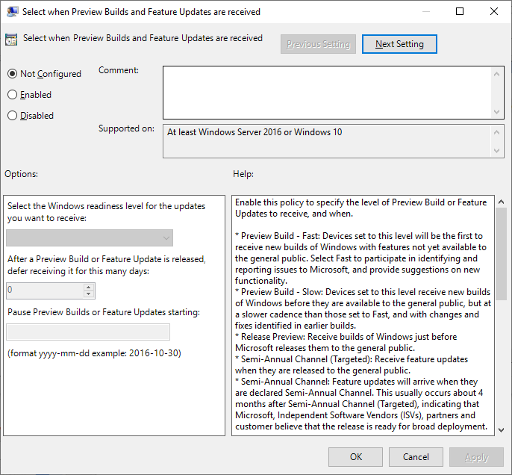
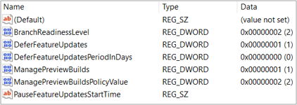

# Manage Insider Preview builds across your organization 
If you're an administrator, you can manage installations of Windows 10 Insider Preview Builds across multiple devices in your organization using Group Policy, MDM solutions such as Intune, Configuration Manager, or Windows Server Update Services.

> [!NOTE] 
> You can also [start flighting on an individual device or virtual machine](./flighting.md) or [use ISOs to download Insider Preview builds](../isos.md). 

## Register your domain 

First, register your Azure Active Directory domain through our website. By registering your domain, you won't have to register each device or user in the program and can set important policies around preview builds.

To register your domain:

* You must already be registered with the work email address tied to your Azure Active Directory (AAD) Global Administrator account. [Learn more about registering with your work email address.](./register.md)  
* It must be in Azure Active Directory. We don't support Active Directory on premises in the Windows Insider Program.
* Use a production tenant of AAD, not a test tenant, to make the most of the program. The AAD tenant is just used for authentication, so you won't need to worry about changes to it from the the program.

> [!div class="nextstepaction"]
> [Register your domain now](https://insider.windows.com/for-business-getting-started#flight)

## Join devices to Azure Active Directory

To receive Insider Preview builds, devices must be joined to the same AAD domain that you used to register with the program.

1. To join individual devices, go to [**Settings** > **Accounts** > **Access work or school**](https://aka.ms/WorkAccountSettings), select **Join this device to Azure Active Directory**, and log in with your AAD account. Get more detailed instructions for this on [Microsoft Azure Docs](/azure/active-directory/user-help/user-help-join-device-on-network).

2. If you have your organization's devices attached to Active Directory Domain Services, you can also bulk import all of them with [Azure AD Connect](/azure/active-directory/hybrid/whatis-hybrid-identity).
 
[Get more help with a detailed walkthrough of joining your device to your organization's network.](/azure/active-directory/user-help/user-help-join-device-on-network)

## Choose your diagnostic data settings
Your privacy is important to us. But, to run Insider Preview builds on a device updating directly from Windows Update, you must allow us to see a certain amount of diagnostic data, so we can investigate issues you might see.

* If you’re setting up Insider Preview builds for the first time, you must have optional data turned on to get started.
* If you're already running Insider Preview builds in the Dev Channel on devices, [use these instructions to update your diagnostic data settings](https://aka.ms/DDChanges).

[Learn more about diagnostic data and configuring it for your organization.](/windows/privacy/configure-windows-diagnostic-data-in-your-organization)

## Create and manage policies 
You can use Windows Update for Business (Group Policy or Mobile Device Management (MDM) tools, such as Intune,) or Windows Server Update Service (WSUS) tools, such as Configuration Manager, to control how and when Windows 10 Insider Preview Builds are installed on devices in your organization.  

### Set up Insider Preview builds using Group Policy

1. In the Group Policy Management Console (GPMC), create a Group Policy Object and add it to the Organizational Unit that has the devices you want to manage in it.

2. Go to **Computer Configuration** > **Administrative Templates** > **Windows Components** > **Data Collection and Preview Builds** > **Allow Telemetry**. 

3. Inside **Allow Telemetry**, select the Enabled radio button. Under Options, set the dropdown to 3 - Full, and apply.

5. Go to **Computer Configuration** > **Administrative Templates** > **Windows Components** > **Windows Update** > **Windows Update for Business** and open **Manage preview builds**.

6. Inside **Manage preview builds**, select the Enabled radio button, and apply. (Under the **Options** section's **Enable preview builds** dropdown, you can also prevent installation on selected devices or set it to stop Insider Preview builds once a release is public.)
Note:  If you configure this setting to Disabled, the Windows Insider page settings for "Get started" will be greyed out for users so they cannot optin to Windows Insider program
7. Go back to **Computer Configuration** > **Administrative Templates** > **Windows Components** > **Windows Update** > **Windows Update for Business** and open **Select when Preview Builds and Feature Updates are received**.

8. Inside **Select when Preview Builds and Feature Updates are received**, select the Enabled radio button. Under **Options**, choose the channel you'd like to get Insider Preview builds from the dropdown. (You can also choose to defer or pause builds here.)

[Learn more about using Group Policy to configure Windows Update for Business.](/windows/deployment/update/waas-wufb-group-policy)

> [!NOTE] 
> You can also schedule update installations, choose active hours, and set policies for restart. [Learn more about managing device restarts after updates.](/windows/deployment/update/waas-restart)

### Set up Insider Preview builds using Intune

1. Log in to the [Azure portal](https://portal.azure.com) and select **Intune**.

2. Go to **Software Updates** > **Windows 10 Update Rings** and select **+ Create** to make an Update Ring policy.

3. Add a name and select the **Settings** section to configure its settings.

6. Under **Servicing Channel**, choose the channel you want to receive Insider Preview builds from.

7. Under **Feature update deferral period**, you can also choose to defer Insider Preview builds for a certain number of days after a release. 

8. Select **OK** to comfirm your settings.

9. Select **Create** to save the policy.

9. Go to **Assignments** and assign your policy to specific users, devices or groups. You can create groups with one or more users or devices in Intune under **Groups**.

10. Select **Save** to deploy your new policy to these users, devices, or groups.

[Learn more about managing software updates in Intune.](/intune/windows-update-for-business-configure)

### Set up Insider Preview builds using other MDM service providers

To set up Insider Preview builds through other MDM service providers, use these CSP settings: 

- [Update/ManagePreviewBuilds](/windows/client-management/mdm/policy-csp-update#update-managepreviewbuilds) 

- [Update/BranchReadinessLevel](/windows/client-management/mdm/policy-csp-update#update-branchreadinesslevel)

[Learn more about configuring CSPs in MDM.](/windows/configuration/provisioning-packages/how-it-pros-can-use-configuration-service-providers#csps-in-mdm) 

### Set up Insider Preview builds using Configuration Manager

1. In the **Products** tab of **Software Update Point Component Properties**, select the checkbox next to **Windows Insider Pre-Release**. Select **OK**. 

> [!NOTE] 
> While this option will be visible on every version of Configuration Manager, you must be running Configuration Manager, version 1906 or newer to select it.

2. If you already manage your organization’s deployments using Configuration Manager, go to **Software Library** > **Overview** > **Windows 10 Servicing** > **All Windows 10 Updates** to use the same procedure you currently use to deploy Windows 10 feature updates. In the list of **All Windows 10 Updates**, you'll see an option for **Windows Insider Pre-release Feature Update to Windows 10 Version 1909**.

3. Deploy the release the same way you would any other feature update. 

### Set up Insider Preview builds with Windows Server Update Services (WSUS)

1. From **Products and Classifications** in WSUS, check the **Windows Insider Pre-release Product and Upgrades**. Sync WSUS. 

2. Once the sync completes and shows up on the WSUS console, approve it for the computer group you want the update deployed to, and deploy as you would any other update.

## Confirm installations

Once a policy has been set, restart the device to activate the policy. Then, to confirm that your policies have been set correctly, go to [**Settings** > **Update & Security** > **Windows Update**](https://aka.ms/WIPWindowsUpdate) on one of the targeted devices and select **View configured update policies**. 

You can also check this key in the Registry Editor on the device: 
- **HKEY_LOCAL_MACHINE\SOFTWARE\Policies\Microsoft\Windows\WindowsUpdate** 

Devices set to receive an Insider Preview build show:

- BranchReadinessLevel = 2 (Dev Channel), 4 (Beta Channel) or 8 (Release Preview Channel) 

- ManagePreviewBuilds = 1

