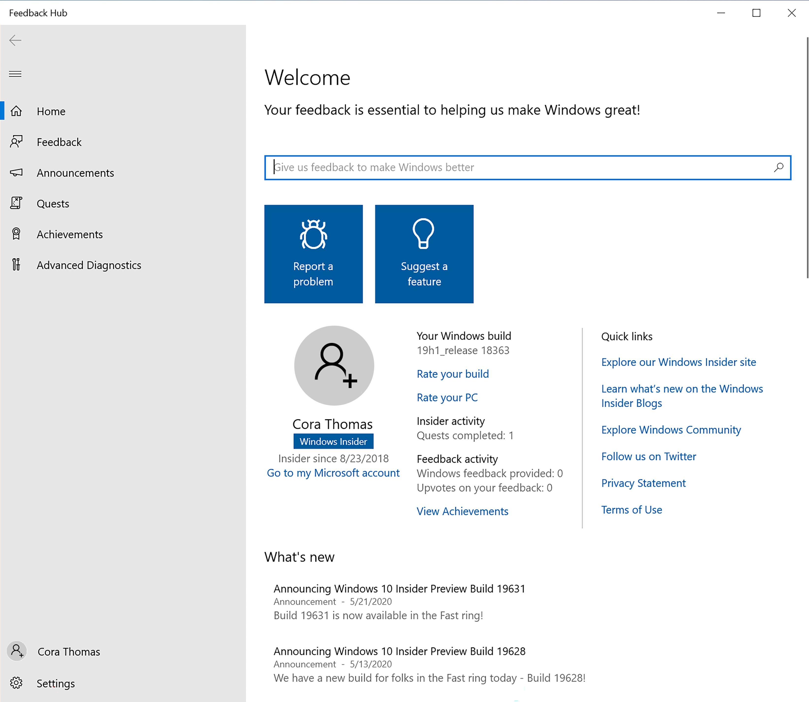
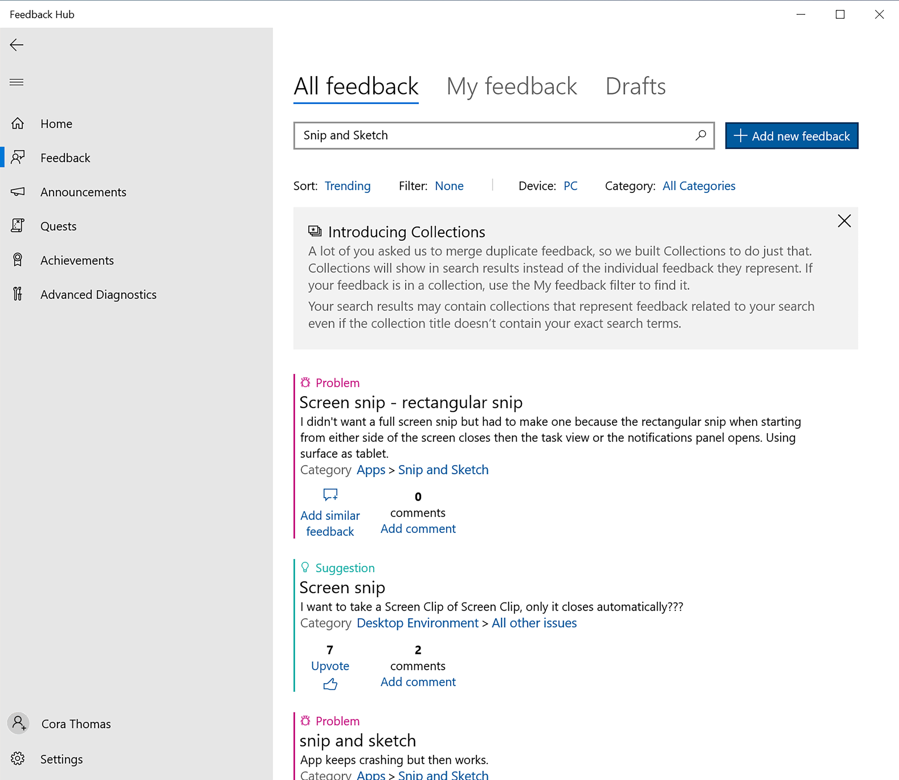
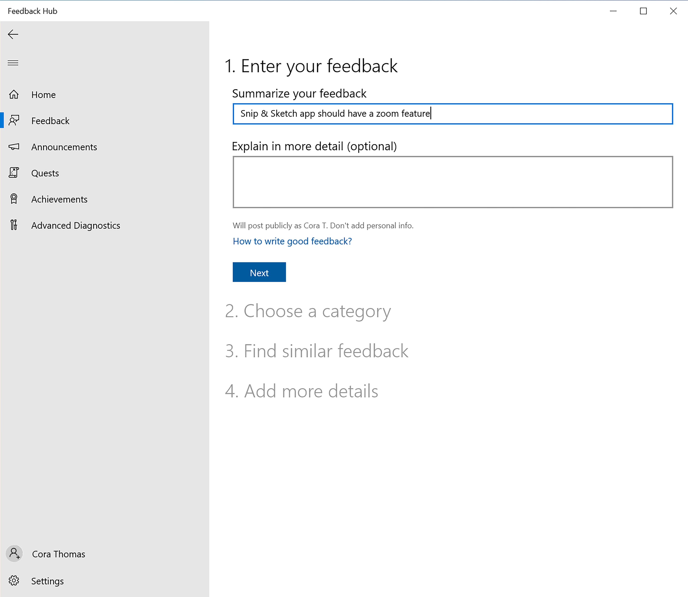
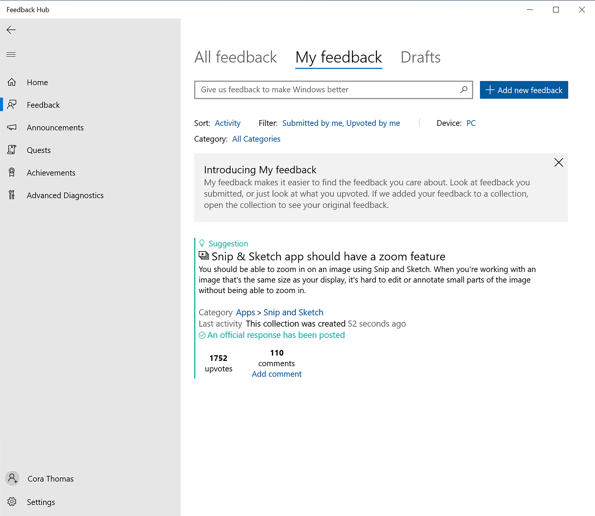
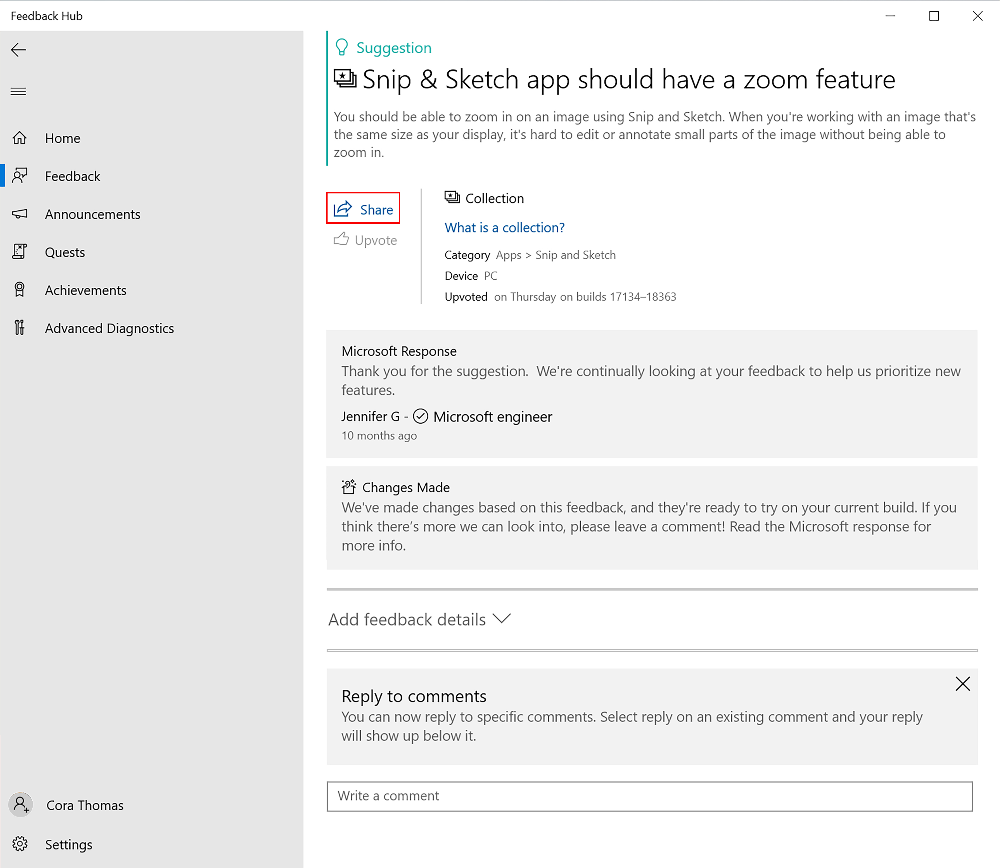
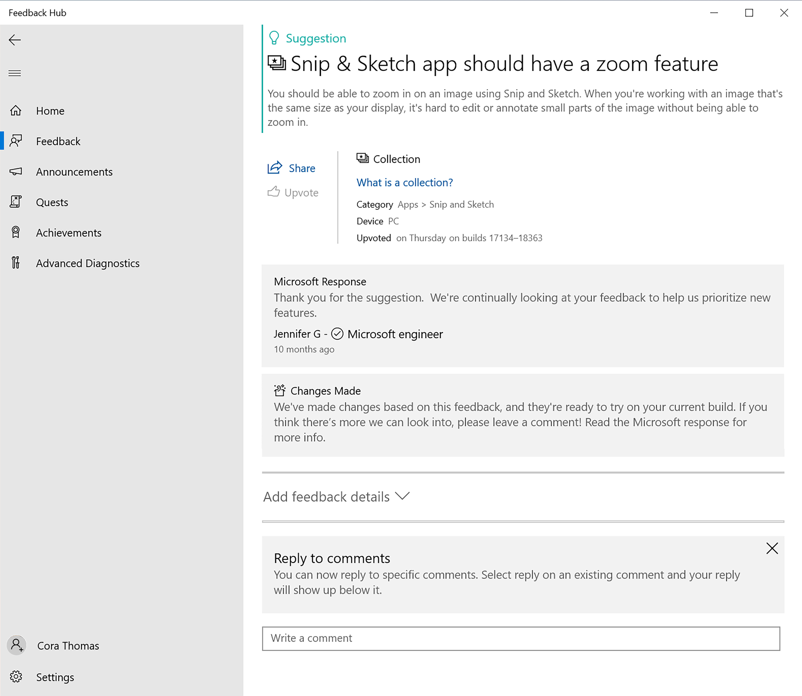

#  Give feedback with the Feedback Hub
As a Windows Insider, your feedback can change and improve Windows for users around the world. Once you're flighting Windows 10 Insider Preview Builds, it's time to give us feedback and start connecting to our community. The [Feedback Hub](https://aka.ms/WIPFeedbackHub) on Windows 10 makes giving us your feedback easy.

## Explore the Feedback Hub 

The [Feedback Hub](https://aka.ms/WIPFeedbackHub) is an app available on Windows devices. You can search for it, press the Windows key + F to open it, or find it in your Start menu to get started. Sign in with the account that that you used to register for the Windows Insider Program to get access to all its features.

### Home section

First, the **Home** section, where you land when you open the app, shows the account you're logged into, some key quick links, and a section with what's new. 

### Feedback section

The **Feedback** section shows you all the current feedback and has filters to help you look through it. You can also add your own new feedback, upvote suggestions from others, or add comments. You'll also see **Collections**, which group together similar feedback, making it easier to find.

Use the **My feedback** tab to go back and look at all of your past feedback and check its status. If you start feedback but don't submit it, a **Drafts** tab will also show up here. From there, you'll be able to open a feedback draft, continue to edit it, and submit when you're ready.

### Announcements section

In **Announcements**, you'll see quick versions of the latest Windows Insider news. You can also [read full versions of these announcements in our flight blog posts](https://blogs.windows.com/windows-insider/). 

### Quests section

In **Quests**, follow our step-by-step instructions to try out Windows features we're currently working on improving with your feedback. For each Quest you finish, you'll earn points towards badges, which you'll see in the **Achievements** section. 

### Achievements section

In the **Achievements** section, you'll see all the badges you've earned as a Windows Insider from flighting, Quests, and more.

### Advanced Diagnostics section

In the **Advanced Diagnostics** section, you can save a copy of diagnostics to your device. Choose either default or custom diagnostics and the category, subcategories, and type of problem from the dropdowns, then start your recording.

### Your account

At the bottom of the menu, you'll see either your account name and picture, which means you're logged in, or an icon you can select to log in.

### Settings

Finally, you'll see **Settings** at the very bottom of the menu. This lets you choose when you get notifications, adjust your theme or diagnostics settings, and see some of your device information. 

## Give great feedback

While your device sends us some anonymous diagnostic data when you're flighting Insider Preview builds, giving us your feedback is key to helping improve Windows for the future.

The [Feedback Hub](https://aka.ms/WIPFeedbackHub) collects information based on your privacy settings and the category of feedback you're giving. If you're letting us pull anonymous diagnostic data, then we also collect info about the specific feature you're giving us feedback on. If you can give us screenshots, key files, or recreate the problem, that can also help us better understand the issue or suggestion.

First, check if feedback already exists for your problem or suggestion. If your problem already exists, you can add similar feedback. If your suggestion already exists, you can upvote that feedback. You can also add comments to share more details. If you can't find feedback like yours, it's time to add new feedback.

> [!div class="nextstepaction"]
> [Give feedback](https://aka.ms/WIPFeedbackHub)

> [!NOTE] 
> Depending on the kind of feedback you're giving, we might need to be able to see a certain amount of diagnostic data. [Make sure your data settings are set to the right level to flight and give us feedback.](https://docs.microsoft.com/windows-insider/get-started)

### Check for existing feedback 

1. Open the [Feedback Hub](https://aka.ms/WIPFeedbackHub). If you're experiencing an issue, it's best to open the [Feedback Hub](https://aka.ms/WIPFeedbackHub) on the Windows device you're seeing the issue on, so it can also send diagnostic data.

2. On the bottom left, make sure you're signed in with the account you used to register for the Windows Insider Program. If you're not, sign in now.

3. In the search on either the **Home** or **Feedback** sections, enter the topic you want to check for feedback on.

4. Use the filters at the top to further narrow your search results:

- The **Sort** option helps you find the latest issues and suggestions. Choose from **Trending**, **Most recent**, or **Upvotes**.

- The **Filter** option gives you the most ways to filter your results, and you can choose multiple filters in the section. You can sort feedback by your build number, if they're suggestions or problems, if they have official responses, or their status, like more details needed and changes made. You can also exclude all feedback with changes made, so you're only seeing open issues.

- The **Device** option helps you narrow your results by device, either **PC** or **HoloLens**.

- The **category** and **subcategories** options let you filter by all the same categories you can use to file feedback.
 
5.  If you find the feedback you’re looking for, you have a few options to engage with it. If it's a suggestion, you can **Upvote** it to let us know you agree with the feedback. On both suggestions and problems, you can also leave a comment to provide additional information or scenarios for us to look into.

6. Once you find existing feedback, we recommend you select **Add similar feedback** to give us feedback on your issue too. By doing this, it will help pre-fill some of the key information you need to file your own, similar feedback.
 
### Add new feedback

1. If you found existing feedback, use the **Add similar feedback** option to get started with some of the key information already filled out. If you couldn't find any existing feedback, select the **+ Add new feedback** button from the top of the Feedback section. 

2. Under the first section, **1. Enter your feedback**, create a clear and descriptive title for your feedback in the **Summarize your feedback** field. For example:

- Snip & Sketch app should have a zoom feature

3. Under **Explain in more detail**, give us more specific details about how you encountered the issue, error messages you saw, why you think improvements would help, or any other information you think will help us resolve the issue. (Information about your device, operating system, and applications are automatically included with your feedback, so you don't have to include those details.) For example:

- You should be able to zoom in on an image using Snip & Sketch. When you're working with an image that's the same size as your display, it's hard to edit or annotate small parts of the image without being able to zoom in. 

4. Select **Next**. 

5. Under **2. Choose a category**, tell us if your feedback is a **Problem** or **Suggestion**. If you're seeing an issue, like something being broken or missing, you should choose problem. If you want a new feature or change in Windows, choose suggestion.

6. Based on what you've entered so far, [Feedback Hub](https://aka.ms/WIPFeedbackHub) usually chooses a **category** and **subcategory** for your feedback. Categories make sure your device pulls the right information and that your feedback is sent to the right teams, so it's important to check these. Make sure what it's chosen matches the feedback you've given or use the dropdowns to change them. 

7. Select **Next.** 

8. Under **3. Find Similar Feedback**, it will pull up a list of any feedback similar to yours. If there's a match, select it and continue to add more details specific to your issue. If there isn't anything that's a good match, select **New feedback**.

9. Select **Next.** 

7.  If you're reporting a problem, under **4. Add more details**, you can check **Prioritize this as high severity** if your issue is urgent. You should also choose which of these categories best describes your problem:

- **Mising personal data**
- **Security or privacy concern**
- **Inability to use my PC**
- **Important functionality not working**
- **Loss of productivity**
- **Other**

8. Once you're done filling out these details, or if you're submitting a suggestion, under the **Attachments** section, you can attach any related information you have.

- **Attach a screenshot** - Press Ctrl + V to paste an image from your clipboard or go to where you're seeing the issue and press the Windows key + Print screen to take a screenshot that gets saved to your Pictures > Screenshots folder. Then **Choose a screenshot** to attach the file. 

- **Attach a file** - Select this to use File Explorer to find and attach the file you'd like to submit with your feedback.

- **Recreate your problem or suggestion** - Check the default settings it's showing for your issue, and then **Start recording**. While it's recording, run through the steps that led to your issue or show us how you think your suggestion would work. When you're done, select **Stop capture** to attach it to your feedback. You can review and edit this data before you send it.

9. If you'd like to have a copy of the information you're sending us, check the box to **Save a local copy of diagnostics and attachments created when giving feedback**.

10. When you’re satisfied with your feedback, select **Submit** to send us your feedback.

## Share your feedback

If you think others are experiencing the same issue or would like the same new feature, please share your feedback with your community. Sometimes, our employees might ask for a feedback link when they're helping you with an issue too. 

1. Once you've submitted feedback, you'll be able to see it under the **My feedback** tab of the **Feedback** section. You can also search and filter all of your feedback to find the piece you're looking for.

2. Select the feedback you'd like to share. Choose the **Share** button near the top of the page to open its link to copy it or open more sharing options.

3. Share your feedback link with your community.

> [!NOTE] 
> If you're on an Azure Active Directory (AAD) work account, you can also see feedback from other users in your organization. [Learn more about giving and tracking feedback as a business.](https://docs.microsoft.com/windows-insider/business/feedback).

## Check the status of your feedback

You can come back to the **My feedback** tab of the **Feedback** section any time to see the status of your feedback. When the status of your feedback changes, you'll get a notification. (You'll also get these for feedback you upvote.) When it changes, you’ll see a banner on your feedback showing its status:

• **We've got it** - Your feedback's been sent to an expert to review.

• **Looking into it** - We're currently investigating your feedback.

• **Working on it** - We're working on improvements based on your feedback.

• **Changes made** - We've made an update based on your feedback. It will also let you know which build or app version has the change and if you need to update to see it. If you think there’s more we can look into, please leave a comment.    

• **Needs more info** - We need your help to understand this issue better. Please review our comments and add details to help us better understand the problem.

