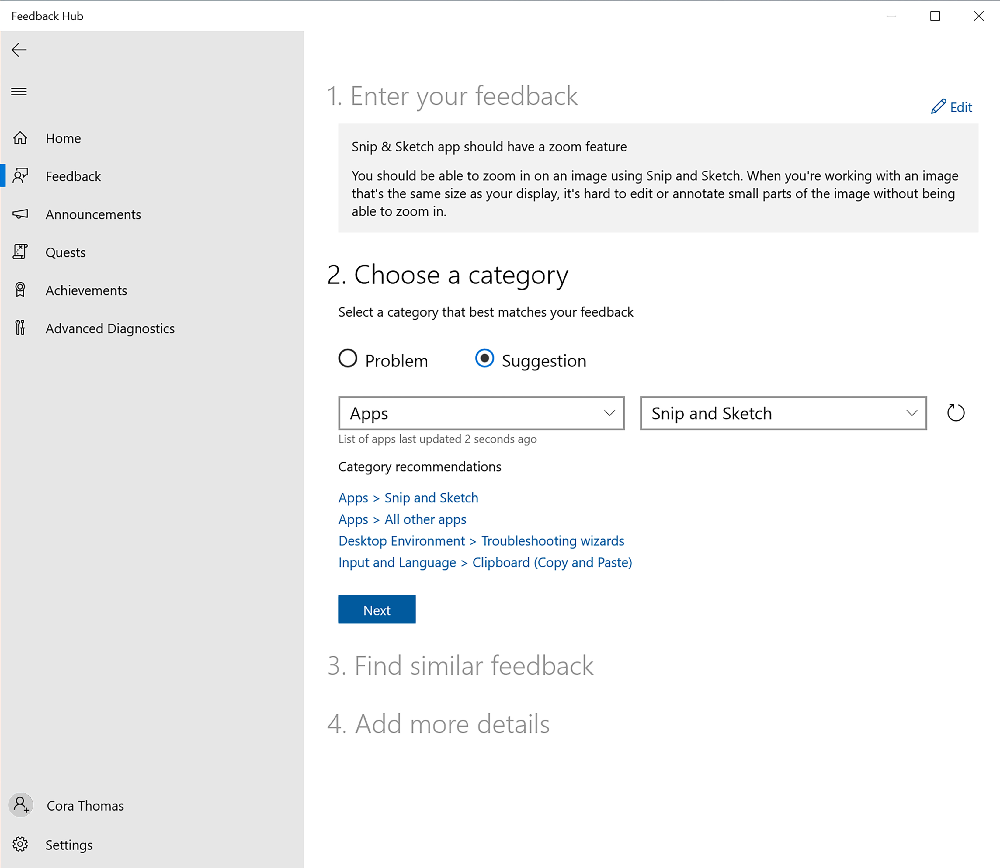
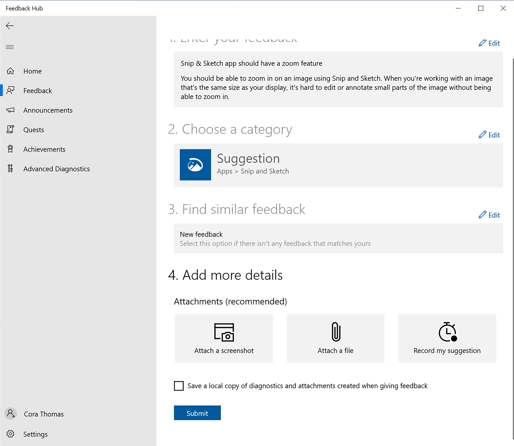

# Deeper look at feedback

As a Windows Insider, your feedback can change and improve Windows for users around the world. While your device sends us some anonymous diagnostic data when you're flighting Windows Insider Preview Builds, giving us your feedback is key to helping improve Windows for the future. 

The [Feedback Hub](https://aka.ms/WIPFeedbackHub), an app on Windows, makes giving us your feedback easy. Sign in with the account that that you used to register for the Windows Insider Program to get access to all its features. 

> [!NOTE] 
> Open the [Feedback Hub](https://aka.ms/WIPFeedbackHub) in Start, search, or by pressing the **Win** + **F**. [Learn more about navigating the Feedback Hub.](./feedback-hub/feedback-hub-app.md)

## Give great feedback

When you file feedback, it will collect information based on your privacy settings and the category of feedback you're giving. If you're letting us pull anonymous diagnostic data, then we also collect info about the specific feature you're giving us feedback on. If you can give us screenshots, key files, or recreate the problem, that can also help us better understand the issue or suggestion and collect more diagnostics.

First, check if feedback already exists for your problem or suggestion. If it already exists, you can upvote or add similar feedback. If you can't find feedback like yours, it's time to add new feedback.

> [!div class="nextstepaction"]
> [Give feedback](https://aka.ms/WIPFeedbackHub)

> [!NOTE] 
> Depending on the kind of feedback you're giving, we might need to be able to see a certain amount of diagnostic data. [Make sure your data settings are set to the right level to flight and give us feedback.](./get-started.md)

## Check for existing feedback 

1. Open the [Feedback Hub](https://aka.ms/WIPFeedbackHub). If you're experiencing an issue, it's best to open it on the Windows device you're seeing the issue on, so it can also send diagnostic data.

2. On the bottom left, make sure you're signed in with the account you used to register for the Windows Insider Program. If you're not, sign in now. We can only get diagnostic data and respond to you if you're logged in as an Insider or retail user.

3. In the search on either the **Home** or **Feedback** sections, enter the topic you want to check for feedback on.

4. Use the filters at the top to further narrow your search results:

- The **Sort** option helps you find the latest issues and suggestions. Choose from **Trending**, **Most recent**, or **Upvotes**.

- The **Filter** option gives you the most ways to filter your results, and you can choose multiple filters in the section. You can sort feedback by your build number, if they're suggestions or problems, if they have official responses, or their status, like more details needed and changes made. You can also exclude all feedback with changes made, so you're only seeing open issues.

- The **Device** option helps you narrow your results by device, either **PC** or **HoloLens**.

- The **category** and **subcategories** options let you filter by all the same categories you can use to file feedback.
 
5.  If you find the feedback you’re looking for, you have a few options to engage with it. You can **Upvote** it to let us know you agree with the feedback. 

- Upvote it. If this is a major trending issue or suggestion that hasn't been fixed yet, upvoting it is all you need to do to be heard and show you care about the issue. 

- If there's no collection, very few reports or upvotes, or it's marked with **More details needed**, it's a good idea to file your own similar feedback to share your experience. Also, if it's marked with **Changes made**, but you're still seeing the issue on build numbers higher than the fixed build number in the response, file similar feedback to help us investigate further.

6. To file your own similar feedback, select **Add similar feedback**. This will help pre-fill some of the key information you need in your feedback based on the original piece of feedback.
 
## Add new feedback

1. If you found existing feedback, use the **Add similar feedback** option to get started with some of the key information already filled out. If you couldn't find any existing feedback, select the **+ Give new feedback** button from the top of the Feedback section. 

2. Under the first section, **1. Enter your feedback**, create a clear and descriptive title for your feedback in the **Summarize your feedback** field. It is incredibly important to give a good title because it's usually the first thing we see at Microsoft when trying to make sure your feedback gets to the right people. We recommend including the name of the feature and a clear overview of the issue or the request you're seeing.

- **Good suggestion title:** Snip & Sketch app should have a zoom feature
- **Bad suggestion title:** I hate it! Give me back old option instead

- **Good problem title:** "New" label on apps in the Start menu isn't translated correctly in Russian, it says "create" instead
- **Bad problem title:** It won't open anymore!

3. Under **Explain in more detail**, it's very important to give us a clear detailed description of your suggestion or issue and why it matters. We get millions of pieces of feedback, so regularly we'll know from just a good description if this is new a known issue, which saves us time. And that means we get to more feedback and fixes! We recommend including: 
- An overview of your experience
- What you were doing when the issue occurred
- Any error messages you saw
- Why you think improvements would help 
- Only one piece of feedback in this—giving us a long list of different issues and/or suggestions means we can't tie them to collections or assign them to our teams correctly, so you'll get put into a bucket asking you to file each piece separately instead of being told when your issue is fixed
- **Do not** include detailed information about your device, operating system, or application versions, which are automatically included with your feedback

- **Good suggestion description:** You should be able to zoom in on an image using Snip & Sketch. When you're working with an image that's the same size as your display, it's hard to edit or annotate small parts of the image without being able to zoom in. 
- **Bad suggestion description:** I don't like that I can't drag files to the taskbar anymore, move it to be vertical on the side, and that auto-hide taskbar has a bug where settings aren't remembered. I also hate Recommended in the Start menu, let me remove it.

- **Good problem description:** In Russian, the "New" label on apps in the Start menu's Recommended section isn't translated correctly. It says "create" or "Создать" instead. It should be "Новое."
- **Bad problem description:** Nothing opens anymore, what happened? See screenshot.

4. Select **Next**. 

5. Under **2. Choose a category**, tell us if your feedback is a **Problem** or **Suggestion**. If you're seeing an issue, like something being broken or missing, you should choose problem. If you want a new feature or change in Windows or us to bring back something that used to be a feature, choose suggestion.

6. Based on what you've entered so far, [Feedback Hub](https://aka.ms/WIPFeedbackHub) usually chooses a **category** and **subcategory** for your feedback. Categories make sure your device pulls the right information and that your feedback is sent to the right teams, so it's important to check these. Make sure what it's chosen matches the feedback you've given or use the dropdowns to change them. 

> [!NOTE] 
> We know there's a lot of categories, which can be confusing. [Learn more about where you should file your feedback and what to include.](./feedback-categories.md)

7. Select **Next.** 

8. Under **3. Find Similar Feedback**, it will pull up a list of any feedback similar to yours. If there's a match, select it and continue to add more details specific to your issue. If there isn't anything that's a good match, select **New feedback**.

9. Select **Next.** 

7.  If you're reporting a problem, under **4. Add more details**, you can check **Prioritize this as high severity** if your issue is urgent. You should also choose which of these categories best describes your problem:

- **Missing personal data**
- **Security or privacy concern**
- **Inability to use my PC**
- **Important functionality not working**
- **Loss of productivity**
- **Other**

8. Next, under the **Attachments** section, you can attach any related information you have. In certain categories and subcategories, we need certain diagnostics attached with your report to take action. [Learn more about what you need to include with certain categories.](./feedback-categories.md)

- **Attach a screenshot** - If you're describing a problem that can be seen visually, always attach a screenshot. If it's a new issue, they are incredibly important for us to be able to understand and investigate, especially if we can't reproduce the issue ourselves. Press **Ctrl** + **V** to paste an image from your clipboard or go to where you're seeing the issue and press **Win** + **PrtScn** to take a screenshot that gets saved to your **Pictures** > **Screenshots folder**. Then **Choose a screenshot** to attach the file.

- **Attach a file** - Select this to use File Explorer to find and attach the file you'd like to submit with your feedback. This is great for attaching a video recording of your issue.

- **Recreate your problem or suggestion** - Most of the time, this is the best thing you can do to help us investigate an issue. Check the default settings it's showing for your issue, and then **Start recording**. While it's recording, run through your issue step by step or show us how you think your suggestion would work. When you're done, select **Stop capture** to attach it to your feedback. You can review and edit this before you send it.

9. If you'd like to have a copy of the information you're sending us, check the box to **Save a local copy of diagnostics and attachments created when giving feedback**.

10. When you’re satisfied with your feedback, select **Submit** to send us your feedback.

> [!NOTE] 
> Want to keep track of your feedback after you've submitted? [Learn more about checking the status of your feedback or how to share it with our community.](./tracking-feedback.md)

